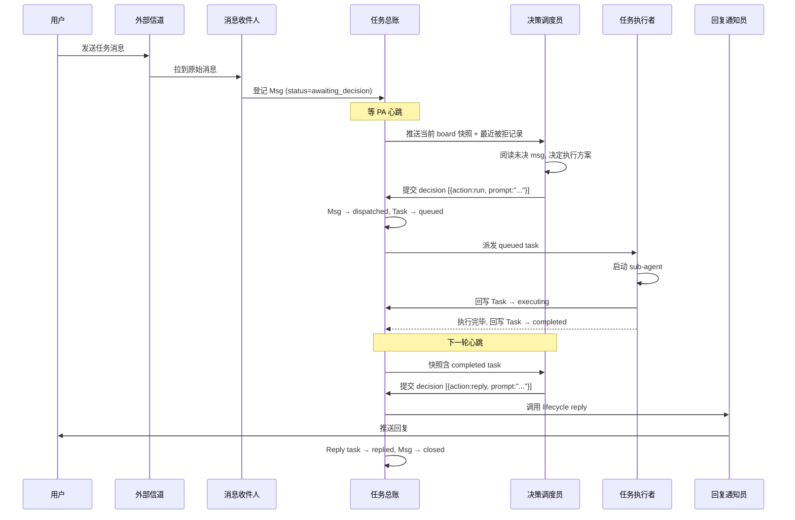
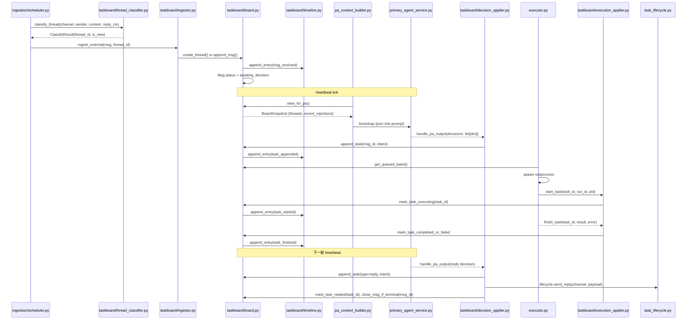

---
# ── Identity ──
id: "20260512-msg-task-board-redesign"
title: "Msg/Task Board 对象重构: 单一持久化 + 四 Applier 闭环"
scope: "把 message_cache / ingested_tasks / threads / traces 四套持久化归一为 TaskBoard + Timeline, 引入 Msg/Task/Thread 三层状态机与四 action 词汇, 根治 PA 重复响应根因"

# ── Lifecycle ──
status: draft
created: 2026-05-12
updated: 2026-05-12
completed: null

# ── Classification ──
domain: server
tags: [pa, task-board, msg-lifecycle, persistence-unification, state-machine, vacuum, freeze-v1.2]

# ── Impact Footprint ──
modules:
  - src/frago/server/services/
  - src/frago/server/services/ingestion/
  - src/frago/cli/
  - tests/server/

files:
  # 新对象与处理器
  - path: src/frago/server/services/taskboard/__init__.py
    action: new
  - path: src/frago/server/services/taskboard/board.py
    action: new
  - path: src/frago/server/services/taskboard/models.py
    action: new
  - path: src/frago/server/services/taskboard/applier.py
    action: new
  - path: src/frago/server/services/taskboard/ingestor.py
    action: new
  - path: src/frago/server/services/taskboard/decision_applier.py
    action: new
  - path: src/frago/server/services/taskboard/execution_applier.py
    action: new
  - path: src/frago/server/services/taskboard/resume_applier.py
    action: new
  - path: src/frago/server/services/taskboard/timeline.py
    action: new
  - path: src/frago/server/services/taskboard/vacuum.py
    action: new
  - path: src/frago/server/services/taskboard/fold.py
    action: new
  - path: src/frago/server/services/taskboard/migration.py
    action: new

  # 既有文件大改造
  - path: src/frago/server/services/primary_agent_service.py
    action: modify
  - path: src/frago/server/services/executor.py
    action: modify
  - path: src/frago/server/services/pa_validators.py
    action: modify
  - path: src/frago/server/services/pa_context_builder.py
    action: modify
  - path: src/frago/server/services/pa_prompts.py
    action: modify
  - path: src/frago/server/services/resume_inbox.py
    action: modify
  - path: src/frago/server/services/scheduler_service.py
    action: modify
  - path: src/frago/server/services/thread_classifier.py
    action: modify
  - path: src/frago/server/services/reflection_tick.py
    action: modify
  - path: src/frago/server/services/task_lifecycle.py
    action: modify
  - path: src/frago/server/services/task_service.py
    action: modify
  - path: src/frago/server/services/trace.py
    action: modify
  - path: src/frago/server/services/ingestion/scheduler.py
    action: modify

  # 旧文件删除 (Phase 1 末, 与 Applier 接入配套; Phase 0 留 legacy 路径不接 Applier)
  - path: src/frago/server/services/ingestion/store.py
    action: delete
  - path: src/frago/server/services/ingestion/models.py
    action: delete
  - path: src/frago/server/services/thread_service.py
    action: delete

  # CLI 扩展
  - path: src/frago/cli/task_commands.py
    action: modify
  - path: src/frago/cli/thread_commands.py
    action: delete
  - path: src/frago/cli/timeline_commands.py
    action: modify

  # 测试
  - path: tests/server/test_taskboard_models.py
    action: new
  - path: tests/server/test_decision_applier.py
    action: new
  - path: tests/server/test_resume_applier.py
    action: new
  - path: tests/server/test_vacuum_fold.py
    action: new
  - path: tests/server/test_taskboard_migration.py
    action: new
  - path: tests/server/test_taskboard_fold.py
    action: new
  - path: tests/server/test_taskboard_applier_invariants.py
    action: new
  - path: tests/server/test_timeline_query_perf.py
    action: new

# ── Phase Progress ──
phases:
  - name: "Phase 0 — Foundation: TaskBoard schema + 单一持久化 + Migration"
    status: implemented
  - name: "Phase 1 — PA Decision Loop: 四 Applier + 四 action + prompt 格式 + recent_rejections"
    status: implemented
  - name: "Phase 2 — Vacuum & Performance: bounded-progress + SLA + fold 两遍 + telemetry"
    status: implemented
  - name: "Phase 3 — PA Cleanup: primary_agent_service rewrite + executor + task_lifecycle 改读 TaskBoard"
    status: implementing
  - name: "Phase 4 — Legacy Ingestion Deletion: ingestion/store.py + models.py 物理删 + frontend API mapping + 剩余 caller cascade"
    status: pending

# ── Dependency Graph ──
related:
  - spec: 20260501-pa-resume-hot-injection
    relation: extends
  - spec: 20260406-pa-task-lifecycle-visibility
    relation: related
  - spec: 20260405-pa-rotation-message-loss-fix
    relation: related
  - spec: 20260401-pa-multi-step-task-orchestration
    relation: related
  - spec: 20260416-hook-response-protocol-extension
    relation: depends-on
  - spec: 20260331-reply-task-status-desync
    relation: supersedes

# ── Decision Trace ──
decisions:
  - question: "四套持久化文件 (message_cache.json / ingested_tasks.json / threads/index.jsonl / traces/) 归并方案"
    choice: "归并为 ~/.frago/timeline/timeline.jsonl 单一 append-only 文件; thread 归档时 lazy 切到 ~/.frago/timeline/archive/<thread_id>.jsonl; 启动 fold timeline.jsonl 重建内存投影, 不引入 tasks.json snapshot"
    rejected: ["保留分离仅在 PA service 内做协调 (现状, 根因未除)", "SQLite (跨工具读取增加门槛)", "tasks.json + timeline.jsonl 双源 (HUMAN 明确反对, 双写一致性成本高于回收一次 fold 成本)"]
  - question: "Msg key 是否去掉 channel 前缀"
    choice: "保留 channel:msg_id 复合键, _sender_index 同步 (channel, sender_id) 复合"
    rejected: ["仅 msg_id 单键 (跨信道 ID 撞车风险被低估)"]
  - question: "PA 对 Msg 的 action 词汇集"
    choice: "{run, reply, resume, dismiss} 4 个, prompt 字段统一, 不再拆 description"
    rejected: ["{run, reply, resume, schedule, dismiss} 5 个 (schedule 走独立注册路径不在 Msg loop)", "description + prompt 双字段 (一致性风险高于摘要价值)"]
  - question: "prompt 摘要从哪儿取"
    choice: "PA system prompt 硬约束 prompt 首行 ≤80 字摘要 + 空行 + 正文; board 视图取 split('\\n', 1)[0]; Applier 拒绝格式不符的 decision 落 decision_rejected"
    rejected: ["prompt[:80] 硬截断 (长 prompt 摘要丧失)", "另立 description 字段 (字段数 ≠ 一致性根源)"]
  - question: "Task → Session 多重性"
    choice: "保持 0..1 单字段, 历次 run 历史走 timeline.jsonl 还原 + frago tasks task --history <task_id> CLI 兜底"
    rejected: ["改 0..* (list, append-only) (schema 重复真相源)", "加 session_history 字段 (同理重复)"]
  - question: "resume 的 Case A (session 已结束) 与 Case B (session 在跑) 路由"
    choice: "ResumeApplier 按 task.status 路由: completed/failed → Case A spawn_resume, executing → Case B ResumeInbox 注入"
    rejected: ["合并为单一通路 (语义不一致, 失败模式不同)"]
  - question: "Case A 实施前的 resume action 处理"
    choice: "DecisionApplier 阶段化 reject: 未实施期 resume 对 completed/failed task 直接 reject(reason=case_a_not_implemented), 落 decision_rejected"
    rejected: ["静默丢弃 (PA 失去自校正信号)", "回退到 kill+respawn (技术债倒退)"]
  - question: "Case A CSID 失效如何处理"
    choice: "spawn_resume 抛 ClaudeSessionNotFoundError 时 task.status=resume_failed (新增终态), 落 resume_csid_lost timeline; PA 看到自决新建 task 或 dismiss"
    rejected: ["task 卡在 executing (同构 message_cache 卡死 bug)", "自动回退 dismiss (PA 丢失决策权)"]
  - question: "scheduled_task ingress 路径"
    choice: "走 Ingestor 创建 Msg with source.channel='scheduled', 但 Msg 从 received 直接 dispatched 跳过 awaiting_decision (fast-path); 同 transaction append_task(type=run, prompt=锁定值)"
    rejected: ["独立 ScheduleApplier 通路 (§4 处理器矩阵不闭合)", "正常走 awaiting_decision (PA 二次决策, LLM call double)"]
  - question: "scheduled channel thread 归并"
    choice: "不归并, 每次触发独立 thread (origin=scheduled, subkind=job_name)"
    rejected: ["与外部信道走同一 L1/L2 归并 (job 重复 trigger 会被错误归并)"]
  - question: "Vacuum 触发时机与规模"
    choice: "仅在 server startup fold 前执行; bounded-progress 每次最多 100 archive_marker; 触发条件 archived_marker > 0"
    rejected: ["runtime 周期触发 + copy-on-write (并发复杂度过高且为低频路径)", "降级 fold 最近 30 天 + readonly mode (引入额外状态机, 不必要)", "skip-list 外部索引文件 (违反单一持久化原则)"]
  - question: "Startup 性能 SLA"
    choice: "timeline.jsonl ≤ 500MB 时 startup 总耗时 (load + vacuum + fold) ≤ 10s; 超阈值 server 仍按 bounded-progress 推进, 由 archive 累积告警告知用户"
    rejected: ["超阈值降级到只 fold 最近 N 天 (引入降级状态机, 与 bounded-progress 重复)"]
  - question: "Archive marker schema 与 fold 算法"
    choice: "marker = {data_type:'thread_archived', thread_id, archived_at, archived_to, by ∈ {vacuum, applier, user}}; fold 两遍 (第一遍收 archived_thread_ids set, 第二遍跳过该 set)"
    rejected: ["运行时维护 archived set (启动恢复风险)", "单遍 fold + 边读边判 (无法跨 marker 跳前向 entries)"]

deviation: null
---

# Msg/Task Board 对象重构: 单一持久化 + 四 Applier 闭环

## Context

frago Primary Agent (PA) 当前在处理外部信道 (飞书 / 邮件 / webhook) 消息时, 状态散落在四套独立文件: `~/.frago/message_cache.json` 缓原始消息、`~/.frago/ingested_tasks.json` 存活跃 task、`~/.frago/ingested_tasks/` 按日归档已完成 task、`~/.frago/threads/index.jsonl` 存 thread 索引、`~/.frago/traces/trace-YYYY-MM-DD.jsonl` 存 timeline。这四套文件由 `IngestionScheduler` / `TaskStore` / `ThreadStore` / `trace._append_entry` 各自维护, 之间通过 `primary_agent_service.py` 的 `_reconcile_message_cache_with_tasks` 这样的零散对账逻辑兜底。

这套结构在 2026 年 4-5 月已经多次出问题。`message_cache.json` 与 `ingested_tasks.json` 之间的对账存在时序窗口: scheduler 收到消息写入 cache, 移交 PA 后等 PA 输出 decision; 若 PA 当轮没产 decision (网络抖动 / LLM rate-limit / prompt 格式错误 abort), 消息留在 cache, 下一轮 PA 心跳又把它当 awaiting 重新喂一次——同一条 msg 被 PA 看到 N 次, 表现为"重复响应"。运营上的具体事故是 2026-05 同一条飞书消息被回复 3 次, 用户体验灾难。`_reconcile_message_cache_with_tasks` 是这条 bug 的补丁, 不是修复——补丁本身又引入了"启动恢复时哪些 cache 项算 orphan"的判定模糊。

更深的问题是真相源不止一个。task 的 status 流转写在 `ingested_tasks.json`, 但同一变化必须同步写一条 timeline entry; thread 索引在 `threads/index.jsonl`, 但活跃信息又散落在 task 的 `thread_id` 字段。每加一个跨文件不变量就要在 PA service 里加一段对账, PA service 已经成为"对账聚合点"而非"决策路由器"。

设计草稿 `/tmp/frago-taskboard-redesign.html` 经三方协作 (Product Yi / Dev Kai / Test Ce) 在 jsonl 决议日志 `~/.frago/tables/msg-task-redesign.jsonl` 上迭代到 v1.2 freeze, 决议日志含 23:46:43 freeze v1.1 + 23:49:25 final decide。本 spec plan 是把 v1.2 freeze 落地为可实施 implementation plan, 不重开 spec 讨论。

## Design

### Design Principles

1. **单一真相源** — 运行时状态唯一持久化在 `~/.frago/timeline/timeline.jsonl` (append-only); 启动 fold 该文件重建内存投影, 不引入 `tasks.json` 第二份快照。Thread 归档 lazy 切到 `~/.frago/timeline/archive/<thread_id>.jsonl`, 但活跃 board 永远从 timeline.jsonl 还原。
2. **强封装写入** — TaskBoard 单例的公有方法是修改 board 的唯一入口, 四个 Applier (Ingestor / DecisionApplier / ExecutionApplier / ResumeApplier) 是 board 之外的唯一调用者。PA、Executor、sub-agent、scheduler 不直接改 board。
3. **状态机闭环** — Thread / Msg / Task 三层状态机, 任何 transition 都必须在 board 公有方法内做合法性校验; 非法 transition 抛错并落 `decision_rejected` timeline, 让 PA 下一轮看到自己被拒原因, 构成自校正回路。
4. **PA 决策可观测** — view_for_pa() 返回的 board 切片含 `recent_rejections` 字段 (默认 N=10), PA 系统 prompt 引导其在看到 reject 后调整下一轮策略, 不需要外挂监控。
5. **历史下沉到 timeline** — Task 对象不存历史 (run history、resume 序列、reject 记录), 全部走 timeline.jsonl + CLI 还原。schema 不重复, 真相只在一处。

### Core Concepts

新对象树用 Python `@dataclass` 表示:

```python
from dataclasses import dataclass, field
from datetime import datetime
from typing import Literal

# ── 顶层容器 ──

@dataclass
class TaskBoard:
    """单例, 进程内唯一; 所有 mutation 走公有方法 + 同一 RLock。"""
    _threads: dict[str, "Thread"] = field(default_factory=dict)
    _channelref_index: dict[tuple[str, str], str] = field(default_factory=dict)
    # (channel, msg_id) → thread_id, L1 归并 O(1) 查找
    _sender_index: dict[tuple[str, str], set[str]] = field(default_factory=dict)
    # (channel, sender_id) → set[thread_id], L2 归并候选集
    _recent_rejections: list["RejectionRecord"] = field(default_factory=list)
    # 滚动窗口, N=10

# ── Thread / Msg / Task 三层 ──

@dataclass
class Thread:
    thread_id: str                       # ULID
    status: Literal["active", "dormant", "closed"]
    origin: Literal["external", "internal", "scheduled"]
    subkind: str                         # feishu / email / webhook / job_name (scheduled)
    root_summary: str                    # 首条 msg 摘要, 用于 board 视图
    created_at: datetime
    last_active_at: datetime
    senders: set[str]                    # 该 thread 内出现过的 sender_id
    msgs: list["Msg"]                    # 按时间升序

@dataclass
class Msg:
    msg_id: str                          # 业务键 channel:original_msg_id
    status: Literal[
        "received",                      # 入 board 瞬时态
        "awaiting_decision",             # 等 PA 决策
        "dispatched",                    # PA 已下 task
        "closed",                        # 全部 task 终态且至少 1 个 reply 已 replied
        "dismissed",                     # PA 显式放弃
    ]
    source: "Source"                     # 历史事实只读
    tasks: list["Task"]                  # 动态产物

@dataclass
class Source:
    channel: str                         # feishu / email / webhook / scheduled
    text: str                            # 原文 (scheduled 时 = task prompt)
    sender_id: str                       # 外部信道 = 用户 ID; scheduled = '__scheduler__'
    parent_ref: str | None               # L1 引用: parent_message_id / In-Reply-To / schedule_id
    received_at: datetime
    reply_context: dict | None           # 信道原生 reply payload (scheduled 时 None)

@dataclass
class Task:
    task_id: str                         # ULID
    status: Literal[
        "queued", "executing",
        "completed", "failed",
        "resume_failed",                 # 新增终态: Case A spawn_resume 时 CSID 失效
        "replied",                       # 仅 type=reply 用
    ]
    type: Literal["run", "reply"]        # PA dismiss/resume 不创建 task
    intent: "Intent"
    session: "Session | None"            # 仅 type=run 有, 0..1 (resume 时覆盖更新, 历史走 timeline)
    result: "Result | None"

@dataclass
class Intent:
    prompt: str                          # 首行 ≤80 字摘要 + 空行 + 正文; Applier 强校验

@dataclass
class Session:
    run_id: str                          # 每次 (含 resume) 生成新 ULID
    claude_session_id: str | None        # Case A resume 沿用旧 CSID; 新建 task 时 None, sub-agent 启动后回写
    pid: int | None
    started_at: datetime
    ended_at: datetime | None            # resume 前清空; spawn_resume 成功返回后赋新值前为 None

@dataclass
class Result:
    summary: str                         # sub-agent 自报
    error: str | None

# ── Timeline entry 与 reject 记录 ──

@dataclass
class TimelineEntry:
    """append-only, 单一写入点 ~/.frago/timeline/timeline.jsonl"""
    entry_id: str                        # ULID
    ts: datetime
    data_type: str                       # msg_received / task_appended / task_started /
                                         # task_finished / task_resumed_caseA / task_resume_pending_caseB /
                                         # task_resume_injected / resume_csid_lost / decision_rejected /
                                         # thread_archived / startup_fold_completed / ...
    by: str                              # 哪个 Applier 写
    thread_id: str | None
    msg_id: str | None
    task_id: str | None
    data: dict                           # 业务 payload, 含 prev_status / status / reason 等

@dataclass
class RejectionRecord:
    """view_for_pa.recent_rejections 暴露给 PA"""
    ts: datetime
    reason: str                          # action_invalid / prompt_format_invalid /
                                         # case_a_not_implemented / illegal_transition / ...
    offending_msg_id: str | None
    offending_task_id: str | None
    original_action: str                 # PA 输出动词
    original_prompt_head: str            # 首行截断, 避免回灌大段 prompt
```

### Architecture

```
┌─────────────────────────────────────────────────────────────┐
│  External channels (feishu / email / webhook)               │
│  Scheduled cron triggers (SchedulerService)                 │
└──────────────────────────┬──────────────────────────────────┘
                           │
                           ▼
                  ┌────────────────┐
                  │   Ingestor     │ ← create_thread / append_msg
                  │ (scheduled 走  │   scheduled channel: append_task fast-path
                  │  fast-path)    │
                  └───────┬────────┘
                          │
                          ▼
              ╔═══════════════════════╗
              ║       TaskBoard       ║
              ║   (单例 + RLock)      ║──→  timeline/timeline.jsonl (append-only, 唯一持久化)
              ╚═══════════════════════╝
                                      └→ archive/<thread_id>.jsonl (vacuum 切出, 冷存)
                  ▲       ▲       ▲
                  │       │       │
   ┌──────────────┘       │       └──────────────┐
   │                      │                       │
┌──┴──────────┐  ┌────────┴────────┐  ┌──────────┴────────┐
│ Decision    │  │ Execution       │  │ Resume Applier    │
│ Applier     │  │ Applier         │  │  case A: spawn    │
│ (PA output) │  │ (executor write)│  │  case B: inbox    │
└─────────────┘  └─────────────────┘  └───────────────────┘
       ▲                  ▲                    ▲
       │                  │                    │
       │ decisions JSON   │ run/finish callback│ resume route
       │                  │                    │
   ┌───┴────┐        ┌────┴─────┐        ┌─────┴────────┐
   │   PA   │        │ Executor │        │ Sub-agent +  │
   │ (LLM)  │        │ (subproc │        │ frago-core   │
   │        │        │  spawn)  │        │ PreToolUse   │
   └────────┘        └──────────┘        └──────────────┘
       ▲                                         │
       │ view_for_pa() snapshot + recent_rejects │
       │                                         │
       └─────────── board read-only ─────────────┘
```

### 业务时序图 (Happy Path: 外部信道消息 → run → reply)



### 技术时序图 (代码文件级)



## 做什么

1. 新增 `src/frago/server/services/taskboard/` package, 含 `board.py`、`models.py`、`applier.py` (基类) + 四个具体 Applier、`timeline.py`、`vacuum.py`、`fold.py`、`migration.py`、`thread_classifier.py` (从 services 根目录迁入)。
2. 把 `IngestionScheduler` 中的 message_cache 完全摘除, scheduler 只负责"拉到原始消息"和调用 `Ingestor.ingest_external()`。
3. 把 `TaskStore` 与 `ThreadStore` 替换为 `TaskBoard` 单例; `IngestedTask` / `CachedMessage` / `ThreadIndex` 三套 dataclass 合并到新 `taskboard/models.py`。
4. PA action 词汇集改为 `{run, reply, resume, dismiss}` 4 个; `schedule` 作为 PA 独立 action (注册 cron, 不在 Msg loop 内) 保留, 走单独 SchedulerService 通路。
5. `pa_validators.py` 增加 prompt 格式校验 (首行 ≤80 字 + 空行 + 正文), 不符则 reject 并落 `decision_rejected` timeline + 推入 `recent_rejections` 窗口。
6. 实现 Case A `Executor.spawn_resume(claude_session_id, prompt) → new run_id + new pid`; 失败抛 `ClaudeSessionNotFoundError`, 由 ResumeApplier 转 task.status=resume_failed + 落 `resume_csid_lost` timeline。
7. 实现 scheduled channel fast-path: Ingestor 收到 scheduled trigger 在同 transaction 内 create Msg + append_task(type=run), Msg 直接 dispatched 跳过 awaiting_decision。
8. Vacuum: startup 前执行, bounded-progress 100 archive_marker/启动, 触发条件 `archived_marker > 0`; vacuum 写序 (先写 archive/<thread_id>.jsonl + fsync, 再 atomic rename 新 timeline.jsonl)。
9. Fold 两遍算法: 第一遍扫 timeline.jsonl 收 archived_thread_ids set, 第二遍读 entries 时跳过该 set 内 thread_id 的所有 entries (含 marker 后误写)。落 `startup_fold_completed` entry 含 `{fold_duration_ms, vacuum_duration_ms, entries_read, entries_skipped, timeline_bytes, archived_threads_count}`。
10. Migration 脚本 `taskboard/migration.py`: 一次性把现存的 message_cache.json / ingested_tasks.json / ingested_tasks/*.json / threads/index.jsonl / traces/trace-*.jsonl fold 进新 schema, 备份原文件到 `~/.frago/.migration-backup-YYYYMMDD/`。
11. CLI 扩展: `frago tasks list / thread / msg / task / awaiting / active / search / stats / vacuum`、`frago tasks task --history <task_id>` 通过 timeline 还原历次 Session、`frago timeline tail` 扩展 thread/task 过滤。
12. 删除 `ingestion/store.py`、`ingestion/models.py`、`thread_service.py`、`cli/thread_commands.py`、`message_cache.json` 相关代码路径。

## 不做什么

1. **不引入 SQLite 或外部 KV** — 单文件 + atomic rename 已经覆盖原子性需求, 引入 SQL 增加跨工具调试门槛。
2. **不实现 L3 LLM 分类与 L4 用户锚定** — 维持当前 L1 (信道原生引用) + L2 (规则) 两层, L3/L4 留待后续 spec; 命中率实测后再决定。
3. **不在 runtime 跑 vacuum** — 仅 startup 前, 避免 runtime copy-on-write 的并发复杂度; 长跑场景由 startup bounded-progress + 用户重启托底。
4. **不引入降级 fold (只 fold 最近 N 天)** — bounded-progress 已覆盖长跑回收, 引入降级会多一套状态机, 与 archive_marker 路径重复。
5. **不改 Claude Code hook 协议** — Case B 复用现有 PreToolUse additionalContext 路径 (spec 20260501), Case A 复用 `claude --resume` CLI, 不新增协议字段。
6. **不重新设计 PA 心跳调度** — 维持现有 reflection_tick 节奏, 仅替换其读 TaskBoard 的方式 (从 TaskStore + ThreadStore 双源改成 board.view_for_pa() 单源)。
7. **不做 board 的 HTTP API 实时推送** — CLI 调用 `frago tasks ...` 时通过进程内 IPC 拿 in-memory board 视图 (server 进程提供 read-only endpoint), v1 不引入 WebSocket 推送。
8. **不在本 spec 处理 PA system prompt 的全面重写** — 仅补 4 action 词汇定义 + prompt 格式契约 + recent_rejections 解释三段, 其他 PA 决策原则维持现状。

## Implementation

### Phase 0 — Foundation: TaskBoard schema + 单一持久化 + Migration

**目标**: 新对象树落地, 单一持久化文件就绪, 旧数据无损迁移。Phase 0 完成后系统可读旧 PR 状态, 但 PA 决策路径仍是 legacy (不接入 Applier)。

#### File Changes

| File | Action | Description |
|---|---|---|
| `src/frago/server/services/taskboard/__init__.py` | NEW | Package 入口, 导出 TaskBoard 单例 getter |
| `src/frago/server/services/taskboard/models.py` | NEW | 全部 dataclass (Thread/Msg/Task/Source/Intent/Session/Result/TimelineEntry/RejectionRecord) |
| `src/frago/server/services/taskboard/board.py` | NEW | TaskBoard 单例 + 公有方法 (create_thread/append_msg/append_task/start_task/finish_task/mark_*/record_resume_pending/clear_resume_pending/view_for_pa/fold) + RLock; 状态变更同锁段必写一条 timeline entry, 不维护额外快照 |
| `src/frago/server/services/taskboard/timeline.py` | NEW | `append_entry(data_type, by, ...)` 唯一写入点 + `iter_entries()` 读取 |
| `src/frago/server/services/taskboard/thread_classifier.py` | NEW (迁入) | 从 `services/thread_classifier.py` 物理移入, 重写 _channelref_index / _sender_index 反查为 board 内存查表 |
| `src/frago/server/services/taskboard/ingestor.py` | NEW | `ingest_external(msg, thread_id)` 方法 (Phase 0 仅外部信道路径); 调 board.create_thread / append_msg。`ingest_scheduled` 留 Phase 1 添加 (Gap 3a 修订) |
| `src/frago/server/services/taskboard/migration.py` | NEW | 一次性脚本: 读旧四套文件 → 构建新 board → 把全部历史 entries append 到 timeline/timeline.jsonl + 备份旧文件 |
| `src/frago/server/services/ingestion/scheduler.py` | MODIFY | 摘除 message_cache 字段 / `_save_cache` / `_load_cache` / `get_cached_message` / `remove_cached_message`; ingest_message 改调 Ingestor.ingest_external (实装移至 Phase 1, 与 Applier 接入配套; Phase 0 验收线只要求 'PA 决策路径仍是 legacy') |
| `src/frago/server/services/ingestion/store.py` | DELETE | 全部行为转移到 board.py |
| `src/frago/server/services/ingestion/models.py` | DELETE | dataclass 转移到 taskboard/models.py |
| `src/frago/server/services/thread_service.py` | DELETE | ThreadStore 行为转移到 board.py + thread_classifier.py |
| `tests/server/test_taskboard_models.py` | NEW | 对象 dataclass 字段不变量 + JSON round-trip |
| `tests/server/test_taskboard_migration.py` | NEW | 旧数据 fixture → migration → 新 schema 完整性断言 |
| `tests/server/test_taskboard_fold.py` | NEW | T5.1 case_marker_skip — 注入 archive_marker fixture, fold 两遍正确跳过 (Gap 2: T5.1 跨入 Phase 0) |

#### 关键实现要点

**TaskBoard 公有方法事务模板** (board.py):

```python
def append_task(self, msg_id: str, intent: Intent, task_type: str, by: str) -> Task:
    with self._lock:
        msg = self._find_msg_by_id(msg_id)
        # 1. 状态机前置校验
        if msg.status not in {"awaiting_decision", "dispatched"}:
            self._record_rejection(
                reason="illegal_transition",
                offending_msg_id=msg_id,
                original_action=task_type,
                original_prompt_head=intent.prompt.split("\n", 1)[0][:80],
            )
            raise IllegalTransitionError(...)
        # 2. 改内存
        task = Task(task_id=ulid_new(), status="queued", type=task_type, intent=intent, session=None, result=None)
        msg.tasks.append(task)
        msg.status = "dispatched"
        # 3. timeline entry (同锁段, 单一持久化点)
        self._timeline.append_entry(
            data_type="task_appended",
            by=by,
            thread_id=self._thread_of(msg_id),
            msg_id=msg_id,
            task_id=task.task_id,
            data={"prev_status": "awaiting_decision", "status": "dispatched"},
        )
        return task
```

**Migration 算法** (migration.py):

```python
def migrate(home: Path) -> MigrationReport:
    backup_dir = home / f".migration-backup-{date.today().isoformat()}"
    backup_dir.mkdir(parents=True, exist_ok=True)
    board = TaskBoard()  # 空板

    # 1. 读 ingested_tasks.json + archive
    tasks = _load_legacy_tasks(home / "ingested_tasks.json")
    for archived in (home / "ingested_tasks").glob("*.json"):
        tasks.extend(_load_legacy_tasks(archived))

    # 2. 读 threads/index.jsonl
    threads = _load_legacy_threads(home / "threads" / "index.jsonl")

    # 3. 按 thread_id 重建 Thread + Msg + Task 对象
    for t in threads:
        board.create_thread(t.thread_id, origin=t.origin, ...)
    for task in tasks:
        thread = board._threads[task.thread_id or _allocate_fallback(task)]
        msg = _msg_from_legacy_task(task)
        thread.msgs.append(msg)
        # SubTasks → Task list
        for st in task.sub_tasks:
            msg.tasks.append(_task_from_legacy_subtask(st))

    # 4. 重放 traces/trace-*.jsonl 为 timeline entries (保留历史)
    for tracefile in sorted((home / "traces").glob("trace-*.jsonl")):
        _replay_entries(board._timeline, tracefile)

    # 5. fsync timeline.jsonl (migration 期间 append 的全部 entries 已落盘)
    board._timeline.fsync()

    # 6. 备份旧文件
    for p in ["message_cache.json", "ingested_tasks.json", "ingested_tasks", "threads", "traces"]:
        src = home / p
        if src.exists():
            shutil.move(str(src), str(backup_dir / p))

    return MigrationReport(threads=len(threads), tasks=len(tasks), ...)
```

**Server 启动序列** (main 进程):

```python
def boot(home: Path) -> None:
    if (home / "ingested_tasks.json").exists() and not (home / ".migration-done").exists():
        migration.migrate(home)              # 一次性, 完成后写 .migration-done 锁
    # 启动唯一加载路径: fold timeline.jsonl 两遍重建内存 board
    board = TaskBoard.fold(home / "timeline" / "timeline.jsonl")
    # fold 完成后立即写 startup_fold_completed entry
    board._timeline.append_entry(
        data_type="startup_fold_completed",
        by="boot",
        data={
            "fold_duration_ms": fold_ms,
            "entries_read": board.entries_read,
            "entries_skipped": board.entries_skipped,
            "timeline_bytes": (home / "timeline" / "timeline.jsonl").stat().st_size,
        },
    )
    # Phase 0: 不接 Applier, 仅暴露读路径给 CLI
```

> **Gap 4 startup_fold_completed 字段集 Phase 演进**: Phase 0 entry 含 4 字段 `{fold_duration_ms, entries_read, entries_skipped, timeline_bytes}` (Yi 23:49:25 锁定); Phase 2 引入 vacuum 后扩展为 6 字段, 增加 `vacuum_duration_ms` 与 `archived_threads_count` (见 Phase 2 boot 示例)。

#### Phase 0 验收线

- `uv run pytest tests/server/test_taskboard_models.py tests/server/test_taskboard_migration.py -v` 全绿
- 在含旧数据的 `~/.frago/` 副本上跑 `frago server migrate` 一次性完成, 备份目录生成, `~/.frago/.migration-done` 锁文件写入
- `~/.frago/timeline/timeline.jsonl` 存在且 fold 后 board 与旧 store **migration 后 in-time 快照等价** (因 Phase 0 不接 Applier, board 不接收 ongoing ingest, ongoing 等价推到 Phase 1 验收)
- `frago tasks list` 输出与旧 `frago thread list` **快照计数等价** (thread + msg + task 静态计数; ongoing ingest 等价 Phase 1 覆盖)

---

### Phase 1 — PA Decision Loop: 四 Applier + 四 action + prompt 格式 + recent_rejections + Case A

**目标**: PA 决策完全通过 DecisionApplier 落 board, Executor 通过 ExecutionApplier 回写, ResumeApplier 同时支持 Case A (新增) 与 Case B (复用 spec 20260501)。Phase 1 完成后 message_cache 彻底退场, PA 重复响应根因消除。

#### File Changes

| File | Action | Description |
|---|---|---|
| `src/frago/server/services/taskboard/applier.py` | NEW | 抽象基类 `BaseApplier`, 含 `_reject(reason, ...)` 与 `_record_rejection` 公共逻辑 |
| `src/frago/server/services/taskboard/ingestor.py` | MODIFY | 新增 `ingest_scheduled(schedule_id, prompt, trigger_at, job_name)` 方法; scheduled 走 fast-path 同 transaction append_task (Phase 0 已建文件含 ingest_external; Gap 3a) |
| `src/frago/server/services/taskboard/decision_applier.py` | NEW | `handle_pa_output(decisions: list[dict])`: 词汇校验 / prompt 格式校验 / 状态机校验 / 路由到 board 方法或 ResumeApplier |
| `src/frago/server/services/taskboard/execution_applier.py` | NEW | `start_task(task_id, run_id, pid, csid)`, `finish_task(task_id, result, error)` |
| `src/frago/server/services/taskboard/resume_applier.py` | NEW | `route_resume(task_id, prompt)`: 按 task.status 分流 Case A / Case B / reject(case_a_not_implemented) |
| `src/frago/server/services/pa_validators.py` | MODIFY | `VALID_PA_ACTIONS = {"run", "reply", "resume", "dismiss"}`; 加 `validate_prompt_format(prompt)` (首行 ≤80 + 空行 + 正文); 不符返回 `RejectReason.prompt_format_invalid` |
| `src/frago/server/services/pa_context_builder.py` | MODIFY | 从 TaskBoard.view_for_pa() 直接拿 snapshot, 不再聚合 TaskStore + ThreadStore |
| `src/frago/server/services/pa_prompts.py` | MODIFY | 补 4 action 词汇定义 + prompt 格式约束 + recent_rejections 解释三段 |
| `src/frago/server/services/primary_agent_service.py` | MODIFY | `_handle_pa_output` 直接调 DecisionApplier; 删除 `_reconcile_message_cache_with_tasks` 与 message_cache 相关代码 |
| `src/frago/server/services/executor.py` | MODIFY | `spawn(prompt)` → 调 ExecutionApplier.start_task; 新增 `spawn_resume(claude_session_id, prompt) → new_run_id`, CSID 失效抛 `ClaudeSessionNotFoundError` |
| `src/frago/server/services/resume_inbox.py` | MODIFY | Case B 写入逻辑保留, 但调用入口从 PA service 改成 ResumeApplier.route_resume |
| `src/frago/server/services/scheduler_service.py` | MODIFY | scheduled cron 触发时调 Ingestor.ingest_scheduled (而非直接 enqueue 给 Executor) |
| `src/frago/server/services/task_lifecycle.py` | MODIFY | reply 推送函数改成被 DecisionApplier 调用; 不再自行管理 task 状态 |
| `src/frago/server/services/task_service.py` | MODIFY | task list/get API 改读 TaskBoard, 删除 TaskStore 依赖 |
| `src/frago/cli/task_commands.py` | MODIFY | 改读 TaskBoard; 新增 `task --history <task_id>` 通过 timeline 还原 Session 历史 |
| `tests/server/test_decision_applier.py` | NEW | T3.1–T3.4 (词汇校验 / prompt 格式 / 摘要取首行 / recent_rejections 暴露) |
| `tests/server/test_resume_applier.py` | NEW | T9.1–T9.6 + T9.7a (case_a_not_implemented / Case A happy path / CSID 失效 / resume_failed 进 §7 / 历史轨迹查询 / task --history 返回结构正确 — Gap 5: T9.7 拆 a/b 两步) |
| `tests/server/test_taskboard_applier_invariants.py` | NEW | T5.2 post_archive_reject + T_B1.1 / T_B1.2 (scheduled fast-path Msg 状态 / Source default 完整性) — applier 层不变量 (Gap 2 修订) |

#### Phase 1 关键路径

**DecisionApplier 主流程**:

```python
def handle_pa_output(self, decisions: list[dict]) -> None:
    for d in decisions:
        action = d.get("action")
        if action not in VALID_PA_ACTIONS:
            self._reject(reason="action_invalid", original_action=str(action), original_prompt_head="")
            continue

        prompt = d.get("prompt", "")
        if action in {"run", "reply", "resume"}:
            err = validate_prompt_format(prompt)
            if err:
                self._reject(reason="prompt_format_invalid", original_action=action,
                             original_prompt_head=prompt.split("\n", 1)[0][:80])
                continue

        msg_id = d.get("msg_id")
        task_id = d.get("task_id")

        try:
            if action == "run":
                self._board.append_task(msg_id, Intent(prompt=prompt), task_type="run", by=self.name)
            elif action == "reply":
                task = self._board.append_task(msg_id, Intent(prompt=prompt), task_type="reply", by=self.name)
                self._lifecycle.send_reply(self._board, task)
                self._board.mark_task_replied(task.task_id, by=self.name)
                self._board.close_msg_if_terminal(msg_id, by=self.name)
            elif action == "resume":
                self._resume_applier.route_resume(task_id, prompt)
            elif action == "dismiss":
                self._board.mark_msg_dismissed(msg_id, reason=prompt or "(no reason)", by=self.name)
        except IllegalTransitionError as e:
            # board 内部已经 record_rejection, 这里不再重复
            continue
```

**ResumeApplier 三档路由**:

```python
def route_resume(self, task_id: str, prompt: str) -> None:
    task = self._board.get_task(task_id)
    if task is None:
        self._reject(reason="task_not_found", offending_task_id=task_id, original_action="resume",
                     original_prompt_head=prompt.split("\n", 1)[0][:80])
        return
    if task.status in {"queued", "replied"}:
        self._reject(reason="resume_illegal_state", offending_task_id=task_id, ...)
        return
    if task.status in {"completed", "failed"}:
        # Case A
        if not self._executor.case_a_enabled():       # 阶段化 reject (Phase 1 末才打开)
            self._reject(reason="case_a_not_implemented", offending_task_id=task_id, ...)
            return
        csid = task.session.claude_session_id if task.session else None
        try:
            new_run_id, new_pid = self._executor.spawn_resume(csid, prompt)
        except ClaudeSessionNotFoundError:
            self._board.mark_task_resume_failed(task_id, reason="resume_csid_lost", by=self.name)
            return
        self._board.start_task(task_id, run_id=new_run_id, pid=new_pid, csid=csid, by=self.name)
        return
    if task.status == "executing":
        # Case B - 复用 spec 20260501
        self._resume_inbox.enqueue(task.session.claude_session_id, task_id, prompt)
        self._board.record_resume_pending(task_id, prompt, by=self.name)
        return
```

**scheduled fast-path** (ingestor.py):

```python
def ingest_scheduled(self, schedule_id: str, prompt: str, trigger_at: datetime, job_name: str) -> None:
    # B1 决议: 不归并, 每次触发独立 thread
    thread_id = ulid_new()
    self._board.create_thread(
        thread_id=thread_id,
        origin="scheduled",
        subkind=job_name,
        root_summary=prompt.split("\n", 1)[0][:80],
        created_at=trigger_at,
    )
    msg = Msg(
        msg_id=f"scheduled:{schedule_id}:{trigger_at.isoformat()}",
        status="received",
        source=Source(
            channel="scheduled",
            text=prompt,
            sender_id="__scheduler__",
            parent_ref=schedule_id,
            received_at=trigger_at,
            reply_context=None,
        ),
        tasks=[],
    )
    self._board.append_msg_fast_path(thread_id, msg, task_intent=Intent(prompt=prompt), by=self.name)
    # board 内部: msg.status 从 received 直接 dispatched, 同 transaction append type=run task
```

#### Phase 1 验收线

- `uv run pytest tests/server/test_decision_applier.py tests/server/test_resume_applier.py -v` 全绿
- 触发同一条飞书消息 10 次, PA 应输出恰好 1 个 decision (不再重复响应)
- `frago tasks awaiting` 在 PA 没产 decision 时正确显示卡住的 msg + reason

---

### Phase 2 — Vacuum & Performance: bounded-progress + SLA + fold 两遍 + telemetry + CLI

**目标**: 长跑场景下 timeline 文件回收, startup 性能可量化, 测试可断言。Phase 2 完成后整个重构进入生产可用状态。

#### File Changes

| File | Action | Description |
|---|---|---|
| `src/frago/server/services/taskboard/vacuum.py` | NEW | `run_bounded_vacuum(home, max_markers=100)`: 扫 archived_marker 队列 / 按 thread_id 抽到 `archive/<thread_id>.jsonl` / atomic rename 新 timeline.jsonl |
| `src/frago/server/services/taskboard/fold.py` | NEW | `fold(timeline_path) → BoardSnapshot`: 两遍读 (第一遍收 archived_thread_ids, 第二遍跳过) |
| `src/frago/server/services/taskboard/board.py` | MODIFY | 增 `record_thread_archived(thread_id, by)` 写 archive_marker entry; archive duplicate / post-archive append 各落 reject entry |
| `src/frago/server/services/timeline_service.py` | MODIFY | CLI `frago timeline search --thread-id / --task-id` 增加索引扫描 (单遍 jsonl scan) |
| `src/frago/cli/task_commands.py` | MODIFY | 新增 `frago tasks stats` (timeline_bytes, archived_threads_count, last_fold_duration_ms); `frago tasks vacuum` (触发离线 vacuum, 等价于重启) |
| `src/frago/cli/timeline_commands.py` | MODIFY | 默认输出包含 startup_fold_completed 行, 便于排障 |
| `tests/server/test_vacuum_fold.py` | NEW | T5.3–T5.6 + T_B2.alt.1 / T_B2.alt.2 (marker_duplicate / vacuum crash 一致性 / vacuum runtime 拒绝 / fold 性能上限 / bounded 上限 100 / SLA edge 500MB) — Gap 2: T5.1 → Phase 0, T5.2 → Phase 1 applier_invariants |
| `tests/server/test_timeline_query_perf.py` | NEW | T9.7b — task --history 在 10000 entries fixture 下 ≤5s (Gap 5: T9.7 拆 a/b 两步) |

#### Bounded-Progress Vacuum

```python
MAX_MARKERS_PER_STARTUP = 100

def run_bounded_vacuum(home: Path) -> VacuumReport:
    """仅在 server startup fold 前调用; runtime 调用抛 VacuumOnlyOnStartupError。"""
    timeline = home / "timeline" / "timeline.jsonl"
    if not timeline.exists():
        return VacuumReport(processed=0)

    # 第一遍: 收 marker 队列 (≤100 个)
    markers = _scan_archive_markers(timeline, limit=MAX_MARKERS_PER_STARTUP)
    if not markers:
        return VacuumReport(processed=0)

    # 第二遍: 抽 entries
    new_path = timeline.with_suffix(".new")
    archive_writers: dict[str, IO] = {}
    try:
        with timeline.open() as src, new_path.open("w") as dst:
            for line in src:
                entry = json.loads(line)
                tid = entry.get("thread_id")
                if tid in markers:
                    aw = archive_writers.setdefault(tid, _open_archive(home, tid))
                    aw.write(line)
                else:
                    dst.write(line)
        for aw in archive_writers.values():
            aw.flush()
            os.fsync(aw.fileno())
        # atomic rename
        os.replace(new_path, timeline)
    finally:
        for aw in archive_writers.values():
            aw.close()

    return VacuumReport(processed=len(markers))
```

**触发条件** (boot 序列):

```python
def startup(home: Path) -> None:
    t0 = time.monotonic()
    # 1. (可选) migration: 首次启动时
    if _needs_migration(home):
        migration.migrate(home)

    # 2. bounded vacuum (archived_marker > 0 时)
    vacuum_started = time.monotonic()
    vac_report = vacuum.run_bounded_vacuum(home)
    vacuum_ms = int((time.monotonic() - vacuum_started) * 1000)

    # 3. fold
    fold_started = time.monotonic()
    snapshot = fold.fold(home / "timeline" / "timeline.jsonl")
    fold_ms = int((time.monotonic() - fold_started) * 1000)

    # 4. telemetry
    snapshot.timeline.append_entry(
        data_type="startup_fold_completed",
        by="boot",
        data={
            "fold_duration_ms": fold_ms,
            "vacuum_duration_ms": vacuum_ms,
            "entries_read": snapshot.entries_read,
            "entries_skipped": snapshot.entries_skipped,
            "timeline_bytes": (home / "timeline" / "timeline.jsonl").stat().st_size,
            "archived_threads_count": vac_report.processed,
        },
    )

    # 5. 接收流量
    start_http_server(snapshot)
```

#### Phase 2 验收线

- `uv run pytest tests/server/test_vacuum_fold.py -v` 全绿, 含 T5.6 SLA fold ≤5s @ 200MB fixture
- 构造 150 markers 的 timeline, 启动后 `frago tasks stats` 显示 `archived_threads_count=100`, 剩余 50 marker 等下次启动
- 构造 500MB 边界 timeline, 启动总耗时 (vacuum + fold) ≤ 10s, telemetry entry 落盘

## Migration Strategy

### 时机

Migration 是一次性脚本, 在 server 启动时如果检测到旧数据 (`~/.frago/ingested_tasks.json` 存在且 `~/.frago/.migration-done` 不存在) 自动触发, 完成后写 `~/.frago/.migration-done` 锁文件防止重入。

### 步骤

```
1. 创建备份目录 ~/.frago/.migration-backup-YYYYMMDD/
2. 读 ingested_tasks.json + ingested_tasks/*.json → IngestedTask 列表
3. 读 threads/index.jsonl → ThreadIndex 列表
4. 读 message_cache.json → CachedMessage 列表 (用于补全 thread_id 缺失的 task)
5. 在内存中构建新 TaskBoard:
   - 每个 ThreadIndex → Thread (status 转换: active 保留; 无 last_active 超 24h 转 dormant)
   - 每个 IngestedTask → Msg (msg_id = channel:channel_message_id) + Task (取最新一条 SubTask)
   - SubTasks 列表 → 重放为多条 task_started/task_finished timeline entry (历史保留)
6. 重放 traces/trace-YYYY-MM-DD.jsonl 全部行到 timeline.jsonl (entry_id 用旧 id 保持引用)
7. 全部历史 entries append 到 ~/.frago/timeline/timeline.jsonl + fsync
8. 旧文件 mv 到备份目录 (不删, 用户可手动回滚)
9. 写 .migration-done
```

### 回滚

如果新 schema 出现问题, 用户可:
```bash
rm ~/.frago/.migration-done
rm -rf ~/.frago/timeline
mv ~/.frago/.migration-backup-YYYYMMDD/* ~/.frago/
# 然后回退 frago 版本
```

### Migration 测试

`tests/server/test_taskboard_migration.py` 构造 fixture: 5 个 thread, 30 个 task (含 active/completed/archived 各一半), 100 行 trace entries; 跑 migration 后断言:
- TaskBoard.threads 数量 == 5
- 每个 Thread.msgs 长度 == 原对应 task 数
- timeline.jsonl 行数 == 100 (历史 trace) + ≥30 (migration 自身产 entry)
- `frago tasks list` 输出与旧 `frago thread list` 行为等价

## Verification

### Phase 0

```bash
# 单元 + migration
uv run pytest tests/server/test_taskboard_models.py tests/server/test_taskboard_migration.py -v

# 启动 server 跑迁移
cp -r ~/.frago ~/.frago.backup-test
uv run frago server restart
ls ~/.frago/timeline/timeline.jsonl ~/.frago/.migration-done ~/.frago/.migration-backup-*

# 等价性
diff <(uv run frago thread list --json | jq -S .) <(uv run frago tasks list --json | jq -S .)
```

### Phase 1

```bash
# Applier 单元
uv run pytest tests/server/test_decision_applier.py tests/server/test_resume_applier.py -v

# 重复响应回归
uv run frago debug inject-feishu --msg-id om_test_001 --sender U_test_001 --text "test"
# 等 PA 心跳一次, 然后再注入 5 次相同 msg
for i in {1..5}; do
  uv run frago debug inject-feishu --msg-id om_test_001 --sender U_test_001 --text "test"
done
# 期望: 只生成 1 个 task (而非 6 个)
uv run frago tasks task --history $(uv run frago tasks active --json | jq -r '.[0].task_id')

# Case A spawn_resume happy path
uv run frago debug spawn-resume --task-id $TASK_ID --prompt "继续追加: 加一段总结\n\n详细..."
uv run frago tasks task $TASK_ID --json | jq '.session.run_id'
# 期望: run_id 已变, csid 沿用

# CSID 失效
uv run frago debug invalidate-csid --task-id $TASK_ID
uv run frago debug spawn-resume --task-id $TASK_ID --prompt "..."
uv run frago tasks task $TASK_ID --json | jq '.status'
# 期望: "resume_failed"
uv run frago timeline tail --task-id $TASK_ID --data-type resume_csid_lost
```

### Phase 2

```bash
# Vacuum + fold 单元
uv run pytest tests/server/test_vacuum_fold.py -v

# Bounded-progress 上限
uv run frago debug fabricate-timeline --markers 150 --output /tmp/fake-timeline.jsonl
cp /tmp/fake-timeline.jsonl ~/.frago/timeline/timeline.jsonl
uv run frago server restart
uv run frago tasks stats --json | jq '.archived_threads_count'
# 期望: 100 (剩余 50 等下次启动)

# SLA 500MB 边界
uv run frago debug fabricate-timeline --size 500M --output /tmp/edge-timeline.jsonl
cp /tmp/edge-timeline.jsonl ~/.frago/timeline/timeline.jsonl
time uv run frago server restart  # 等 startup_fold_completed 落盘
uv run frago timeline tail --data-type startup_fold_completed --limit 1 --json | jq '.fold_duration_ms'
# 期望: < 5000
```

## Edge Cases

| Case | Behavior |
|---|---|
| migration 中途崩溃 | `.migration-done` 未写, 重启再次触发; timeline.jsonl 中重复 append 的历史 entries 用 entry_id 去重 (旧 trace entry_id 保留, 新生成的也用 ulid 唯一); 备份目录保留原文件不删 |
| 同 thread_id 第二次 archive_marker | board.record_thread_archived 抛 DuplicateMarkerError, 落 `marker_duplicate` timeline, 不重复物理 archive |
| Marker 之后该 thread 又被 append entry | Applier 抛 PostArchiveAppendError, 落 `post_archive_append` timeline, 内存 board 该 thread 已不在 |
| Vacuum 在 archive fsync 后 / rename 前崩溃 | 重启时 archive/<thread_id>.jsonl 已存在, 旧 timeline 仍含 marker + entries, 下次 vacuum 跳过已存在 archive, 直接 rename |
| PA 输出 prompt 首行 = 90 字 | DecisionApplier reject(reason=prompt_format_invalid), recent_rejections 推入, PA 下轮 view_for_pa 看到自己被拒, 调整摘要长度 |
| scheduled job 在 PA 还在处理上一条 msg 时触发 | Ingestor 直接 create thread + dispatch, 不与 PA 心跳同步, scheduled fast-path 不抢占 |
| Case A spawn_resume 启动超时 (CSID 有效但 Claude Code 启动失败) | Executor 抛 SpawnTimeoutError (≠ ClaudeSessionNotFoundError), task.status 保持 completed/failed, ResumeApplier reject(reason=spawn_timeout), PA 下轮自决重试或 dismiss |
| view_for_pa snapshot 与 PA decision 之间窗口 task 状态改变 | board 公有方法做状态机校验, illegal transition reject 落 timeline, PA 下轮看见 recent_rejections 自校正 |

## Risk and Mitigation

| Risk | Impact | Mitigation |
|---|---|---|
| 旧数据 migration 丢字段 (例: ingested_task 自定义字段) | task 历史信息缺失 | migration 报告输出未识别字段列表, 用户审阅; 旧文件备份保留 30 天 |
| timeline.jsonl 增长失控 | startup 越来越慢 | bounded-progress + `frago tasks stats` 告警; 超 1GB 时 prompt 用户手动 vacuum |
| Case A 实施期 PA 频繁触发 resume 失败 | PA decision 大量被 reject, 自校正回路压力大 | Phase 1 默认 case_a_enabled=False, 通过 env var `FRAGO_CASE_A_ENABLED=1` 显式打开 (灰度) |
| Migration 后旧 CLI 命令 (`frago thread`) 行为变化 | 用户脚本依赖旧 CLI 会断 | Phase 1 末才删除 `cli/thread_commands.py`; Phase 0 期间保留旧 CLI 作为 alias 导向新命令 |
| Atomic rename 在某些 NFS 上不原子 | vacuum 重写 timeline.jsonl 时中间态 | spec 默认 frago 仅在本地 ext4/btrfs/apfs 上运行, NFS 场景文档单独说明 |
| 单 RLock 成为吞吐瓶颈 | 高并发心跳 + ingest 阻塞 | v1 单锁可接受 (PA 决策频率每秒不超 1 次, ingest 每秒不超 10); 后续按 thread_id 分片再考虑 |

## Related Specs

| Spec | Relationship |
|---|---|
| `20260501-pa-resume-hot-injection.md` | 扩展: 本 spec 的 Case B 完全复用其 ResumeInbox 通路 |
| `20260406-pa-task-lifecycle-visibility.md` | 相关: 本 spec 完成后 task 生命周期对 PA 完全透明, `_cleanup_terminal_tasks` 由 vacuum 替代 |
| `20260405-pa-rotation-message-loss-fix.md` | 相关: 本 spec 用 board snapshot + recent_rejections 替代 rotation 后 bootstrap 重建逻辑 |
| `20260401-pa-multi-step-task-orchestration.md` | 相关: 多步计划存活机制改由 thread + msg + task 三层状态机自动支撑 |
| `20260416-hook-response-protocol-extension.md` | 依赖: Case B 的 PreToolUse hook 协议扩展 |
| `20260331-reply-task-status-desync.md` | 取代: reply task 状态同步在新 schema 下由 mark_task_replied + close_msg_if_terminal 两步原子完成 |

## Acceptance Criteria

Ce 21 条测试用例与本 spec 的 Phase 映射 (Ce 00:18:41 specify 修订, 5 个 gap: Gap 1 撤 T5.7 总数 21 不变; Gap 2 T5.1 移 Phase 0 / T5.2 移 applier_invariants; Gap 5 T9.7 拆 a/b 两步仍算 1 条):

| Test ID | Phase | Test File | Description |
|---|---|---|---|
| T5.1 (1 条) | Phase 0 | `test_taskboard_fold.py` | case_marker_skip — 注入 marker fixture, fold 两遍正确跳过 |
| T3.1–T3.4 (4 条) | Phase 1 | `test_decision_applier.py` | 词汇校验 / prompt 格式 / 摘要取首行 / recent_rejections 暴露 |
| T5.2 (1 条) | Phase 1 | `test_taskboard_applier_invariants.py` | post_archive_reject — applier 公共不变量 |
| T_B1.1 / T_B1.2 (2 条) | Phase 1 | `test_taskboard_applier_invariants.py` | scheduled fast-path Msg 状态 / Source default 完整性 |
| T9.1–T9.6 (6 条) | Phase 1 | `test_resume_applier.py` | case_a_not_implemented / 拒绝可见性 / Case A happy path / CSID 失效 / resume_failed 进 §7 / 历史 run 轨迹查询 |
| T9.7 (1 条, 拆 a/b 两步) | Phase 1 → Phase 2 | `test_resume_applier.py` + `test_timeline_query_perf.py` | a (Phase 1): task --history CLI 返回结构正确 (字段 run_id/csid/started_at/ended_at/error/summary), 不约束耗时; b (Phase 2): 10000 entries fixture 下 ≤5s |
| T5.3–T5.6 (4 条) | Phase 2 | `test_vacuum_fold.py` | marker_duplicate / vacuum crash 一致性 / vacuum runtime reject / fold SLA |
| T_B2.alt.1 / T_B2.alt.2 (2 条) | Phase 2 | `test_vacuum_fold.py` | bounded vacuum 上限 100 / SLA 500MB 边界 |

合计 21 条: Phase 0 = 1; Phase 1 = 14 (T3.1–4 + T5.2 + T_B1.1–2 + T9.1–6 + T9.7a); Phase 2 = 7 (T5.3–6 + T_B2.alt.1–2 + T9.7b)。

合并验收:
1. 三个 Phase 测试套件全绿 (`uv run pytest tests/server/test_taskboard_*.py tests/server/test_decision_applier.py tests/server/test_resume_applier.py tests/server/test_vacuum_fold.py -v`)
2. 在 1 周生产数据上不出现重复响应 (人工核查飞书最近 100 条 inbound msg, 每条 PA 输出 ≤ 1 个 reply)
3. `frago tasks stats` 在 server 重启 1 个月后 fold_duration_ms < 5000 (假设 timeline 增长不超 500MB)
4. Migration 成功率: 在内部 dogfooding 3 台机器上 100% 通过, 备份目录可用
5. PR 切分: 3 个 PR, 每个 PR diff ≤ 800 行 (允许超 500 行因为新增文件多; 单文件改造 ≤ 300 行)

## PR 切分提议

| PR | Phase | 文件改动 | 行数估算 |
|---|---|---|---|
| PR #1 | Phase 0 | TaskBoard 新增 (board/models/timeline/thread_classifier/migration); 删除 store/thread_service/ingestion/models; ingestion/scheduler 摘 cache | ~700 行新增 / ~500 行删除 |
| PR #2 | Phase 1 | 四 Applier 新增; pa_validators + pa_prompts + pa_context_builder + primary_agent_service + executor + resume_inbox + scheduler_service 改造 | ~600 行新增 / ~400 行修改 |
| PR #3 | Phase 2 | vacuum + fold 新增; timeline_service + task_commands + timeline_commands 扩展 | ~400 行新增 / ~200 行修改 |

PR 间依赖严格: PR #1 → PR #2 → PR #3, 不并行。每个 PR 落地前 Ce specify PR 级测试 fixture, Yi 审过再合。

---

## 2026-05-12 Spec 修订 — Supersede B-2b stage 2 with Phase 3 + Phase 4

### 背景

Phase 1 实施分多次拆分: 1A (PR #68) / 1B-1 (PR #69) / 1B-2a (PR #70) / 1B-2b stage 1 (PR #72) 已 merged。Phase 2 (PR #71) 已 merged。**B-2b stage 2 (~1500 行 spec 估算)** 在 2026-05-12 实施触发后实测远超估 (Kai jsonl #129 实测 PA service 1604 行 + 15 sub-method 需 rewrite + executor 4 核心方法改造 + task_lifecycle + 51 caller cascade + 物理删 + frontend API mapping, 总 ~2400 行 net rewrite + ~4000 行 total modifications), 单 long-context session token budget 不够。

按 Yi #114/#115 设定的 (iii) escape valve 路径 (实测超估必须回 spec plan 改 phase 切分), Yi #130/#131 race → #133 final lock: B-2b stage 2 概念作废, 替换为 Phase 3 + Phase 4 干净命名 (避免与 "禁拆 B-2c" 历史决议字面冲突)。

### Phase 3 — PA Cleanup: primary_agent_service rewrite + executor + task_lifecycle 改读 TaskBoard

**目标**: 把 PA service / executor 核心执行路径 / task_lifecycle 从依赖 ingestion.store + IngestedTask 改为读 TaskBoard.view_for_pa (dict 形态, Yi #94 (b') lock), 派发 4 action via DA/EA/RA/Ingestor。**本 phase 不删 ingestion/store.py 和 ingestion/models.py** — 那些留 Phase 4 物理删。

#### File Changes (估 ~1500 行 single PR)

| File | Action | Description |
|---|---|---|
| `src/frago/server/services/primary_agent_service.py` | MODIFY (Write 整文件覆盖, 1618 行) | _handle_pa_output 改读 board.view_for_pa + 派发 4 action via DA/EA/RA/Ingestor; 15 sub-method (_send_reply / _enqueue_run / _handle_resume / _handle_schedule / _create_task_from_cache / _cleanup_terminal_tasks / _recover_pending_tasks / rotate_session / _reconcile_orphaned_messages / _build_bootstrap_prompt 等) rewrite |
| `src/frago/server/services/executor.py` | MODIFY (Edit) | _safe_execute_run / _execute_run / _launch_agent / _monitor_until_done 4 核心方法改读 TaskBoard; IngestedTask 作为参数的方法签名暂保留 (Phase 4 删) |
| `src/frago/server/services/task_lifecycle.py` | MODIFY (Edit) | 改读 TaskBoard 而非 ingestion.store; ingest 路径改派发 Ingestor; IngestedTask 实例化暂保留 (Phase 4 删) |
| `src/frago/cli/task_commands.py` | MODIFY | 简单 caller cascade — TaskStore 调用改优先读 TaskBoard, 兼容性保留 |
| `src/frago/server/app.py` | MODIFY | TaskStatus + TaskStore 调用 cascade |
| `src/frago/server/daemon.py` | MODIFY | sanitize / recovery 路径 cascade |
| `src/frago/server/routes/pa.py` | MODIFY | /pa/tasks endpoint 暂保留 IngestedTask wire format (Phase 4 反向 mapping) |
| `src/frago/server/services/ingestion/scheduler.py` | MODIFY | TaskStore 调用 cascade |

#### Phase 3 验收线

- 既有 56 cases 全绿不退化 (含 9 测试模块: taskboard_applier_invariants / decision_applier / fold / migration / models / repeat_response_regression / resume_applier / repeat_response_production_path / vacuum_fold)
- production path 3 cases (test_repeat_response_production_path.py) 不退化
- ruff All checks passed
- grep 验证 PA service / executor / task_lifecycle 读 path 不再直读 ingestion.store (但 IngestedTask import 仍允许, Phase 4 删)

### Phase 4 — Legacy Ingestion Deletion: ingestion/store.py + models.py 物理删 + frontend API mapping + 剩余 cascade

**目标**: 物理删除 ingestion/store.py (526 行) + ingestion/models.py 旧 IngestedTask/SubTask/TaskStatus 类; frontend API /pa/tasks endpoint 引入 board → IngestedTask-shaped dict 反向 mapping 维持 wire 兼容 (frontend TypeScript TaskStatus 独立定义不动); rename test_vacuum_fold.py → test_taskboard_vacuum_fold.py + .gitignore allowlist 回归通配 (Kai #110 承诺)。

#### File Changes (估 ~1500 行 single PR)

| File | Action | Description |
|---|---|---|
| `src/frago/server/services/ingestion/store.py` | DELETE | 526 行物理删除, 所有 caller 已在 Phase 3 改读 board |
| `src/frago/server/services/ingestion/models.py` | MODIFY/DELETE | 旧 IngestedTask/SubTask/TaskStatus 类物理删除 (如文件仅含这些类, 整文件删) |
| `src/frago/server/routes/pa.py` | MODIFY | /pa/tasks endpoint 引入 board → IngestedTask-shaped dict 反向 mapping (维持 frontend wire 兼容, frontend TypeScript TaskStatus 不动) |
| 所有剩余 caller (~13 文件) | MODIFY | 删除 ingestion.store / IngestedTask / SubTask / TaskStatus import + 替换为 taskboard 等价物 |
| `src/frago/server/services/taskboard/migration.py` | MODIFY | docstring 删除 IngestedTask/SubTask 历史引用 |
| `tests/server/test_vacuum_fold.py` | RENAME → `test_taskboard_vacuum_fold.py` | 与 taskboard 模块测试命名规约对齐 (Kai #110 承诺) |
| `.gitignore` | MODIFY | allowlist 移除 `!tests/server/test_vacuum_fold.py`, 回归 `!tests/server/test_taskboard_*.py` 通配 |

#### Phase 4 验收线

- 既有 56 cases 全绿不退化
- production path 3 cases pass
- `grep -rE "from frago\.server\.services\.ingestion\.store|IngestedTask|SubTask|TaskStatus" src/frago/server src/frago/cli src/frago/run tests/` 实际 import 0 处 (frontend client/.ts/.tsx 独立 TaskStatus 不在范围)
- ruff All checks passed
- frontend API /pa/tasks endpoint wire 兼容 (返回 IngestedTask-shaped dict)

### Phase 3 / 4 严格约束 (Yi #133 lock — 第 7 次范围让步是最后一次)

- 各自 single PR 一次性交付, 禁止再拆
- 实测超估必 surface HUMAN scope 重新讨论, 不允许 jsonl 内拆 stage / sub-phase
- 拒绝 "B-2e / Phase 5 / stage 3" 等任何形式新切分名义 (除非走 HUMAN scope 重启)

### Decision Trace 补充

- 2026-05-12 Kai jsonl #129 触发 (iii) escape valve, 实测 PA service rewrite + executor + task_lifecycle + 51 caller cascade + 物理删 + frontend API mapping ~4000+ 行远超 B-2b stage 2 spec 估算 ~1500 行
- 2026-05-12 Yi jsonl #133 final lock: Phase 3 (PA cleanup) + Phase 4 (ingestion 物理删) 命名 + (β) Kai 在 PR 内修订 spec plan
