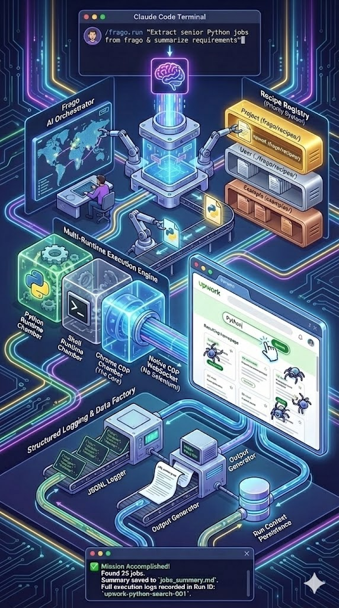

# Frago - Multi-Runtime Automation Infrastructure

[](https://opensource.org/licenses/MIT)
[](https://www.python.org/downloads/)
[](https://github.com/tsaijamey/Frago)
[](https://www.google.com/chrome/)
[](https://claude.ai/code)

[简体中文](README.zh-CN.md)

Multi-runtime automation infrastructure designed for AI agents, providing persistent context management and reusable Recipe system.

**Docs**: [Installation](docs/installation.md) · [User Guide](docs/user-guide.md) · [Recipes](docs/recipes.md) · [Architecture](docs/architecture.md) · [Use Cases](docs/use-cases.md) · [Development](docs/development.md)

---

## What Problems Does Frago Solve

AI agents face three core pain points when executing automation tasks:

### 1. No Working Memory

Every task starts from scratch, unable to remember previous work:

- Repeated reasoning of same operation flows (browser DOM structure, system commands, API calls)
- Validated scripts and methods cannot accumulate
- Similar tasks require re-exploration, wasting tokens and time

### 2. Tool Discovery Difficulty

Unaware of available automation capabilities:

- No standardized tool catalog and capability descriptions
- Validated automation scripts scattered in conversation history
- AI cannot automatically discover and invoke existing tools

### 3. Requires Continuous Manual Intervention

Unable to autonomously complete complex multi-step tasks:

- Lack of task context management, difficult to handle interruptions and recovery
- Lack of standardized execution logs, unable to trace and audit
- Complex tasks require continuous human participation in every step

---

## Solutions



Frago provides three core systems to solve the above problems:

### 🧠 Run System - AI's Working Memory

Persistent task context, recording complete exploration process:

```bash
# Create task instance
uv run frago run init "Research YouTube subtitle extraction methods"

# All subsequent operations automatically link to this instance
uv run frago navigate https://youtube.com/watch?v=...
uv run frago screenshot step1.png
uv run frago run log --step "Locate subtitle button" --data '{"selector": "..."}'

# Persistent storage
projects/youtube-transcript-research/
├── logs/execution.jsonl          # Structured logs
├── screenshots/                  # Screenshot archive
├── scripts/                      # Validated scripts
└── outputs/                      # Output files
```

**Value**: Avoid repeated exploration, accumulate auditable execution history.

### 📚 Recipe System - AI's "Muscle Memory"

Metadata-driven reusable automation scripts, AI can automatically discover and use:

```yaml
# examples/atomic/chrome/youtube_extract_video_transcript.md
---
name: youtube_extract_video_transcript
type: atomic
runtime: chrome-js
description: "Extract complete transcript text from YouTube videos"
use_cases:
  - "Batch extract video subtitle content for text analysis"
  - "Create indexes or summaries for videos"
output_targets: [stdout, file]
---
```

```bash
# AI discovers available Recipes
uv run frago recipe list --format json

# Execute Recipe
uv run frago recipe run youtube_extract_video_transcript \
  --params '{"url": "..."}' \
  --output-file transcript.txt
```

**Value**: Solidify high-frequency operations, avoid repeated AI reasoning, support three-tier priority management (Project > User > Example).

### ⚡ Native CDP - Lightweight Execution Engine

Direct connection to Chrome DevTools Protocol, no Playwright/Selenium dependencies:

```bash
# Navigate
uv run frago navigate https://github.com

# Click element
uv run frago click 'button[type="submit"]'

# Execute JavaScript
uv run frago exec-js 'document.title' --return-value

# Screenshot
uv run frago screenshot output.png
```

**Architecture Comparison**:

```
Playwright:  Python → Node.js relay → CDP → Chrome  (~100MB)
Frago:       Python → CDP → Chrome                  (~2MB)
```

**Value**: Lightweight deployment, persistent browser sessions, direct connection without relay latency.

---

## Core Features

| Feature                    | Description                                                     |
| -------------------------- | --------------------------------------------------------------- |
| 🧠 **Run Command System**  | Topic-based task management, persistent context and JSONL logs |
| 📚 **Recipe Metadata**     | Reusable scripts, AI-discoverable, three-tier priority support |
| ⚡ **Native CDP**          | ~2MB lightweight, direct Chrome connection, no Node.js deps    |
| 🔄 **Multi-Runtime**       | Chrome JS, Python, Shell three runtime support                 |
| 📊 **Structured Logs**     | JSONL format, 100% programmatically parseable and auditable    |
| 🤖 **AI-Driven Tasks**     | Claude Code slash command integration (`/frago.run`)           |

---

## Quick Start

### Installation

```bash
# Basic installation (core features)
pip install frago
# Or use uv (recommended)
uv add frago

# Initialize environment (check dependencies, configure auth, install resources)
frago init
```

### What `frago init` Does

The init command sets up your environment in one step:

- **Checks dependencies**: Node.js ≥18.0.0, Claude Code CLI
- **Auto-installs missing deps**: Node.js via nvm, Claude Code via npm
- **Configures authentication**: Default (Claude Code built-in) or custom API endpoint (DeepSeek, Aliyun, Kimi, MiniMax)
- **Installs resources**: Slash commands to `~/.claude/commands/`, example recipes to `~/.frago/recipes/`

```bash
# View current config and resources
frago init --show-config

# Reset and re-initialize
frago init --reset
```

See [Installation Guide](docs/installation.md) for details

### Basic Usage

#### 1. Create and Manage Run Instances

```bash
# Create task instance
uv run frago run init "Search for Python jobs on Upwork"

# Set current working context
uv run frago run set-context <run_id>

# Execute operations and log
uv run frago navigate https://upwork.com/search
uv run frago run log \
  --step "Navigate to search page" \
  --status "success" \
  --action-type "navigation" \
  --execution-method "command"

# View instance details
uv run frago run info <run_id>
```

#### 2. Use Recipes

```bash
# List available Recipes
uv run frago recipe list

# View Recipe details
uv run frago recipe info youtube_extract_video_transcript

# Execute Recipe
uv run frago recipe run youtube_extract_video_transcript \
  --params '{"url": "https://youtube.com/watch?v=..."}' \
  --output-file transcript.txt
```

#### 3. Claude Code Integration (AI-Driven Tasks)

Use slash commands in Claude Code:

```
/frago.run Search for Python jobs on Upwork and analyze skill requirements
```

AI will automatically:

1. Discover or create Run instance
2. Invoke CDP commands and Recipes
3. Log all operations to structured logs
4. Generate execution reports and output files

---

## Comparison with Other Tools

### Frago vs Playwright/Selenium

| Dimension              | Playwright/Selenium                       | Frago                                        |
| ---------------------- | ----------------------------------------- | -------------------------------------------- |
| **Design Goal**        | Test automation framework                 | AI-driven multi-runtime automation infra     |
| **Core Scenarios**     | E2E testing, UI testing                   | Data collection, workflow orchestration, AI  |
| **Browser Management** | Complete lifecycle (launch→test→close)    | Connect to existing CDP instance (persistent)|
| **Deployment Size**    | ~100MB + Node.js                          | ~2MB (pure Python WebSocket)                 |
| **Architecture**       | Double RPC (Python→Node.js→Browser)       | Direct CDP (Python→Browser)                  |
| **Knowledge Base**     | None                                      | Recipe metadata-driven system                |

**Use Case Selection**:

- Need quality assurance, regression testing → Playwright/Selenium
- Need data collection, AI automation, knowledge accumulation → Frago

See [Architecture Comparison](docs/architecture.md#core-differences) for details

---

## Documentation Navigation

- **[Use Cases](docs/use-cases.md)** - Complete workflow from Recipe creation to Workflow orchestration
- **[Architecture](docs/architecture.md)** - Core differences, technology choices, system design
- **[Installation](docs/installation.md)** - Installation methods, dependencies, optional features
- **[User Guide](docs/user-guide.md)** - CDP commands, Recipe management, Run system
- **[Recipe System](docs/recipes.md)** - AI-First design, metadata-driven, Workflow orchestration
- **[Development](docs/development.md)** - Project structure, development standards, testing methods
- **[Roadmap](docs/roadmap.md)** - Completed features, todos, version planning

---

## Project Status

📍 **Current Stage**: Run command system completed, multi-runtime automation infrastructure ready

**Completed (Feature 005)**:

- ✅ Run command system - Topic-based task management and context accumulation
- ✅ Structured logs - JSONL format execution records
- ✅ AI-driven task execution - `/frago.run` slash command integration
- ✅ Run instance auto-discovery - RapidFuzz-based fuzzy matching
- ✅ Complete test coverage - unit tests, integration tests, contract tests

**Core Infrastructure**:

- ✅ Native CDP protocol layer (direct Chrome control)
- ✅ Recipe metadata-driven architecture (multi-runtime support)
- ✅ CLI tools and command system
- ✅ Three-tier Recipe management system

See [Roadmap](docs/roadmap.md) and [Run Command System Spec](specs/005-run-command-system/spec.md) for details

---

## License

MIT License - see [LICENSE](LICENSE) file

## Author

**Jamey Tsai** - [caijia@frago.ai](mailto:caijia@frago.ai)

Project founder and primary maintainer

## Contributing

Issues and Pull Requests are welcome!

- Project issues: [Submit Issue](https://github.com/tsaijamey/Frago/issues)
- Technical discussion: [Discussions](https://github.com/tsaijamey/Frago/discussions)

---

Created with Claude Code | 2025-11
