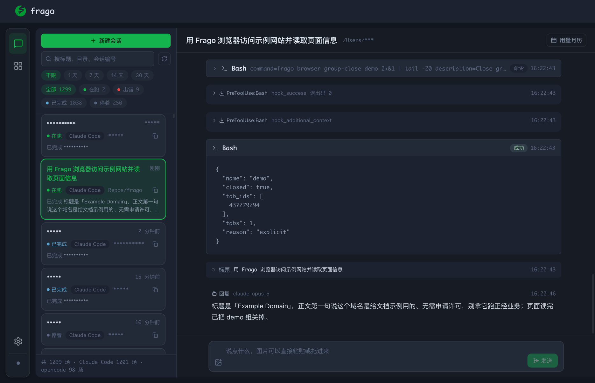
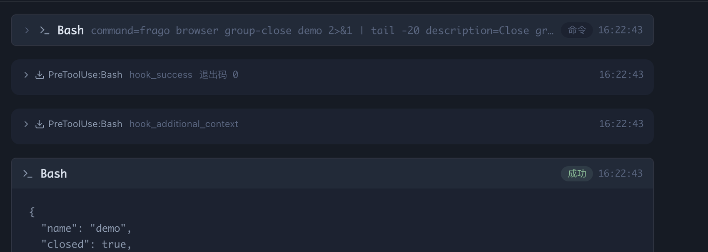
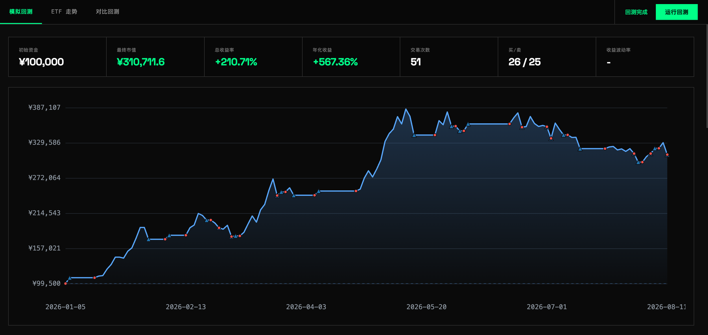
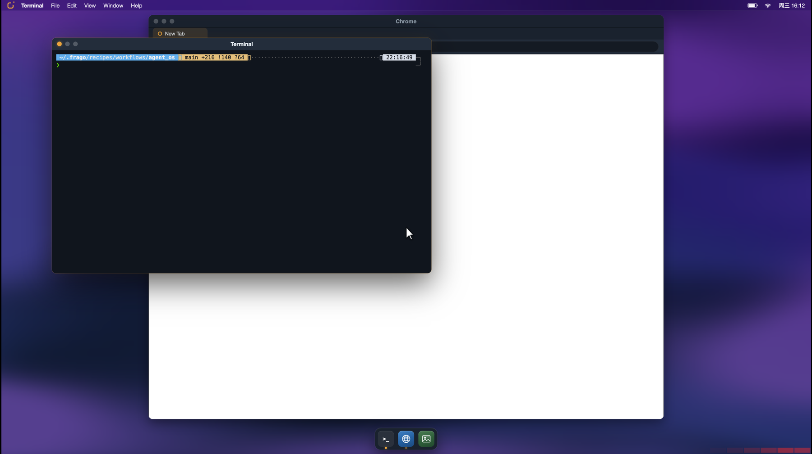
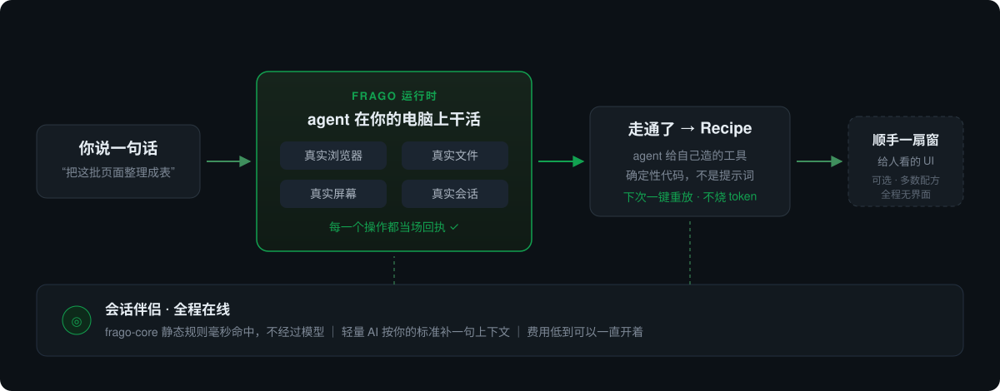

# frago

**让你的电脑成为 AI agent 的操作系统**

简体中文 · [English](README.md) · [使用指南](docs/user-guide.zh-CN.md) · [配方系统](docs/recipes.zh-CN.md) · [讨论区](https://github.com/tsaijamey/frago/discussions)

> frago 与 OpenClaw（龙虾）无关。frago 的启动时间早于 OpenClaw 约一个月。

## Why frago

CLI Agent 一定程度上很好用，但也并没有那么方便。尤其是对大部分普通人而言。

对于 Agent 来说，CLI 可能是最佳的形态，因为 CLI 使其操控系统更容易。**但是对于人类而言并不是。**

且几乎所有的 CLI Agent 都无法直接使用你已经登录过某些站点的浏览器，比如 Twitter，于是它们即便能操纵浏览器，也无法自主地帮你翻阅 Twitter。

而且 CLI Agent 并没有为多 Agent 同时操控浏览器做任何自身的优化，于是两个任务会互相踩对方的标签页。

事实证明，当今世界，**绝大多数人缺少的不是选择，而是**一个准备好的 Agent OS，能让他们安装任何高效率的 CLI 后都能**像使用传统的软件一样快速上手。**

现如今你配置好你电脑上的 CLI Agent，还需要花很多时间去折腾更多的配置，你换一台电脑，所有的东西都要重来。这种消耗，对你使用 AI 挣钱、提高效率，只有副作用。

## 一句话理解 frago

frago 是另一个龙虾、另一个 Hermes 吗？

不是。

假设你与 Agent 合作，你们俩的组合是托尼·斯塔克，那么 frago 就是那套钢铁侠战袍。

斯塔克本人只是个极其聪明的人。但要飞起来、跟绿巨人打一架、拯救世界，光聪明不够——他得先穿上那套战袍。

## frago 帮 Agent 做什么

这一半 Agent 自己用，你平时看不见。

| 子系统 / 指令 | 它带来什么 |
|---|---|
| **Recipes** `frago recipe` | 让 Agent 快速掌握「为自己开发工具」而不是等你配置更多的工具。规范和依赖 frago 都兜住了：依赖写在脚本头上、跑起来隔离现装，密钥由框架注入，配方之间靠固定的 JSON 约定互相调用——Agent 只管写脚本，写完就是一个能反复跑的工具 |
| **实时积累经验** `frago def <domain>` | 边干边把经验存下来，不用等空闲时间再拿另一个上下文不完整的 Agent 来补 |
| **内置宪法知识** `frago book` | 大多数人还得自己准备一份 agent.md，很不友好。frago 内置了一批避坑知识，装完就在 |
| **浏览器** `frago browser` | 市面上帮 Agent 操控浏览器的项目不少，但都很复杂，要装一堆东西。frago 自带一个轻量插件，你只需要准备好 Edge（你自己平时也照用），Agent 就能借这套基础设施把浏览器上的事全办了——用的是你已经登录好的那个浏览器，多个 Agent 各占一个标签组，互不干扰 |
| **会话伴侣** `frago hook-rules` | 通过你的表达理解你，理解什么允许、什么不允许，并且尽可能不再犯同样的错 |
| **Agent OS && frago desktop** `frago desktop` | 一个完全像 macOS/Linux、专门为 Agent 定制的桌面。最早我只是想让 Agent 自己操控界面、自动录制视频；后来觉得，Agent 始终有一个「可以展示给你看」的窗口，本身就是很酷的事。用法你可以继续挖 |
| **代你下发需求** `frago agent` | orchestrator 是一种虚无的用法——十个 Agent 不会比一个聪明十倍，只会更混乱。frago 主张的是：由一个与你实时互动的 Agent 理解你的需求，再由它代表你把需求下发出去。要相信 Agent 写提示词比人类写得更优雅、更准确 |
| **落点检索** `frago context` | 产出该放哪、上次那份放哪了——Agent 自己查，不用你指路 |
| **外部入口** `frago channel` · `frago reply` | 从外部渠道接任务进来、把结果回出去，Agent 不必只在你面前才干活 |

## frago 帮你做什么

这一半是给人的窗口。

| 子系统 / 指令 | 它带来什么 |
|---|---|
| **Server && WebUI** `frago start` · `frago server` | 支持主流 CLI Agent，让你在网页里管理会话 |
| **Providers** `frago profile` | 帮助不熟悉 CLI 的人管理他们的多个不同的 Providers，而 Agent 通过内置知识知道要如何使用这些信息 |
| **会话检索** `frago session search` | 跨 Claude Code / opencode 按意思搜历史会话，而不是靠记得关键词 |
| **定时与常驻** `frago schedule` · `frago daemon` | 配方按点自己跑、长任务常驻后台，不需要你守着 |
| **配方市场** `frago market` · `frago recipe share` | 把配方发出去，也把别人的装进来 |
| **安装运维** `frago client` · `frago update` · `frago autostart` | 桌面客户端、自更新、开机自启，换一台电脑不用从头折腾一遍 |

## 能拿它做什么

上面是指令，这里是场景——都由配方承载，配方由你的 Agent 现写：

- **让你不再需要 Office**，因为你完全可以让 Agent 按照配方规格帮你做一个
- **让你不再需要为一段教学视频重录第七遍**，在虚拟舞台上演一次，录完就是成片
- **让你不再需要把会议录音交给第三方**，转写、提要点、列行动项都在你自己机器上
- **让你不再需要在几个网站之间来回复制粘贴**，Agent 用你已登录的浏览器一趟走完
- **让你不再需要手动整理调研资料**，抓回来、去重、成文、落到固定位置，一条配方到底
- **让你不再需要记住上次那件事怎么做的**，走通过一次，它就是一段随时能重跑的代码

### 🖥 把终端里的 agent，搬进网页

#### 任务：「打开这个网站，把标题和正文第一句读给我」

先说清楚哪部分不是 frago 干的：命令、`成功`、时间戳、返回值，
**是你用的那个 cli-agent 自己产生的**——这台机器上同时跑着 Claude Code 和 opencode，
上图这场恰好是前者。回执它们本来就有，只是各自滚在各自的终端窗口里，管理不方便。

frago 不生产回执，**也不挑边**。它做的是把**每一家**的记录读进来、
归一成同一种形状、变成同一张网页。

|  | 终端里 | frago 网页 |
|---|---|---|
| **翻历史会话** | 类似 resume 的选择器不好用 | 1299 场排成一张列表，可按标题、目录、会话编号搜 |
| **换一个 cli-agent** | 每家一套自己的记录、自己的翻法 | 归一成同一种形状，合成一份清单（图中 Claude Code 1201 场 + opencode 98 场） |
| **一场会话的经过** | 一屏一屏往回翻 | 逐条卡片摊开，按 `在跑 / 已完成 / 停着 / 出错` 分档 |
| **接着往下说** | 得找回那个终端窗口 | 在网页上直接说 |
| **用了多少** | 自己数 | 用量月历 |

对天天泡在 CLI 里的人，这是个方便；
对不用 CLI 的人，这是**能不能用上 agent 的分界线**。

（上图中间那两条 `PreToolUse:Bash` 是会话伴侣插进来的——一条报回执，一条补上下文，见下。）

下面这一层才是 frago 自己干的活：

| 这一层 | frago 的做法 | 你得到的结果 |
|---|---|---|
| **登录态** | 默认驱动你浏览器**自己的真实 profile** | 已经登录的网站直接可用，不用重新扫码 |
| **反爬** | 它**就是**一台真实浏览器，不是模拟器 | 检测天然通过 |
| **并发** | 每个 agent 待在自己的真实标签组里 | 两个 agent 同时干活不打架，扫一眼标签栏就知道哪些页是谁的 |

### 🛠 走通一次之后，agent 会给自己造一个工具

#### 任务：「这套回测以后我要能自己反复调参数」

图为 ¥100,000 虚拟本金的<b>模拟回测</b>，用于展示界面，不构成任何投资建议。

> **这只是其中一个。** 上面这张图来自一台开发机上的 **317 个个人配方**中的一个，
> 挑它出来只是因为它好看。frago 不是炒股工具——同一台机器上的其他配方在做：
> 剪视频、写文章、转写会议、抓 arXiv 论文、扒公开神经科学数据集、
> 合成语音、生成分镜图、整理会话账本、填高考志愿。
> **配方长成什么样，取决于你让 agent 反复做什么。**

这是 frago 和「一个很能干的 agent」最大的区别：走通的路不会烂在聊天记录里，
它被固化成一份 **Recipe**——真正的、确定性的 Python/Shell 代码。

|  | 第一次 | 之后每一次 |
|---|---|---|
| **谁在干** | agent 一步步试 | 一段确定性代码 |
| **过模型吗** | 过 | **不过** |
| **结果** | 这次这样，下次可能那样 | 和上次一模一样 |
| **token** | 烧 | **不烧** |

**Recipe 是 agent 给自己造的工具，不是给人看的文档。**

|  | 给 agent 的那一面 | 给人的那一面 |
|---|---|---|
| **形态** | `recipe.md` + 确定性代码 | `/app/<配方名>` 上的一个网页 |
| **怎么用** | `recipe list --format json` 发现 · `run` 执行 · `schedule` 定时 | 点开，调参数，看结果 |
| **必须有吗** | 是，这是配方本体 | **否**——很多配方从头到尾没有界面，照样是完整的软件 |

只有当一件事**人也需要看一眼**的时候——比如上面这个回测，参数得由人来调、
曲线得由人来判断——配方才顺手挂一个界面上去。界面是可选的那一层，不是终点。

### 🎬 需要演示的时候，它还有一块舞台

#### 任务：「把刚才那套操作录成教学视频」

看着是一块 macOS 桌面，其实底下全是真的：那个终端是真实 tmux 会话，
那个浏览器窗口是真实标签页，鼠标移动和点击可复现。
一次表演，录成视频，随时重放——不用再对着屏幕重录第七遍。

## 工作原理

图里最下面那条是**会话伴侣**，也是最容易被低估的一层。它由两层叠成：

| 层 | 是什么 | 过模型吗 | 命中速度 | 费用 |
|---|---|---|---|---|
| **frago-core** | 静态规则编译进一个 3 MB 的原生二进制 | **否** | 本机实测 34–961 ms，随注入体积走 | **零** |
| **轻量 AI** | 按你自己的标准，在恰当时机补一句上下文 | 是，但只跑很短的提示 | 一次调用 | 极低 |

它做的事只有一件——盯着 agent 别跑偏：

| 常见的跑偏 | 伴侣做的事 |
|---|---|
| 该用浏览器时凭记忆瞎猜 | 当场按住，指回真实浏览器 |
| 产出乱建目录 | 指到已有的落点上 |
| 你纠正过一次的毛病又犯 | 下次同样场景自动提醒 |

因为静态那层根本不花钱、AI 那层只跑很短的提示，**它便宜到可以一直开着**。
设置页实时展示这两层此刻的状态，没有黑话。

## 示例：我个人创建的配方

**仅作示例。** 下面这些**不是 frago 内置的，也不随安装包分发**，更不是什么推荐清单——
它们是我自己机器上的私人配方，围着我自己的生活和工作长出来的，
放在这里只为回答一个问题：配方能长成什么样。

你装完 frago 是一张白纸。配方由**你的** agent 在**你的**重复劳动里长出来，
大概率和下面这几个毫无关系。

| 配方 | agent 做的事 | 人看到的 |
|------|-------------|---------|
| `agent_os` | 把真实 tmux 会话和真实浏览器标签页，重构成一块可脚本操控的虚拟 macOS 桌面 | `/app/agent_os` 上的实时舞台 |
| `etf_backtest_dashboard_v5` | 零参数跑 A股 / 跨境 ETF 策略回测，一组接一组 | 参数滑杆、净值曲线、逐笔盈亏 |
| `etf_kdj_ths_auto_trade` | 盯 5 分钟 KDJ 信号，直接在同花顺客户端下单 | 成交回执和持仓核对（链路里没有 LLM） |
| `gaokao_henan_volunteer_analysis` | 分数换算全省位次，按家庭学费预算与地域匹配院校，主动揭穿民办伪装公办、天价中外合作这类套路 | 一份带可核实清单的报告，另有网页版 |
| `meeting_copilot` | 实时转写会议全程，结合本地材料提炼要点、疑问、行动项，还能克隆音色替你开口 | 滚动的转写稿和提问列表 |
| `article_studio` | 一文一常驻编辑 agent——访谈你、按你的语气顺句、写回 HTML | 左栏文章列表，右栏阅读 + 写作/访谈区 |

## 安装

| 平台 | 下载 |
|------|------|
| **macOS (Apple Silicon)** | [.dmg](https://github.com/tsaijamey/frago/releases/latest) |
| **macOS (Intel)** | [.dmg](https://github.com/tsaijamey/frago/releases/latest) |
| **Windows** | [.msi](https://github.com/tsaijamey/frago/releases/latest) |
| **Linux** | [.deb](https://github.com/tsaijamey/frago/releases/latest) · [.rpm](https://github.com/tsaijamey/frago/releases/latest) · [.AppImage](https://github.com/tsaijamey/frago/releases/latest) |

> 所有下载见 [Releases 页面](https://github.com/tsaijamey/frago/releases/latest)。当前版本：**v1.2.101**。

下载、打开、配好一个模型 profile，然后开工。桌面客户端会自动检查和安装它需要的一切——不需要终端、不需要配环境、不需要自己管理依赖。

## 文档

- [使用指南](docs/user-guide.zh-CN.md) — 安装后的入门指引
- [关键概念](docs/concepts.zh-CN.md) — Recipe、Run、Session 与提示注入如何协作
- [Recipe 系统](docs/recipes.zh-CN.md) — 配方命令面，端到端
- [示例参考](docs/examples.zh-CN.md) — 实际的 Run + Recipe + 浏览器工作流
- [浏览器支持](docs/browser-support.zh-CN.md) — 后端、端口、标签组、桌面舞台
- [开发者文档](docs/developer.zh-CN.md) — CLI、架构、开发环境

产品内部，`frago book` 读取随包分发的知识库——与代码同步的操作手册，两边冲突时以它为准。

## 许可证

AGPL-3.0 — 详见 [LICENSE](LICENSE)

## 贡献

- [提交 Issue](https://github.com/tsaijamey/frago/issues)
- [技术讨论](https://github.com/tsaijamey/frago/discussions)
- [社区配方](community-recipes/README.md)

---

Created with Claude Code

