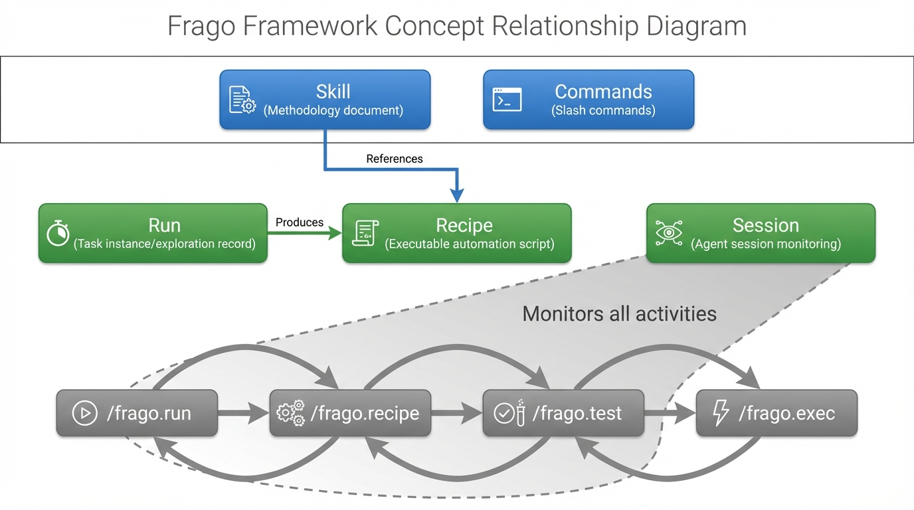

# Key Concepts

This document explains the core concepts in the Frago project and their origins.



---

## Claude Code Concepts (Not Frago Original)

The following concepts come from [Claude Code](https://docs.anthropic.com/en/docs/claude-code). Frago extends upon these concepts.

### Skill (Methodology)

Skill is Claude Code's documentation architecture design, stored in the `.claude/skills/` directory.

**Essence**: Methodology documents that tell AI "how to do a certain type of task".

**Example**: The `video-production` skill describes the complete video production workflow:
1. Split narration, determine emotions
2. Generate voiceover, calculate duration
3. Record footage, fill in materials
4. Compose video, check results

**Characteristics**:
- Everyone can have their own skills (personalized)
- Describes "what to do" and "why do it this way"
- Does not contain actual execution code

### Commands (Slash Commands)

Claude Code's slash command mechanism, stored in the `.claude/commands/` directory.

**Essence**: Quick entry points that trigger specific AI behaviors.

**Examples**: `/frago.run`, `/frago.recipe`, `/frago.exec`, `/frago.test`

---

## Frago Concepts

The following concepts are original designs from the Frago project.

### Recipe

**Essence**: Executable automation scripts with metadata descriptions.

**Storage locations** (three-tier priority):
1. `.frago/recipes/` - Project level (highest priority)
2. `~/.frago/recipes/` - User level
3. `examples/` - Example level

**Structure**:
```
recipe_name/
├── recipe.md    # Metadata (YAML frontmatter)
└── recipe.js    # Execution script (or .py / .sh)
```

**Metadata example**:
```yaml
---
name: youtube_extract_video_transcript
type: atomic
runtime: chrome-js
description: "Extract complete transcript text from YouTube videos"
use_cases:
  - "Batch extract video subtitle content"
  - "Create indexes or summaries for videos"
---
```

**Characteristics**:
- Reusable and shareable
- AI can automatically discover and select through metadata
- Supports multiple runtimes (chrome-js, python, shell)

### Run (Task Instance)

**Essence**: Complete record of an exploration task.

**Storage location**: `projects/<run-name>/`

**Structure**:
```
projects/youtube-transcript-research/
├── logs/execution.jsonl    # Structured execution logs
├── screenshots/            # Screenshot archive
├── scripts/                # Validated scripts
└── outputs/                # Output files
```

**Characteristics**:
- Persistent task context
- Records every step during exploration
- Auditable and traceable

---

## Frago's Contribution

Frago didn't invent new concepts. Instead, it **links Claude Code's skill with Frago's recipe** and provides a complete toolchain.

### Linking Skill and Recipe

| | Skill (Claude Code) | Recipe (Frago) |
|--|---------------------|----------------|
| Essence | Methodology document | Executable script |
| Answers | "What to do", "Why" | "How to do it" |
| Personalizable | Yes, varies per person | No, universally shareable |
| Executable | No, just documentation | Yes, runs directly |

**How they link**: Skill documents reference Recipe names, telling AI which recipe to use at specific steps.

**Example** (in `video-production` skill):
```markdown
### Phase 2: Generate Voiceover

Use recipe: `volcengine_tts_with_emotion`

​```bash
uv run frago recipe run volcengine_tts_with_emotion \
  --params '{"text": "[#excited]Awesome!", "output": "seg_001.wav"}'
​```
```

### Explore → Solidify → Execute Loop

Frago provides four slash commands that form a complete workflow loop:

```
/frago.run     Explore and research, accumulate experience (Output: Run instance)
     ↓
/frago.recipe  Solidify experience into recipes (Output: Recipe)
/frago.test    Validate recipe correctness (while context is fresh)
     ↓
/frago.exec    Execute quickly with skill guidance
```

**Core value**:
- First time: AI explores for you, records the process
- After that: Directly call recipes, no repeated exploration

---

## Comparison with Other Concepts

### vs Workflow Nodes (Dify/Coze/n8n)

| | Workflow Nodes | Frago Recipe |
|--|----------------|--------------|
| Creation method | Manual drag-drop / AI-assisted diagramming | Auto-generated after AI exploration |
| Output | Flowchart (needs maintenance) | Executable script (runs directly) |
| Debugging | Enter platform, read diagram, modify config | AI handles automatically |

### vs RAG

| | RAG | Frago Skill + Recipe |
|--|-----|---------------------|
| Knowledge form | Fragmented vectors | Structured documents + executable scripts |
| Retrieval method | Semantic similarity | AI directly reads documents |
| Use case | Massive knowledge bases | Limited task sets for individuals/teams |
| Complexity | High (requires vector database) | Low (just files) |

### Session (Agent Session)

**Essence**: Real-time record of an AI agent's execution process.

**Storage location**: `~/.frago/sessions/{agent_type}/{session_id}/`

**Structure**:
```
~/.frago/sessions/claude/abc123/
├── metadata.json    # Session metadata (project, time, status)
├── steps.jsonl      # Execution steps (messages, tool calls)
└── summary.json     # Session summary (statistics)
```

**Characteristics**:
- Real-time monitoring via file system watching
- Supports multiple agent types (Claude, Cursor, Cline)
- Enables post-hoc analysis of agent behavior
- Decoupled from the original agent's session storage

---

## Summary

- **Skill** (Claude Code): Methodology, tells AI how to do things
- **Recipe** (Frago): Recipe, specific execution steps
- **Run** (Frago): Task instance, records exploration process
- **Session** (Frago): Agent session, real-time execution monitoring
- **Frago's contribution**: Links all concepts, provides explore → solidify → execute → monitor loop tools
