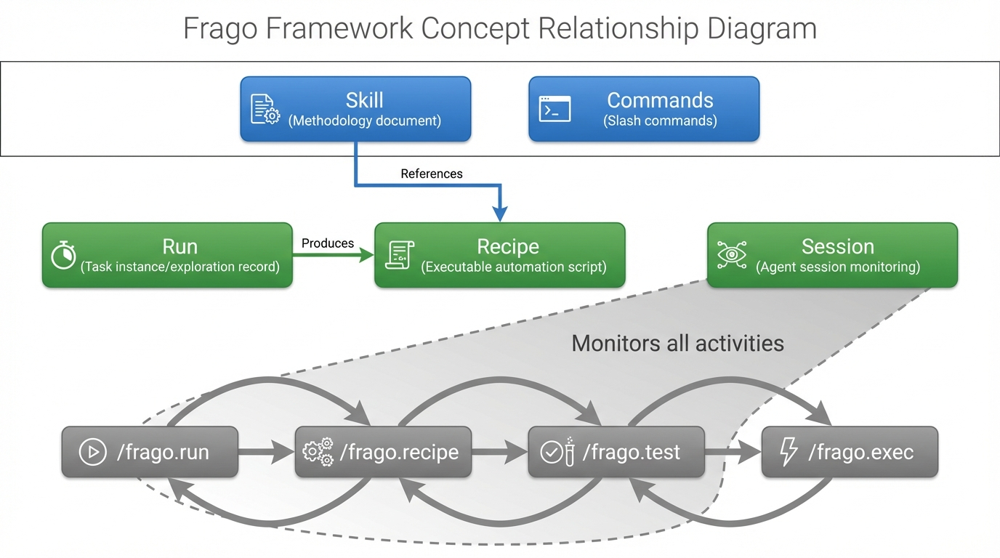

# Key Concepts

This document explains the core concepts in the frago project and their origins.



---

## Claude Code Concepts (Not frago Original)

The following concepts come from [Claude Code](https://docs.anthropic.com/en/docs/claude-code). frago extends upon these concepts.

### Skill (Methodology)

Skill is Claude Code's documentation architecture design, stored in the
agent's skills directory (default `~/.claude/skills/`; other agents use their
own skill directories).

**Essence**: Methodology documents that tell AI "how to do a certain type of task".

**Example**: The `video-production` skill describes the complete video production workflow:
1. Split narration, determine emotions
2. Generate voiceover, calculate duration
3. Record footage, fill in materials
4. Compose video, check results

**Characteristics**:
- Everyone can have their own skills (personalized)
- Describes "what to do" and "why do it this way"
- Does not contain actual execution code

### Commands (Slash Commands)

Claude Code's slash command mechanism, stored in the `.claude/commands/` directory.

**Essence**: Quick entry points that trigger specific AI behaviors.

> frago used to rely on you typing `/frago.run`, `/frago.recipe` or `/frago.test` to trigger things.
> **It doesn't any more.** Knowledge that should surface is pushed to the agent by hooks, per event,
> so nobody has to remember which command to type; drafting and checking recipes runs on
> `frago recipe plan` / `create` / `validate`, below.

---

## frago Concepts

The following concepts are original designs from the frago project.

### Recipe

**Essence**: Executable automation scripts with metadata descriptions.

**Storage locations** (two-tier priority):
1. `~/.frago/recipes/` - User level (highest priority)
2. `~/.frago/community-recipes/` - Community level, installed from
   [frago-recipe-community](https://github.com/tsaijamey/frago-recipe-community)

The frago package ships no recipes of its own.

**Structure** (user recipes live under `~/.frago/recipes/`):
```
atomic/system/<name>/      # Python / shell recipes
├── recipe.md              # Metadata (YAML frontmatter)
└── recipe.py              # Execution script
atomic/browser/<name>/     # Chrome-js recipes (browser automation)
└── recipe.js
workflows/<name>/          # Orchestrated workflows
└── recipe.py
```

**Metadata example**:
```yaml
---
name: youtube_extract_video_transcript
type: atomic
runtime: chrome-js
description: "Extract complete transcript text from YouTube videos"
use_cases:
  - "Batch extract video subtitle content"
  - "Create indexes or summaries for videos"
---
```

**Characteristics**:
- Reusable and shareable
- AI can automatically discover and select through metadata
- Supports multiple runtimes (chrome-js, python, shell)

### Work directories and knowledge domains

> The earlier **Run (task instance)** concept is retired. Its two jobs — holding output and
> keeping what was learned — now belong to separate places, and `~/.frago/projects/` has become
> frago's own session ledger, which agents no longer write to.

**Output** always lands in `~/.frago/data/<subject>/<YYYYMMDD>-<slug>/`. Both levels are required.

```
~/.frago/data/research/20260812-youtube-transcript/
├── scripts/                # Validated scripts
├── outputs/                # Result files
└── screenshots/
```

Look for an existing home before creating one:

```bash
frago context data:<keyword>       # Fuzzy match; reports where matches live
```

**What was learned** goes into a knowledge domain, saved while the work happens rather than after.

```bash
frago def list                     # Which domains exist
frago <domain> find                # What the domain already holds
frago <domain> save --name=<doc> --data='{"tags":["..."]}' --content='[...]'
```

**Characteristics**:
- Output and knowledge are stored separately, each searchable on its own terms
- Knowledge is organized by domain, reusable across sessions and tasks
- Paths follow a hard convention, so things stay findable on another machine

### Prompting (Hint Injection)

frago injects guidance into the agent on every prompt submission, in two
layers:

- **Static rules** — routing rules compiled into the `frago-core` binary,
  combined with user rules in `~/.frago/hook-rules.json`. They match events
  in milliseconds, need no configuration, and are always in effect. Manage
  them with `frago hook-rules`.
- **Lightweight AI** — the last few turns of the conversation, together with
  the rule/book/domain indexes, are sent to a cheap model; its one-line
  verdict is injected back. This layer only exists once a model profile is
  configured. The switch lives in `~/.frago/config.json` →
  `hook_review.enabled` (missing section = on), with `FRAGO_REVIEW=off` as a
  session-scoped override. The settings page shows both layers' live state.

---

## frago's Contribution

frago is an agent OS — an operating system for AI agents. It provides the runtime, resource management, and interface layer that lets agents operate a computer on behalf of users. The concepts above (Recipe, Run, Session) are the core resources that frago manages, just as files, processes, and sockets are resources managed by a traditional OS.

### Linking Skill and Recipe

| | Skill (Claude Code) | Recipe (frago) |
|--|---------------------|----------------|
| Essence | Methodology document | Executable script |
| Answers | "What to do", "Why" | "How to do it" |
| Personalizable | Yes, varies per person | No, universally shareable |
| Executable | No, just documentation | Yes, runs directly |

**How they link**: Skill documents reference Recipe names, telling AI which recipe to use at specific steps.

**Example** (in `video-production` skill):
```markdown
### Phase 2: Generate Voiceover

Use recipe: `volcengine_tts_with_emotion`

​```bash
frago recipe run volcengine_tts_with_emotion \
  --params '{"text": "[#excited]Awesome!", "output": "seg_001.wav"}'
​```
```

### Explore → Solidify → Execute Loop

The recipe command surface carries this loop:

```
the agent works, saving as it goes    explore and research, banked on the spot
  via frago <domain> save
     ↓
frago recipe plan                     draft a recipe spec from what was learned
     ↓
frago recipe create                   generate the recipe from that spec
     ↓
frago recipe validate + run           check it while the context is still fresh
```

**Core value**:
- First time: AI explores for you, and what it learns is banked as it happens
- After that: Directly call recipes, no repeated exploration

> Note: Solidifying is something you start deliberately — frago won't decide for you which piece of exploration deserves to become a recipe.

---

## Comparison with Other Concepts

### vs Workflow Nodes (Dify/Coze/n8n)

| | Workflow Nodes | frago Recipe |
|--|----------------|--------------|
| Creation method | Manual drag-drop / AI-assisted diagramming | AI-assisted creation after exploration |
| Output | Flowchart (needs maintenance) | Executable script (runs directly) |
| Debugging | Enter platform, read diagram, modify config | AI handles automatically |

### vs RAG

| | RAG | frago Skill + Recipe |
|--|-----|---------------------|
| Knowledge form | Fragmented vectors | Structured documents + executable scripts |
| Retrieval method | Semantic similarity | AI directly reads documents |
| Use case | Massive knowledge bases | Limited task sets for individuals/teams |
| Complexity | High (requires vector database) | Low (just files) |

### Session (Agent Session)

**Essence**: Real-time record of an AI agent's execution process.

**Storage location**: `~/.frago/sessions/{agent_type}/{session_id}/`

**Structure**:
```
~/.frago/sessions/claude/abc123/
├── metadata.json    # Session metadata (project, time, status)
├── steps.jsonl      # Execution steps (messages, tool calls)
└── summary.json     # Session summary (statistics)
```

**Characteristics**:
- Real-time monitoring via file system watching
- Monitors multiple agent types — Claude Code, opencode, Cursor, Cline —
  normalized into one record format
- Enables post-hoc analysis of agent behavior

---

## Summary

- **Skill** (Claude Code): Methodology, tells AI how to do things
- **Recipe** (frago): Recipe, specific execution steps
- **Run** (frago): Task instance, records exploration process
- **Session** (frago): Agent session, real-time execution monitoring
- **frago** (agent OS): Provides runtime, resource management, environment sync, and GUI — the operating system layer that makes all the above concepts work together
