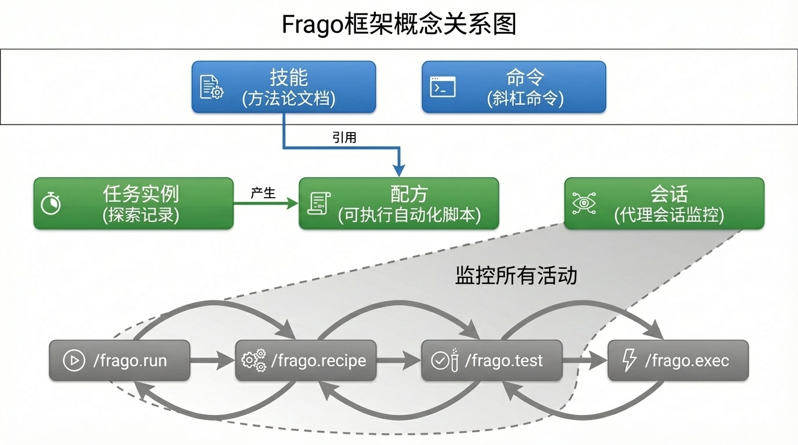

# 关键概念

本文档解释 Frago 项目中的核心概念及其来源。



---

## Claude Code 的概念（非 Frago 原创）

以下概念来自 [Claude Code](https://docs.anthropic.com/en/docs/claude-code)，Frago 基于这些概念进行扩展。

### Skill（方法论）

Skill 是 Claude Code 的文档架构设计，存放在 `.claude/skills/` 目录下。

**本质**：告诉 AI "如何做某类事情"的方法论文档。

**示例**：`video-production` skill 描述了制作视频的完整流程：
1. 拆分朗读稿，确定情感
2. 生成配音，计算时长
3. 录制画面，填入素材
4. 合成视频，检查效果

**特点**：
- 每个人可以有自己的 skill（个性化）
- 描述"做什么"和"为什么这样做"
- 不包含具体的执行代码

### Commands（Slash 命令）

Claude Code 的 slash 命令机制，存放在 `.claude/commands/` 目录下。

**本质**：快捷入口，触发特定的 AI 行为。

**示例**：`/frago.run`、`/frago.recipe`、`/frago.exec`、`/frago.test`

---

## Frago 的概念

以下概念是 Frago 项目的原创设计。

### Recipe（配方）

**本质**：可执行的自动化脚本，带有元数据描述。

**存放位置**（三级优先级）：
1. `.frago/recipes/` - 项目级（最高优先级）
2. `~/.frago/recipes/` - 用户级
3. `examples/` - 示例级

**结构**：
```
recipe_name/
├── recipe.md    # 元数据（YAML frontmatter）
└── recipe.js    # 执行脚本（或 .py / .sh）
```

**元数据示例**：
```yaml
---
name: youtube_extract_video_transcript
type: atomic
runtime: chrome-js
description: "提取 YouTube 视频的完整转录文本"
use_cases:
  - "批量提取视频字幕内容"
  - "为视频创建索引或摘要"
---
```

**特点**：
- 可复用、可共享
- AI 可通过元数据自动发现和选择
- 支持多运行时（chrome-js、python、shell）

### Run（任务实例）

**本质**：一次探索任务的完整记录。

**存放位置**：`projects/<run-name>/`

**结构**：
```
projects/youtube-transcript-research/
├── logs/execution.jsonl    # 结构化执行日志
├── screenshots/            # 截图归档
├── scripts/                # 验证过的脚本
└── outputs/                # 输出文件
```

**特点**：
- 持久化任务上下文
- 记录探索过程中的每一步
- 可审计、可回溯

---

## Frago 的贡献

Frago 不是发明了新概念，而是**将 Claude Code 的 skill 与 Frago 的 recipe 关联起来**，并提供了一套完整的工具链。

### Skill 与 Recipe 的关联

| | Skill（Claude Code） | Recipe（Frago） |
|--|---------------------|-----------------|
| 本质 | 方法论文档 | 可执行脚本 |
| 回答的问题 | "做什么"、"为什么" | "怎么做" |
| 可个性化 | ✅ 每个人不同 | ❌ 通用可共享 |
| 可执行 | ❌ 只是文档 | ✅ 直接运行 |

**关联方式**：Skill 文档中引用 Recipe 名称，告诉 AI 在特定步骤使用特定配方。

**示例**（`video-production` skill 中）：
```markdown
### 阶段 2: 生成配音

使用配方：`volcengine_tts_with_emotion`

​```bash
uv run frago recipe run volcengine_tts_with_emotion \
  --params '{"text": "[#兴奋]太棒了！", "output": "seg_001.wav"}'
​```
```

### 探索 → 固化 → 执行 闭环

Frago 提供四个 slash command，形成完整的工作闭环：

```
/frago.run     探索研究，积累经验（产出：Run 实例）
     ↓
/frago.recipe  将经验固化为配方（产出：Recipe）
/frago.test    验证配方正确性（趁上下文还在）
     ↓
/frago.exec    通过 skill 指导，快速执行
```

**核心价值**：
- 第一次：AI 替你探索，记录过程
- 之后：直接调用配方，不再重复探索

---

## 与其他概念的对比

### vs 工作流节点（Dify/Coze/n8n）

| | 工作流节点 | Frago Recipe |
|--|-----------|--------------|
| 创建方式 | 手动拖拽/AI 辅助画图 | AI 探索后自动生成 |
| 产出物 | 流程图（需要维护） | 可执行脚本（直接运行） |
| 调试方式 | 进平台、看图、改配置 | AI 自动处理 |

### vs RAG

| | RAG | Frago Skill + Recipe |
|--|-----|---------------------|
| 知识形式 | 碎片化的向量 | 结构化的文档 + 可执行脚本 |
| 检索方式 | 语义相似度 | AI 直接阅读文档 |
| 适用场景 | 海量知识库 | 个人/团队的有限任务集 |
| 复杂度 | 高（需要向量数据库） | 低（只是文件） |

### Session（Agent 会话）

**本质**：AI agent 执行过程的实时记录。

**存放位置**：`~/.frago/sessions/{agent_type}/{session_id}/`

**结构**：
```
~/.frago/sessions/claude/abc123/
├── metadata.json    # 会话元数据（项目、时间、状态）
├── steps.jsonl      # 执行步骤（消息、工具调用）
└── summary.json     # 会话摘要（统计信息）
```

**特点**：
- 通过文件系统监控实时监控
- 支持多种 Agent 类型（Claude、Cursor、Cline）
- 支持 Agent 行为的事后分析
- 与原始 Agent 会话存储解耦

---

## 总结

- **Skill**（Claude Code）：方法论，告诉 AI 如何做事
- **Recipe**（Frago）：配方，具体怎么执行
- **Run**（Frago）：任务实例，记录探索过程
- **Session**（Frago）：Agent 会话，实时执行监控
- **Frago 的贡献**：将所有概念关联，提供探索→固化→执行→监控的闭环工具
