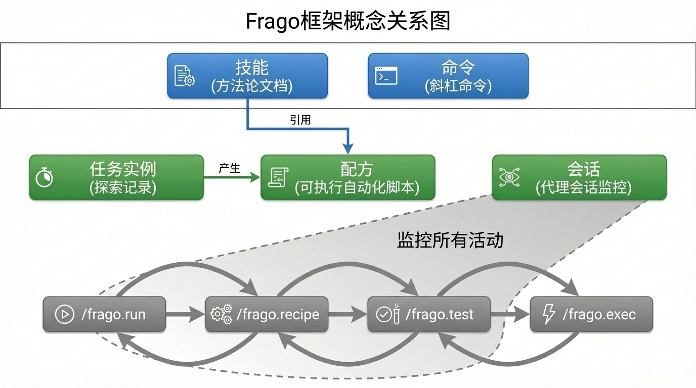

# 关键概念

本文档解释 frago 项目中的核心概念及其来源。



---

## frago 的概念

以下概念是 frago 项目的原创设计。

### Recipe（配方）

**本质**：可执行的自动化脚本，带有元数据描述。

**存放位置**（两级优先级）：
1. `~/.frago/recipes/` - 用户级（最高优先级）
2. `~/.frago/community-recipes/` - 社区级，装自 [frago-recipe-community](https://github.com/tsaijamey/frago-recipe-community)

frago 包本身不带任何配方。

**结构**（用户配方位于 `~/.frago/recipes/` 下）：
```
atomic/system/<name>/      # Python / shell 配方
├── recipe.md              # 元数据（YAML frontmatter）
└── recipe.py              # 执行脚本
atomic/browser/<name>/     # Chrome-js 配方（浏览器自动化）
└── recipe.js
workflows/<name>/          # 编排型工作流
└── recipe.py
```

**元数据示例**：
```yaml
---
name: youtube_extract_video_transcript
type: atomic
runtime: chrome-js
description: "提取 YouTube 视频的完整转录文本"
use_cases:
  - "批量提取视频字幕内容"
  - "为视频创建索引或摘要"
---
```

**特点**：
- 可复用、可共享
- AI 可通过元数据自动发现和选择
- 支持多运行时（chrome-js、python、shell）

### 事务目录与知识域

> 早先的 **Run（任务实例）**已退役。它的两件事——存产出、留经验——现在各有归属，
> `~/.frago/projects/` 也已转为 frago 自己的会话账本，agent 不再往里写。

**存产出**：一律落在 `~/.frago/data/<主体>/<YYYYMMDD>-<slug>/`，两层缺一不可。

```
~/.frago/data/research/20260812-youtube-transcript/
├── scripts/                # 验证过的脚本
├── outputs/                # 结果文件
└── screenshots/
```

建目录之前先查现成落点，别另起炉灶：

```bash
frago context data:<关键词>        # 模糊匹配，只报命中落在哪儿
```

**留经验**：走知识域，干活途中就存，不等事后补。

```bash
frago def list                     # 有哪些域
frago <域名> find                  # 域里已有什么
frago <域名> save --name=<文档名> --data='{"tags":["..."]}' --content='[...]'
```

**特点**：
- 产出和经验分开存，各自可检索
- 经验按域组织，跨会话、跨事务复用
- 路径有硬约定，换台机器也找得到

### 提示注入（Prompting）

frago 在每次提交 prompt 时给 agent 注入提示，分两层：

- **静态规则**——编译进 `frago-core` 二进制的路由规则，叠加
  `~/.frago/hook-rules.json` 里的用户规则。毫秒级匹配、不需要配置、常驻
  生效，用 `frago hook-rules` 管理。
- **轻量 AI**——把最近几轮会话连同规则 / book / 经验域索引交给一个便宜
  模型，换回一句该注入的提示。这一层要有可用的模型 profile 才存在；开关
  在 `~/.frago/config.json` → `hook_review.enabled`（段缺失视为开），
  `FRAGO_REVIEW=off` 可作会话级压过。设置页会展示两层此刻的实际状态。

---

## Claude Code 的概念（非 frago 原创）

以下概念来自 [Claude Code](https://docs.anthropic.com/en/docs/claude-code)，frago 基于这些概念进行扩展。

### Skill（方法论）

Skill 是 Claude Code 的文档架构设计，存放在 agent 的技能目录下（默认
`~/.claude/skills/`；其他 agent 使用各自的技能目录）。

**本质**：告诉 AI "如何做某类事情"的方法论文档。

**示例**：`video-production` skill 描述了制作视频的完整流程：
1. 拆分朗读稿，确定情感
2. 生成配音，计算时长
3. 录制画面，填入素材
4. 合成视频，检查效果

**特点**：
- 每个人可以有自己的 skill（个性化）
- 描述"做什么"和"为什么这样做"
- 不包含具体的执行代码

### Commands（Slash 命令）

Claude Code 的 slash 命令机制，存放在 `.claude/commands/` 目录下。

**本质**：快捷入口，触发特定的 AI 行为。

> frago 早期依赖用户自己敲 `/frago.run`、`/frago.recipe`、`/frago.test` 来触发，**现在不是了**。
> 该出现的知识由 hook 按事件自动推给 agent，不需要人记住该敲哪条；
> 配方的起草与验证走 `frago recipe plan` / `create` / `validate`，见下。

---

## frago 的贡献

frago 不是发明了新概念，而是**将 Claude Code 的 skill 与 frago 的 recipe 关联起来**，并提供了一套完整的工具链。

### Skill 与 Recipe 的关联

| | Skill（Claude Code） | Recipe（frago） |
|--|---------------------|-----------------|
| 本质 | 方法论文档 | 可执行脚本 |
| 回答的问题 | "做什么"、"为什么" | "怎么做" |
| 可个性化 | ✅ 每个人不同 | ❌ 通用可共享 |
| 可执行 | ❌ 只是文档 | ✅ 直接运行 |

**关联方式**：Skill 文档中引用 Recipe 名称，告诉 AI 在特定步骤使用特定配方。

**示例**（`video-production` skill 中）：
```markdown
### 阶段 2: 生成配音

使用配方：`volcengine_tts_with_emotion`

​```bash
frago recipe run volcengine_tts_with_emotion \
  --params '{"text": "[#兴奋]太棒了！", "output": "seg_001.wav"}'
​```
```

### 探索 → 固化 → 执行 闭环

这一闭环由 recipe 命令面承担：

```
agent 干活，边干边 frago <域名> save    探索研究，经验当场入库
     ↓
frago recipe plan                       把经验起草成配方规格
     ↓
frago recipe create                     按规格生成配方
     ↓
frago recipe validate + run             验证配方，趁上下文还在
```

**核心价值**：
- 第一次：AI 替你探索，经验当场沉淀
- 之后：直接调用配方，不再重复探索

> 注：固化这一步需要你手动发起，frago 不会替你决定哪段探索值得变成配方。

---

## 与其他概念的对比

### vs 工作流节点（Dify/Coze/n8n）

| | 工作流节点 | frago Recipe |
|--|-----------|--------------|
| 创建方式 | 手动拖拽/AI 辅助画图 | 探索后 AI 辅助创建 |
| 产出物 | 流程图（需要维护） | 可执行脚本（直接运行） |
| 调试方式 | 进平台、看图、改配置 | AI 自动处理 |

### vs RAG

| | RAG | frago Skill + Recipe |
|--|-----|---------------------|
| 知识形式 | 碎片化的向量 | 结构化的文档 + 可执行脚本 |
| 检索方式 | 语义相似度 | AI 直接阅读文档 |
| 适用场景 | 海量知识库 | 个人/团队的有限任务集 |
| 复杂度 | 高（需要向量数据库） | 低（只是文件） |

### Session（Agent 会话）

**本质**：AI agent 执行过程的实时记录。

**存放位置**：`~/.frago/sessions/{agent_type}/{session_id}/`

**结构**：
```
~/.frago/sessions/claude/abc123/
├── metadata.json    # 会话元数据（项目、时间、状态）
├── steps.jsonl      # 执行步骤（消息、工具调用）
└── summary.json     # 会话摘要（统计信息）
```

**特点**：
- 通过文件系统监控实时监控
- 监控多种 Agent 类型——Claude Code、opencode、Cursor、Cline——统一规整为一种记录格式
- 支持 Agent 行为的事后分析

---

## 总结

- **Skill**（Claude Code）：方法论，告诉 AI 如何做事
- **Recipe**（frago）：配方，具体怎么执行
- **Run**（frago）：任务实例，记录探索过程
- **Session**（frago）：Agent 会话，实时执行监控
- **frago 的贡献**：将所有概念关联，提供探索→固化→执行→监控的工具链
