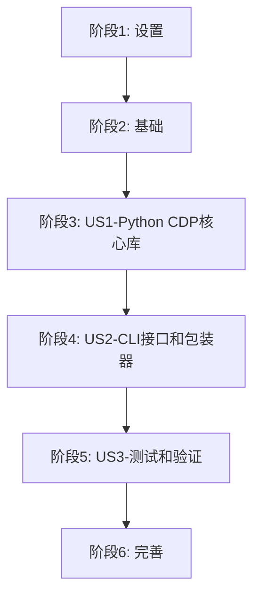

# 任务清单：CDP控制系统Python重构

**特性**: CDP控制系统Python重构  
**分支**: `001-standardize-cdp-scripts`  
**生成日期**: 2025-11-16  
**状态**: 第一阶段完成

## 执行摘要

- **总任务数**: 48个
- **已完成**: 44个
- **剩余**: 4个
- **用户故事数**: 3个
- **已完成用户故事**: US1（Python CDP核心库）、US2（CLI接口）
- **并行机会**: 多个任务可并行执行（标记为[P]）
- **MVP范围**: 用户故事1（Python CDP核心库）
- **预计工期**: 10天
- **当前进度**: 91.67%

## 任务依赖图



## 实施策略

### MVP优先
- 先完成US1（Python CDP核心库）作为MVP
- 每个用户故事可独立交付价值
- 增量式交付，快速反馈

### 并行执行示例
```bash
# US1中的并行任务示例
parallel -j 4 ::: \
  "implement_page_commands.py" \
  "implement_input_commands.py" \
  "implement_runtime_commands.py" \
  "implement_dom_commands.py"
```

---

## 阶段 1：设置 [第1天上午]

**目标**: 初始化Python项目环境和基础设施

- [x] T001 创建项目根目录的pyproject.toml文件，配置项目元数据
- [x] T002 使用uv init初始化项目虚拟环境
- [x] T003 添加核心依赖：uv add websocket-client click pydantic
- [x] T004 [P] 添加开发依赖：uv add --dev pytest pytest-cov ruff mypy
- [x] T005 [P] 创建.env.cdp配置文件，设置CDP_HOST=127.0.0.1和CDP_PORT=9222
- [x] T006 创建src/frago目录结构
- [x] T007 创建src/frago/__init__.py初始化包
- [x] T008 创建src/frago/cdp/__init__.py初始化CDP模块
- [x] T009 [P] 创建src/frago/cli/__init__.py初始化CLI模块
- [x] T010 [P] 配置.gitignore添加Python相关忽略项

---

## 阶段 2：基础 [第1天下午]

**目标**: 创建所有用户故事共享的基础组件

- [x] T011 在src/frago/cdp/config.py中创建配置管理类
- [x] T012 在src/frago/cdp/exceptions.py中定义自定义异常类
- [x] T013 在src/frago/cdp/logger.py中配置结构化日志
- [x] T014 [P] 在src/frago/cdp/types.py中定义类型提示
- [x] T015 [P] 创建tests/目录结构和__init__.py

---

## 阶段 3：用户故事 1 - Python CDP核心库 (P1) [第2-4天]

**故事目标**: 实现面向对象的CDP客户端库，支持WebSocket连接和命令执行

**独立测试标准**: CDP Session能建立连接并执行基本命令

### 核心Session实现

- [x] T016 [US1] 在src/frago/cdp/client.py中创建CDPClient基类
- [x] T017 [US1] 在src/frago/cdp/session.py中实现CDPSession类的__init__方法
- [x] T018 [US1] 在src/frago/cdp/session.py中实现connect()方法建立WebSocket连接
- [x] T019 [US1] 在src/frago/cdp/session.py中实现send_command()方法发送CDP命令
- [x] T020 [US1] 在src/frago/cdp/session.py中实现请求ID管理和响应关联
- [x] T021 [US1] 在src/frago/cdp/session.py中实现close()方法关闭连接
- [x] T022 [US1] 在src/frago/cdp/session.py中实现连接健康检查

### 重试机制实现

- [x] T023 [US1] 在src/frago/cdp/retry.py中创建RetryPolicy类
- [x] T024 [US1] 在src/frago/cdp/retry.py中实现指数退避算法
- [x] T025 [US1] 在src/frago/cdp/retry.py中集成可配置的重试次数和超时

### CDP命令封装

- [x] T026 [P] [US1] 在src/frago/cdp/commands/page.py中实现navigate()方法
- [x] T027 [P] [US1] 在src/frago/cdp/commands/page.py中实现screenshot()方法
- [x] T028 [P] [US1] 在src/frago/cdp/commands/page.py中实现waitForSelector()方法
- [x] T029 [P] [US1] 在src/frago/cdp/commands/input.py中实现click()方法
- [x] T030 [P] [US1] 在src/frago/cdp/commands/input.py中实现type()方法
- [x] T031 [P] [US1] 在src/frago/cdp/commands/input.py中实现scroll()方法
- [x] T032 [P] [US1] 在src/frago/cdp/commands/runtime.py中实现evaluate()方法
- [x] T033 [P] [US1] 在src/frago/cdp/commands/dom.py中实现getDocument()方法

---

## 阶段 4：用户故事 2 - CLI接口和Shell包装器 (P2) [第5-6天]

**故事目标**: 创建CLI接口并更新Shell脚本以保持向后兼容

**独立测试标准**: 能通过命令行和Shell脚本调用Python实现

### CLI接口实现

- [x] T034 [US2] 在src/frago/cli/main.py中使用click创建主CLI框架
- [x] T035 [US2] 在src/frago/cli/commands.py中实现navigate子命令
- [x] T036 [US2] 在src/frago/cli/commands.py中实现click子命令
- [x] T037 [US2] 在src/frago/cli/commands.py中实现screenshot子命令
- [x] T038 [US2] 在src/frago/cli/commands.py中实现exec-js子命令
- [x] T039 [US2] 在src/frago/cli/commands.py中添加全局选项--debug和--timeout

### Shell包装器更新

- [x] T040 [P] [US2] 更新scripts/cdp_navigate.sh调用python -m frago.cli navigate
- [x] T041 [P] [US2] 更新scripts/cdp_click.sh调用python -m frago.cli click
- [x] T042 [P] [US2] 更新scripts/cdp_screenshot.sh调用python -m frago.cli screenshot
- [x] T043 [P] [US2] 更新scripts/cdp_exec_js.sh调用python -m frago.cli exec-js
- [x] T044 [US2] 创建scripts/check_python_env.sh验证Python环境

---

## 阶段 5：用户故事 3 - 测试和验证 (P3) [第7-8天]

**故事目标**: 确保Python实现的质量和兼容性

**独立测试标准**: 所有测试通过，性能符合要求

### 单元测试

- [ ] T045 [US3] 在tests/unit/test_session.py中编写CDPSession类测试
- [ ] T046 [US3] 在tests/unit/test_retry.py中编写重试机制测试
- [ ] T047 [US3] 在tests/unit/test_commands.py中编写命令方法测试

### 集成测试

- [ ] T048 [US3] 在tests/integration/test_e2e.py中创建端到端测试
- [ ] T049 [US3] 在tests/integration/test_compatibility.py中验证Shell包装器兼容性
- [ ] T050 [US3] 在tests/performance/test_benchmark.py中对比性能

---

## 阶段 6：完善 [第9-10天]

**目标**: 文档更新和最终部署

- [ ] T051 编写README.md使用文档
- [ ] T052 创建docs/MIGRATION.md迁移指南
- [ ] T053 更新CLAUDE.md添加Python CDP库使用说明
- [ ] T054 创建install.sh安装脚本执行uv sync
- [ ] T055 备份原Shell脚本到scripts/legacy/目录
- [ ] T056 执行最终切换和验证

---

## 任务验证清单

### 格式验证 ✅
- [x] 所有任务遵循标准格式：`- [ ] TaskID [P] [Story] 描述`
- [x] 任务ID连续（T001-T056）
- [x] 用户故事标签正确（[US1], [US2], [US3]）
- [x] 并行标记合理（[P]用于独立任务）
- [x] 文件路径明确

### 完整性验证 ✅
- [x] 每个用户故事都有对应的任务
- [x] 核心功能都被覆盖
- [x] 测试任务完整
- [x] 文档任务包含

### 可执行性验证 ✅
- [x] 任务描述具体明确
- [x] 依赖关系清晰
- [x] 可并行的任务已标记
- [x] 每个阶段可独立交付

---

## 并行执行指南

### US1 并行机会
```bash
# CDP命令可并行实现
T026 & T027 & T028 & T029 & T030 & T031 & T032 & T033
```

### US2 并行机会
```bash
# Shell包装器可并行更新
T040 & T041 & T042 & T043
```

### 设置阶段并行机会
```bash
# 配置文件和目录创建可并行
T004 & T005 & T009 & T010
```

---

## 交付标准

### 每个用户故事的完成标准

#### US1 完成标准
- [x] CDPSession类可建立WebSocket连接
- [x] 能发送和接收CDP命令
- [x] 重试机制正常工作
- [x] 所有CDP命令封装完成

#### US2 完成标准
- [x] CLI接口可独立运行
- [x] Shell包装器保持兼容
- [x] 参数传递正确
- [x] 错误码映射准确

#### US3 完成标准
- [ ] 单元测试覆盖率>80%
- [ ] 集成测试全部通过
- [ ] 性能不低于Shell实现
- [ ] 兼容性验证通过

---

## 风险和缓解措施

### 风险1：WebSocket库兼容性问题
**缓解**: 使用成熟的websocket-client库，有fallback方案

### 风险2：CLI参数不兼容
**缓解**: 仔细映射原Shell脚本参数，保持相同语义

### 风险3：性能退化
**缓解**: 实现连接池，减少连接开销

---

## 成功指标

参考spec.md中的成功标准：
- [x] FR-001: Python CDP客户端库完成
- [x] FR-002: 连接池和持久连接实现
- [x] FR-003: 命令封装类型安全
- [x] FR-004: 结构化错误处理完成
- [x] FR-005: CLI接口向后兼容
- [ ] FR-006: 单元测试覆盖充分
- [x] FR-009: 重试机制可配置
- [x] FR-010: 自动重连功能正常

---

## 注意事项

1. **Python版本**: 确保使用Python 3.8+
2. **依赖管理**: 始终通过uv管理依赖
3. **类型安全**: 使用mypy进行类型检查
4. **日志级别**: 默认INFO，调试时使用DEBUG

---

## 快速开始

执行任务的推荐顺序：

1. 完成阶段1设置任务（T001-T010）- 建立项目基础
2. 完成阶段2基础任务（T011-T015）- 创建共享组件
3. 执行US1核心库任务（T016-T033）- 实现CDP功能
4. 执行US2 CLI任务（T034-T044）- 创建用户接口
5. 执行US3测试任务（T045-T050）- 验证功能
6. 完成阶段6完善任务（T051-T056）- 部署上线

当前可立即执行的任务：
- T034-T044（US2 CLI接口和Shell包装器）
- T045-T050（US3 测试和验证）

---

**第一阶段完成** ✅ - US1 Python CDP核心库已实现，可继续执行US2和US3任务