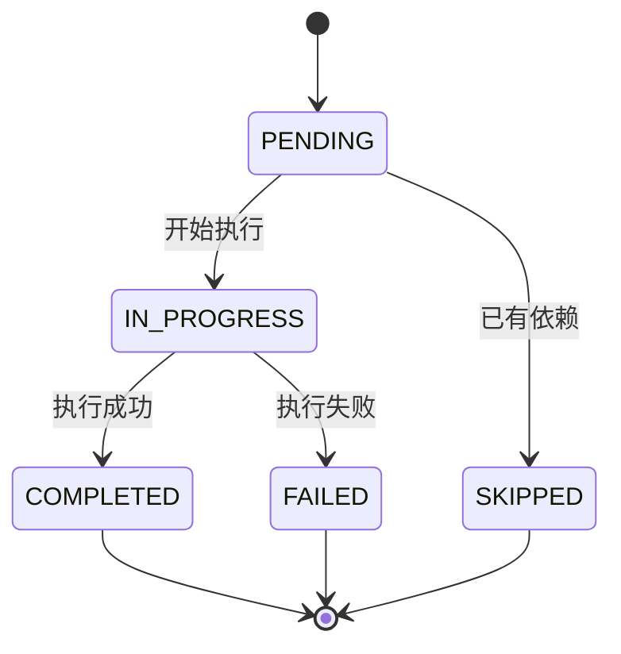
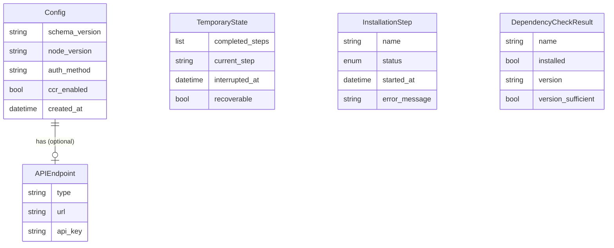

# Data Model: Frago 环境初始化命令

**Feature**: 006-init-command
**Date**: 2025-11-25
**Related**: [spec.md](./spec.md) | [plan.md](./plan.md) | [research.md](./research.md)

本文档定义 `frago init` 命令涉及的所有数据实体和状态机。

---

## 1. Config（配置实体）

### 用途

存储用户的完整配置信息，持久化到 `~/.frago/config.json`。

### 字段定义

| 字段名 | 类型 | 必填 | 默认值 | 说明 |
|-------|------|------|-------|------|
| `schema_version` | `str` | ✅ | `"1.0"` | 配置文件格式版本 |
| `node_version` | `Optional[str]` | ❌ | `None` | Node.js 版本（如 `"20.11.0"`） |
| `node_path` | `Optional[str]` | ❌ | `None` | Node.js 可执行文件路径 |
| `npm_version` | `Optional[str]` | ❌ | `None` | npm 版本（如 `"10.2.4"`） |
| `claude_code_version` | `Optional[str]` | ❌ | `None` | Claude Code 版本（如 `"0.5.0"`） |
| `claude_code_path` | `Optional[str]` | ❌ | `None` | Claude Code 可执行文件路径 |
| `auth_method` | `Literal["official", "custom"]` | ✅ | `"official"` | 认证方式（互斥选择） |
| `api_endpoint` | `Optional[APIEndpoint]` | ❌ | `None` | 自定义 API 端点配置（仅 `auth_method="custom"` 时有值） |
| `ccr_enabled` | `bool` | ✅ | `False` | 是否启用 Claude Code Router |
| `ccr_config_path` | `Optional[str]` | ❌ | `None` | CCR 配置文件路径 |
| `created_at` | `datetime` | ✅ | `datetime.now()` | 配置创建时间（ISO 8601 格式） |
| `updated_at` | `datetime` | ✅ | `datetime.now()` | 配置最后更新时间 |
| `init_completed` | `bool` | ✅ | `False` | init 流程是否完整完成 |

### 嵌套实体：APIEndpoint

| 字段名 | 类型 | 必填 | 说明 |
|-------|------|------|------|
| `type` | `Literal["deepseek", "aliyun", "m2", "custom"]` | ✅ | 端点类型 |
| `url` | `Optional[str]` | ❌ | 端点 URL（type="custom" 时必填） |
| `api_key` | `str` | ✅ | API 密钥 |

### 约束规则

1. **互斥性约束**：
   - `auth_method="official"` → `api_endpoint` MUST be `None`
   - `auth_method="custom"` → `api_endpoint` MUST NOT be `None`

2. **自定义端点约束**：
   - `api_endpoint.type="custom"` → `api_endpoint.url` MUST NOT be `None`
   - `api_endpoint.type` 为预设类型（deepseek/aliyun/m2） → `api_endpoint.url` 可选（使用默认值）

3. **版本兼容性**：
   - 缺失字段使用默认值（Pydantic 自动填充）
   - `schema_version` 不匹配时触发迁移逻辑

### JSON Schema 示例

```json
{
  "schema_version": "1.0",
  "node_version": "20.11.0",
  "node_path": "/usr/local/bin/node",
  "npm_version": "10.2.4",
  "claude_code_version": "0.5.0",
  "claude_code_path": "/usr/local/bin/claude-code",
  "auth_method": "custom",
  "api_endpoint": {
    "type": "deepseek",
    "url": null,
    "api_key": "sk-****"
  },
  "ccr_enabled": false,
  "ccr_config_path": null,
  "created_at": "2025-11-25T10:30:00Z",
  "updated_at": "2025-11-25T10:35:00Z",
  "init_completed": true
}
```

### Pydantic 模型定义

```python
from pydantic import BaseModel, Field, validator
from typing import Optional, Literal
from datetime import datetime

class APIEndpoint(BaseModel):
    type: Literal["deepseek", "aliyun", "m2", "custom"]
    url: Optional[str] = None
    api_key: str

    @validator("url")
    def validate_url(cls, v, values):
        if values.get("type") == "custom" and not v:
            raise ValueError("Custom endpoint requires URL")
        return v

class Config(BaseModel):
    schema_version: str = "1.0"
    node_version: Optional[str] = None
    node_path: Optional[str] = None
    npm_version: Optional[str] = None
    claude_code_version: Optional[str] = None
    claude_code_path: Optional[str] = None
    auth_method: Literal["official", "custom"] = "official"
    api_endpoint: Optional[APIEndpoint] = None
    ccr_enabled: bool = False
    ccr_config_path: Optional[str] = None
    created_at: datetime = Field(default_factory=datetime.now)
    updated_at: datetime = Field(default_factory=datetime.now)
    init_completed: bool = False

    @validator("api_endpoint")
    def validate_auth_consistency(cls, v, values):
        if values.get("auth_method") == "custom" and not v:
            raise ValueError("Custom auth requires api_endpoint")
        if values.get("auth_method") == "official" and v:
            raise ValueError("Official auth cannot have api_endpoint")
        return v
```

---

## 2. TemporaryState（临时状态实体）

### 用途

保存 Ctrl+C 中断时的进度，支持恢复执行。存储于 `~/.frago/.init_state.json`（隐藏文件）。

### 字段定义

| 字段名 | 类型 | 必填 | 默认值 | 说明 |
|-------|------|------|-------|------|
| `completed_steps` | `List[str]` | ✅ | `[]` | 已完成的步骤名称列表 |
| `current_step` | `Optional[str]` | ❌ | `None` | 当前正在执行的步骤名称 |
| `interrupted_at` | `datetime` | ✅ | `datetime.now()` | 中断时间（ISO 8601 格式） |
| `recoverable` | `bool` | ✅ | `True` | 是否可恢复（Ctrl+C=true, 安装失败=false） |

### 生命周期

| 阶段 | 操作 | 文件状态 |
|------|------|---------|
| **init 开始** | 创建空状态文件 | `{"completed_steps": [], "current_step": "check_dependencies", ...}` |
| **步骤完成** | 追加到 `completed_steps` | `{"completed_steps": ["check_dependencies"], ...}` |
| **Ctrl+C 中断** | 保存当前状态 + `recoverable=true` | 文件保留 7 天 |
| **安装失败** | 不保存（直接退出） | 文件删除或不创建 |
| **成功完成** | 删除状态文件 | 文件消失 |
| **过期检查** | 超过 7 天自动忽略并删除 | 文件删除 |

### 步骤名称枚举

| 步骤名称 | 说明 |
|---------|------|
| `check_dependencies` | 并行检查 Node.js 和 Claude Code |
| `install_node` | 安装 Node.js |
| `install_claude_code` | 安装 Claude Code |
| `configure_auth` | 配置认证方式 |
| `configure_ccr` | 配置 Claude Code Router（可选） |
| `save_config` | 保存配置文件 |

### JSON Schema 示例

```json
{
  "completed_steps": [
    "check_dependencies",
    "install_node"
  ],
  "current_step": "install_claude_code",
  "interrupted_at": "2025-11-25T10:32:15Z",
  "recoverable": true
}
```

### Pydantic 模型定义

```python
from pydantic import BaseModel, Field
from typing import List, Optional
from datetime import datetime, timedelta

class TemporaryState(BaseModel):
    completed_steps: List[str] = Field(default_factory=list)
    current_step: Optional[str] = None
    interrupted_at: datetime = Field(default_factory=datetime.now)
    recoverable: bool = True

    def is_expired(self, days: int = 7) -> bool:
        """检查是否过期"""
        return datetime.now() - self.interrupted_at > timedelta(days=days)

    def add_step(self, step: str):
        """记录完成步骤"""
        if step not in self.completed_steps:
            self.completed_steps.append(step)

    def set_current_step(self, step: str):
        """设置当前步骤"""
        self.current_step = step

    def is_step_completed(self, step: str) -> bool:
        """检查步骤是否已完成"""
        return step in self.completed_steps
```

---

## 3. InstallationStep（安装步骤状态机）

### 用途

跟踪每个安装步骤的执行状态，用于日志记录和错误追踪。

### 状态枚举

```python
from enum import Enum

class StepStatus(str, Enum):
    PENDING = "pending"          # 等待执行
    IN_PROGRESS = "in_progress"  # 正在执行
    COMPLETED = "completed"      # 成功完成
    FAILED = "failed"            # 执行失败
    SKIPPED = "skipped"          # 已跳过
```

### 状态转换规则



### 字段定义

| 字段名 | 类型 | 必填 | 说明 |
|-------|------|------|------|
| `name` | `str` | ✅ | 步骤名称（如 `"install_node"`） |
| `status` | `StepStatus` | ✅ | 当前状态 |
| `started_at` | `Optional[datetime]` | ❌ | 开始时间 |
| `completed_at` | `Optional[datetime]` | ❌ | 完成时间 |
| `error_message` | `Optional[str]` | ❌ | 错误信息（仅 status=FAILED 时有值） |
| `error_code` | `Optional[int]` | ❌ | 错误码（仅 status=FAILED 时有值） |

### Pydantic 模型定义

```python
from pydantic import BaseModel
from typing import Optional
from datetime import datetime
from enum import Enum

class StepStatus(str, Enum):
    PENDING = "pending"
    IN_PROGRESS = "in_progress"
    COMPLETED = "completed"
    FAILED = "failed"
    SKIPPED = "skipped"

class InstallationStep(BaseModel):
    name: str
    status: StepStatus = StepStatus.PENDING
    started_at: Optional[datetime] = None
    completed_at: Optional[datetime] = None
    error_message: Optional[str] = None
    error_code: Optional[int] = None

    def start(self):
        """标记步骤开始"""
        self.status = StepStatus.IN_PROGRESS
        self.started_at = datetime.now()

    def complete(self):
        """标记步骤成功"""
        self.status = StepStatus.COMPLETED
        self.completed_at = datetime.now()

    def fail(self, error: str, code: int):
        """标记步骤失败"""
        self.status = StepStatus.FAILED
        self.completed_at = datetime.now()
        self.error_message = error
        self.error_code = code

    def skip(self):
        """标记步骤跳过"""
        self.status = StepStatus.SKIPPED
        self.completed_at = datetime.now()
```

---

## 4. DependencyCheckResult（依赖检查结果）

### 用途

存储并行依赖检查的结果，用于生成安装计划。

### 字段定义

| 字段名 | 类型 | 说明 |
|-------|------|------|
| `name` | `str` | 依赖名称（`"node"`, `"npm"`, `"claude-code"`） |
| `installed` | `bool` | 是否已安装 |
| `version` | `Optional[str]` | 当前版本（如已安装） |
| `path` | `Optional[str]` | 可执行文件路径（如已安装） |
| `version_sufficient` | `bool` | 版本是否满足要求 |
| `required_version` | `str` | 要求的最低版本 |
| `error` | `Optional[str]` | 检查失败的错误信息 |

### 数据流

```
并行检查 → DependencyCheckResult[] → 分析结果 → 安装计划
```

### Pydantic 模型定义

```python
from pydantic import BaseModel
from typing import Optional

class DependencyCheckResult(BaseModel):
    name: str
    installed: bool = False
    version: Optional[str] = None
    path: Optional[str] = None
    version_sufficient: bool = False
    required_version: str
    error: Optional[str] = None

    def needs_install(self) -> bool:
        """是否需要安装"""
        return not self.installed or not self.version_sufficient

    def display_status(self) -> str:
        """生成显示状态"""
        if not self.installed:
            return f"❌ {self.name}: 未安装"
        elif not self.version_sufficient:
            return f"⚠️  {self.name}: 版本不足 (当前 {self.version}, 要求 {self.required_version})"
        else:
            return f"✅ {self.name}: {self.version}"
```

---

## 5. 数据持久化策略

### 文件位置

| 文件路径 | 用途 | 格式 | 生命周期 |
|---------|------|------|---------|
| `~/.frago/config.json` | 主配置文件 | JSON | 永久（手动删除） |
| `~/.frago/.init_state.json` | 临时状态 | JSON | 7 天自动过期 |
| `~/.frago/config.json.bak` | 配置备份 | JSON | 覆盖时创建 |

### 并发控制

- **不需要锁**：init 命令不支持并发运行（由 Click 自然保证）
- **原子写入**：使用临时文件 + `os.rename()` 确保写入原子性

### 数据迁移

```python
def migrate_config(data: dict, from_version: str) -> dict:
    """配置文件版本迁移"""
    migrations = {
        "1.0": lambda d: d,  # 无需迁移
        "1.1": migrate_v1_0_to_v1_1,
        # 未来版本...
    }

    target_version = "1.0"  # 当前版本
    if from_version == target_version:
        return data

    # 应用迁移链
    for version in ["1.0", "1.1"]:  # 按顺序迁移
        if version > from_version:
            data = migrations[version](data)

    data["schema_version"] = target_version
    return data
```

---

## 附录：实体关系图



---

## 总结

- ✅ **5 个核心实体**：Config, TemporaryState, InstallationStep, APIEndpoint, DependencyCheckResult
- ✅ **2 个持久化文件**：config.json（永久）, .init_state.json（临时）
- ✅ **Pydantic 验证**：所有实体使用 Pydantic 模型确保类型安全
- ✅ **版本兼容**：通过 schema_version 支持配置迁移

**下一步**: 生成 `contracts/` 目录的 CLI 命令契约文档。
