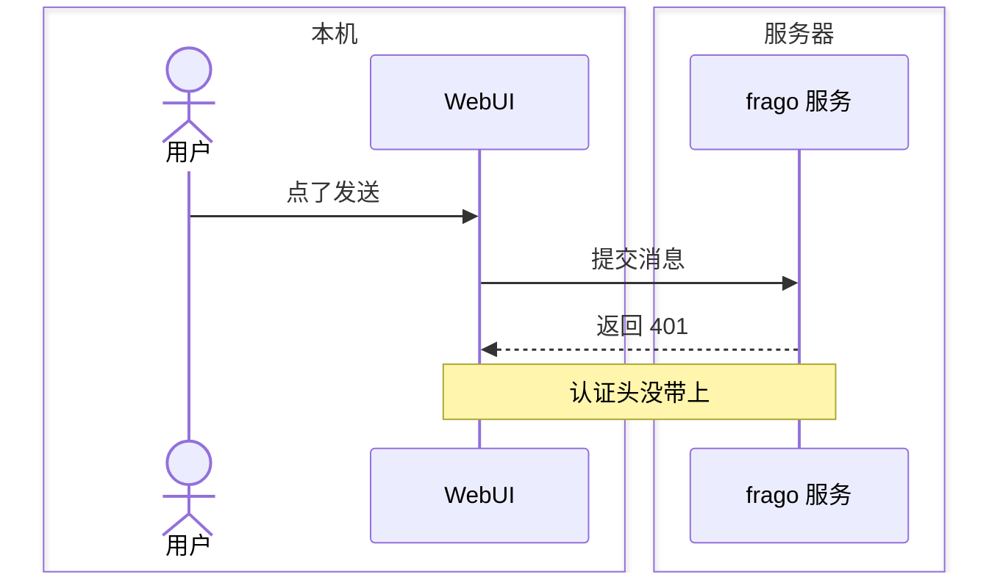
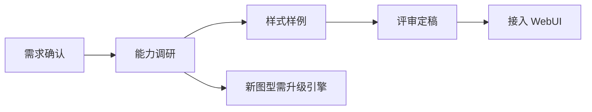
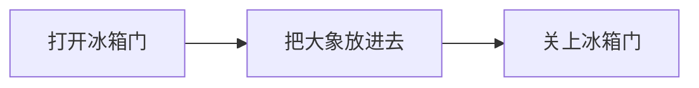
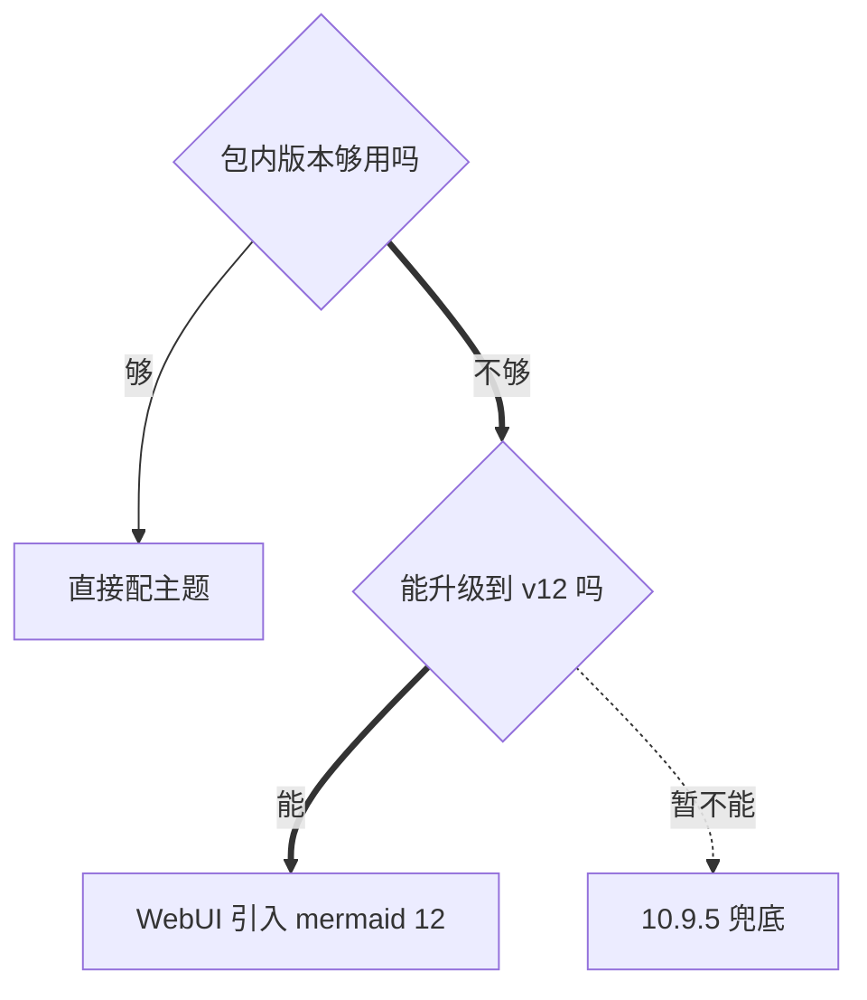

# must-diagram-reply

人读回复的地方是 WebUI。回复里语言标记写 `mermaid` 的代码块，在那里会直接画成图，配色由仓库统一定。本文讲什么时候该用图代替文字、用哪种图、怎么写才画得出来。

## 为什么要画

有先后、有多方、有分叉的事，写成文字，读的人得在脑子里自己把图拼出来：谁先动、交给了谁、卡在哪一步、另一条路通向哪。拼图这件事你已经做过一遍了，再让人拼一遍是纯粹的浪费。直接给图，人扫一眼就知道现在走到了哪、问题出在哪一段、要他在哪里拿主意。

**图用来替代那段文字，不是在文字后面再补一张。** 图画了，原来那段散文就删掉；图前面用一句话说这张图回答什么问题，图后面跟一到三句结论。

## 什么时候画

碰到下面四种，默认画：

- **多方来回交接**：两个以上的参与方（用户、主代理、worker、frago 服务、外部系统、某台服务器）按先后传话或交活。排查经过、调用链、一次请求怎么走的，都属于这一种。→ 时序图
- **进度**：三步以上的活，要说清哪几步做完了、正在做哪一步、哪一步卡住了、还剩哪些。→ 进度流程图
- **几条路选一条**：两个以上的做法摆在面前，每条通向不同的结果或代价，要人拿主意，或者要说明你选了哪条、为什么。→ 决策图
- **用户点名要图**：用户说要流程、流程图、步骤图、示意图，或者问"分几步""怎么走的"。不管有几步、有没有分叉，一律画。→ 流程图

## 什么时候不画

用户点名要图时，下面几条都不适用，照画。

- 五条以内、没有分叉的直线清单：编号列表更快。
- 单个事实、一条命令、一个路径。
- 纯粹的对照数据（几个指标的数值）：用表格。
- 只有一方在做事、没有交接：一句话说完。

拿不准时问自己：去掉这张图，读的人要不要自己在纸上画一遍才看得懂？要，就画。

## 四种图的写法

只用这四种。其他图型（甘特图、类图、状态图、思维导图等）先不要用。

**状态标记只用在进度流程图上。** `:::done`、`:::doing`、`:::todo`、`:::blocked` 说的是"这件活走到哪了"。讲一个做法、一套流程该怎么走，不是在汇报进度，NEVER 加这几个标记——全标成"还没开始"，整张图会画成一排灰色虚线框，看上去像停用了。

### 时序图：谁在什么时候对谁做了什么



- 参与方不超过 6 个，消息不超过 20 条；超了就按阶段拆成两张。
- 参与方用 `box 名称 … end` 按归属分组（本机/服务器、人/系统），不写颜色。
- 实线 `->>` 是主动发起，虚线 `-->>` 是回应或回传。
- 关键发现用 `Note over A,B: …` 标在发生的位置，不要另写一段话解释。

### 进度流程图：走到哪了



- 从左到右 `flowchart LR`。
- 每个节点标一个状态：`:::done` 做完、`:::doing` 正在做、`:::todo` 还没开始、`:::blocked` 卡住了。状态只有这四个。
- 只画已经发生和已经确定要做的步骤，不画猜的。

### 流程图：一件事怎么做



- 步骤少、没有分叉时从左到右 `flowchart LR`；有分叉或超过六步时从上到下 `flowchart TD`，判断点用菱形 `{…}`。
- 节点不加任何状态标记。
- 每个节点写一个动作，动词开头。

### 决策图：几条路怎么选



- 从上到下 `flowchart TD`，判断点用菱形 `{…}`，写成一个问句。
- 推荐或已选的那条路用粗线 `==>`，放弃的路用虚线 `-.->`，其余用普通 `-->`。
- 最终落点加 `:::pick`。
- 每条路的末端节点写明代价或结果，不要只写方案名。

## 写法约定

- 围栏写成 ```` ```mermaid ````，一张图一个代码块。
- **NEVER 写颜色**：不写 `classDef`、`style`、`linkStyle`，不写 `%%{init: …}%%`。颜色和字体由仓库统一定，自己写的会和界面打架。
- 节点编号用英文字母或数字（`A`、`B1`、`db`），显示文字放在括号里。编号 NEVER 用 `end`、`graph`、`subgraph` 这类保留字。
- 显示文字里带括号、冒号、引号、`#`、`;` 时整段加双引号：`A["调用 run()：失败"]`。
- 显示文字控制在 12 个字以内，长了图会被挤窄；细节放到 `Note` 或图后的结论里。
- 用户读的是中文，显示文字写中文；命令、文件名、产品名保留原文。

## 发送前自查

1. 这段内容属于上面四种之一吗？属于，图画了没有？
2. 图画了之后，被它替代的那段文字删掉了吗？
3. 图前有一句"这张图回答什么"，图后有一到三句结论吗？
4. 有没有写颜色、`classDef`、`init`？有就删掉。
5. 显示文字里的特殊符号加引号了吗？
6. 状态标记只出现在进度流程图里吗？讲做法的流程图里有就删掉。
