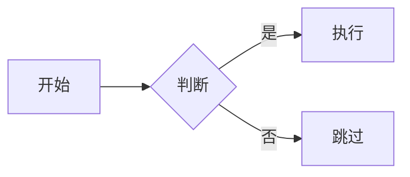
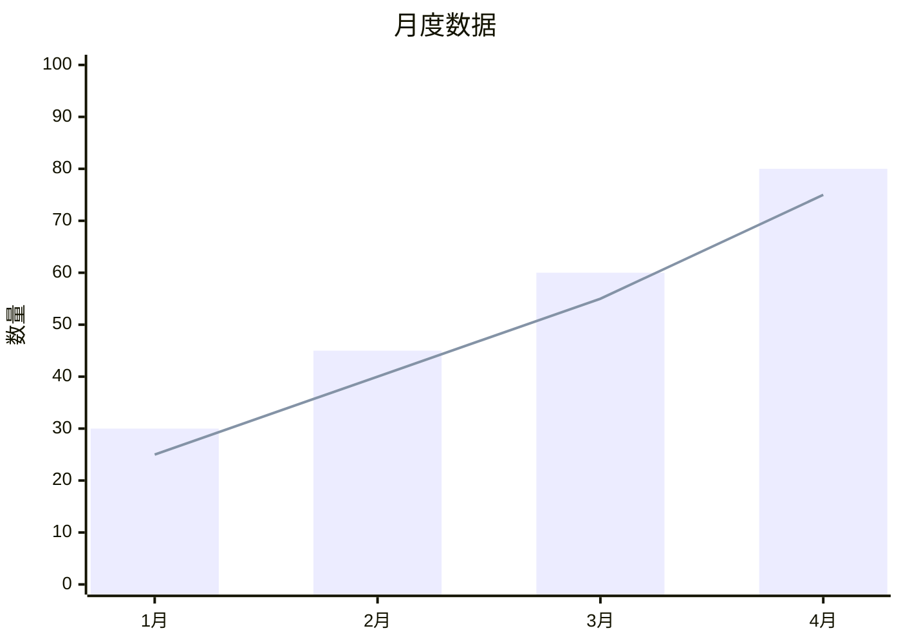

# 可预览内容设计指南

创建可通过 `frago view` 预览的高质量内容。

**核心概念**：可预览内容 = 可通过 `frago view` 命令直接渲染展示的内容

---

## 两种内容类型

| 类型 | 文件格式 | 展示模式 | 适用场景 |
|------|---------|---------|---------|
| **文档** | `.md` | 可滚动文档 | 报告、文档、数据展示 |
| **演示** | `.html`（reveal.js） | 幻灯片演示 | 汇报、演讲、培训 |

**选择建议**：
- 需要详细阅读 → Markdown 文档
- 需要演示汇报 → reveal.js 演示文稿

---

## 技术架构

| 组件 | 技术方案 |
|------|---------|
| Markdown 渲染 | Python `markdown` 库（服务端） |
| 演示框架 | reveal.js（客户端） |
| 代码高亮 | highlight.js（客户端） |
| 图表渲染 | mermaid.js v10（客户端） |
| 样式主题 | GitHub Dark / reveal.js 主题 |
| 窗口容器 | pywebview |

---

# Part 1: Markdown 文档

## 支持的 Markdown 元素

### 完整支持

| 元素 | 语法 | 渲染效果 |
|------|------|---------|
| 标题 | `# H1` ~ `###### H6` | 带底部边框的层级标题 |
| 段落 | 空行分隔 | 16px 下边距 |
| 粗体 | `**text**` | 加粗文本 |
| 斜体 | `*text*` | 斜体文本 |
| 链接 | `[text](url)` | 蓝色链接（#58a6ff） |
| 图片 | `` | 自适应宽度 |
| 代码块 | ` ```lang ` | 语法高亮 |
| 行内代码 | `` `code` `` | 灰色背景圆角 |
| 表格 | `\| col \|` | 边框表格 |
| 列表 | `- item` / `1. item` | 缩进列表 |
| 引用 | `> quote` | 左侧蓝色边框 |
| 水平线 | `---` | 灰色分隔线 |
| 脚注 | `[^1]` | 底部脚注 |
| 定义列表 | `term\n: definition` | 定义格式 |
| 缩写 | `*[abbr]: full` | 悬停显示全称 |

### 扩展支持

| 扩展 | 功能 | 示例 |
|------|------|------|
| `fenced_code` | 围栏代码块 | ` ```python ` |
| `tables` | GFM 表格 | `\| A \| B \|` |
| `toc` | 目录生成 | `[TOC]` |
| `footnotes` | 脚注 | `[^note]` |
| `def_list` | 定义列表 | `term\n: def` |
| `abbr` | 缩写 | `*[HTML]: ...` |
| `attr_list` | 属性列表 | `{#id .class}` |
| `md_in_html` | HTML 内嵌 MD | `<div markdown>` |

---

## Mermaid 图表

### 支持的图表类型

```
flowchart     - 流程图
sequenceDiagram - 时序图
classDiagram  - 类图
stateDiagram  - 状态图
erDiagram     - ER 图
gantt         - 甘特图
pie           - 饼图
mindmap       - 思维导图
timeline      - 时间线
xychart-beta  - XY 图表（柱状图/折线图）
```

### 正确写法

````markdown

````

### XY 图表示例

````markdown

````

### Mermaid 主题

当前配置为 `dark` 主题，与 GitHub Dark 样式协调。

---

## 代码块最佳实践

### 语言标记

**必须标记语言**，否则无高亮：

````markdown
```python
def hello():
    print("Hello, World!")
```
````

### 支持的语言（部分）

| 语言 | 标记 |
|------|------|
| Python | `python` |
| JavaScript | `javascript` / `js` |
| TypeScript | `typescript` / `ts` |
| Bash | `bash` / `sh` |
| JSON | `json` |
| YAML | `yaml` |
| SQL | `sql` |
| Go | `go` |
| Rust | `rust` |
| HTML | `html` |
| CSS | `css` |

---

## 内容结构最佳实践

### 1. 标题层次

```markdown
# 文档标题（仅一个）

## 一级章节

### 二级章节

#### 三级章节（尽量避免更深层次）
```

**原则**：最多使用 4 级标题，层次过深影响阅读。

### 2. 段落长度

- 每段 **3-5 句话**
- 单句不超过 **80 字符**
- 使用空行分隔段落

### 3. 列表使用

```markdown
适合用列表的场景：
- 并列要点
- 步骤说明
- 特性列举

不适合用列表的场景：
- 连续叙述的内容
- 需要上下文关联的说明
```

### 4. 表格设计

```markdown
| 列1 | 列2 | 列3 |
|-----|-----|-----|
| 简短 | 简短 | 简短 |
```

**原则**：
- 列数不超过 **5 列**
- 单元格内容 **简短**
- 复杂内容用列表或段落替代

---

## 图片处理

### 相对路径（推荐）

```markdown

```

**优势**：view 容器会自动复制同目录下的 `images/`、`assets/`、`img/`、`media/`、`figures/` 目录。

### 支持的图片格式

- PNG（推荐，无损）
- JPG（照片）
- SVG（矢量图）
- GIF（简单动画）

### 图片尺寸

- 最大宽度自动限制为容器宽度
- 建议源图宽度 **800-1200px**

---

## 回避事项

### 1. 不支持的 Markdown 语法

| 语法 | 问题 | 替代方案 |
|------|------|---------|
| `[TOC]` 锚点跳转 | 不生成可点击锚点 | 手动添加 `{#id}` |
| LaTeX 数学公式 | 不支持 | 使用图片或 Mermaid |
| HTML `<script>` | 安全限制 | 不可用 |
| 嵌入 iframe | 安全限制 | 使用截图 |

### 2. 性能考量

| 问题 | 影响 | 建议 |
|------|------|------|
| 超大 Mermaid 图 | 渲染慢 | 拆分为多个小图 |
| 过多代码块 | highlight.js 压力 | 合并相关代码 |
| 大图片 | 加载慢 | 压缩至 500KB 以内 |
| 超长文档 | 滚动卡顿 | 拆分为多文件 |

### 3. 编码问题

- **必须使用 UTF-8 编码**
- 避免 BOM 头
- 中文标点正常支持

---

## 样式参考

### 颜色方案（GitHub Dark）

| 元素 | 颜色 |
|------|------|
| 背景 | `#0d1117` |
| 文字 | `#c9d1d9` |
| 链接 | `#58a6ff` |
| 代码背景 | `#161b22` |
| 边框 | `#30363d` |
| 引用文字 | `#8b949e` |

### 字体

- 正文：系统默认无衬线字体
- 代码：`SF Mono, Consolas, Menlo, monospace`

---

## 内容模板

### 技术文档

```markdown
# 功能名称

简短描述功能用途。

## 概述

2-3 句话说明核心价值。

## 使用方法

### 基本用法

代码示例 + 说明

### 高级用法

进阶示例

## 配置选项

| 选项 | 类型 | 默认值 | 说明 |
|------|------|--------|------|

## 注意事项

- 要点 1
- 要点 2
```

### 报告文档

```markdown
# 报告标题

**日期**：YYYY-MM-DD

## 摘要

关键发现的 3-5 点总结。

## 数据概览

```mermaid
xychart-beta
    title "关键指标"
    ...
```

## 详细分析

### 维度 1

分析内容...

### 维度 2

分析内容...

## 结论与建议

1. 结论 1
2. 建议 1
```

---

## 调试技巧

### 检查渲染效果

```bash
# 快速预览
frago view document.md

# 指定主题
frago view document.md --theme monokai
```

### 常见问题排查

| 问题 | 原因 | 解决 |
|------|------|------|
| 代码无高亮 | 未标记语言 | 添加 ` ```python ` |
| Mermaid 不渲染 | 语法错误 | 检查 mermaid 语法 |
| 图片不显示 | 路径错误 | 使用相对路径 |
| 表格错乱 | 列不对齐 | 检查 `\|` 数量 |

---

# Part 2: reveal.js 演示文稿

## 概述

reveal.js 演示文稿是 HTML 文件，通过 `frago view` 以幻灯片模式展示。

**触发条件**：HTML 文件中包含 `class="reveal"` 或 `class="slides"`

## 基础结构

```html
<!DOCTYPE html>
<html>
<head>
    <meta charset="utf-8">
    <title>演示标题</title>
</head>
<body>
    <div class="reveal">
        <div class="slides">
            <section>
                <h1>第一页标题</h1>
                <p>内容</p>
            </section>
            <section>
                <h2>第二页</h2>
                <ul>
                    <li>要点 1</li>
                    <li>要点 2</li>
                </ul>
            </section>
        </div>
    </div>
</body>
</html>
```

**说明**：`frago view` 会自动注入 reveal.js 库和样式，无需手动引入。

## 幻灯片组织

### 水平幻灯片

每个 `<section>` 是一页：

```html
<section>第 1 页</section>
<section>第 2 页</section>
<section>第 3 页</section>
```

### 垂直幻灯片（嵌套）

嵌套 `<section>` 创建垂直导航：

```html
<section>
    <section>主题 A - 概述</section>
    <section>主题 A - 详情 1</section>
    <section>主题 A - 详情 2</section>
</section>
<section>
    <section>主题 B - 概述</section>
</section>
```

## 常用元素

### 标题和文本

```html
<section>
    <h1>大标题</h1>
    <h2>副标题</h2>
    <p>正文段落</p>
    <p class="fragment">渐显文本</p>
</section>
```

### 列表

```html
<section>
    <h2>要点</h2>
    <ul>
        <li class="fragment">逐条显示 1</li>
        <li class="fragment">逐条显示 2</li>
        <li class="fragment">逐条显示 3</li>
    </ul>
</section>
```

### 代码块

```html
<section>
    <h2>代码示例</h2>
    <pre><code class="language-python">
def hello():
    print("Hello, World!")
    </code></pre>
</section>
```

### 图片

```html
<section>
    <h2>架构图</h2>
    
</section>
```

## Fragment 动画

`class="fragment"` 让元素逐步显示：

```html
<p class="fragment">第一步显示</p>
<p class="fragment">第二步显示</p>
<p class="fragment fade-in">淡入效果</p>
<p class="fragment highlight-red">高亮效果</p>
```

**动画类型**：
- `fade-in`：淡入
- `fade-out`：淡出
- `highlight-red/green/blue`：高亮
- `grow`：放大
- `shrink`：缩小

## 可用主题

通过 `--theme` 参数指定：

| 主题 | 说明 |
|------|------|
| `black` | 黑色背景（默认） |
| `white` | 白色背景 |
| `league` | 灰色渐变 |
| `beige` | 米色 |
| `sky` | 蓝色 |
| `night` | 深蓝 |
| `serif` | 衬线字体 |
| `simple` | 简约白 |
| `solarized` | Solarized 配色 |
| `blood` | 深红 |
| `moon` | 深蓝 |
| `dracula` | Dracula 配色 |

```bash
frago view slides.html --theme dracula
```

## 演示文稿模板

```html
<!DOCTYPE html>
<html>
<head>
    <meta charset="utf-8">
    <title>项目汇报</title>
</head>
<body>
    <div class="reveal">
        <div class="slides">
            <!-- 封面 -->
            <section>
                <h1>项目名称</h1>
                <h3>汇报人：xxx</h3>
                <p>2025-01-01</p>
            </section>

            <!-- 目录 -->
            <section>
                <h2>目录</h2>
                <ul>
                    <li>背景与目标</li>
                    <li>实现方案</li>
                    <li>成果展示</li>
                    <li>总结与展望</li>
                </ul>
            </section>

            <!-- 章节 1 -->
            <section>
                <section>
                    <h2>1. 背景与目标</h2>
                </section>
                <section>
                    <h3>背景</h3>
                    <p class="fragment">问题描述...</p>
                    <p class="fragment">现状分析...</p>
                </section>
                <section>
                    <h3>目标</h3>
                    <ul>
                        <li class="fragment">目标 1</li>
                        <li class="fragment">目标 2</li>
                    </ul>
                </section>
            </section>

            <!-- 章节 2 -->
            <section>
                <h2>2. 实现方案</h2>
                <pre><code class="language-python">
# 核心代码
def main():
    pass
                </code></pre>
            </section>

            <!-- 总结 -->
            <section>
                <h2>总结</h2>
                <ul>
                    <li class="fragment">成果 1</li>
                    <li class="fragment">成果 2</li>
                </ul>
                <p class="fragment"><strong>谢谢！</strong></p>
            </section>
        </div>
    </div>
</body>
</html>
```

## 预览命令

```bash
# 预览演示文稿
frago view slides.html

# 指定主题
frago view slides.html --theme moon

# 全屏模式
frago view slides.html --fullscreen
```

## 键盘快捷键

| 快捷键 | 功能 |
|--------|------|
| `→` / `Space` | 下一页 |
| `←` | 上一页 |
| `↑` / `↓` | 垂直导航 |
| `F` | 全屏 |
| `Esc` | 退出全屏 / 总览 |
| `O` | 幻灯片总览 |
| `S` | 演讲者笔记 |

---

## 参考

- [Python Markdown Extensions](https://python-markdown.github.io/extensions/)
- [Mermaid 官方文档](https://mermaid.js.org/)
- [highlight.js 支持语言](https://highlightjs.org/static/demo/)
- [reveal.js 官方文档](https://revealjs.com/)
