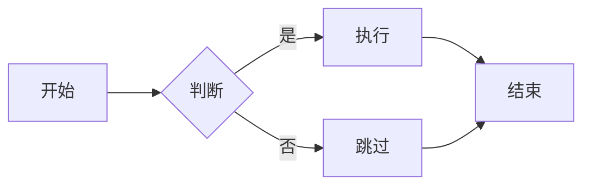
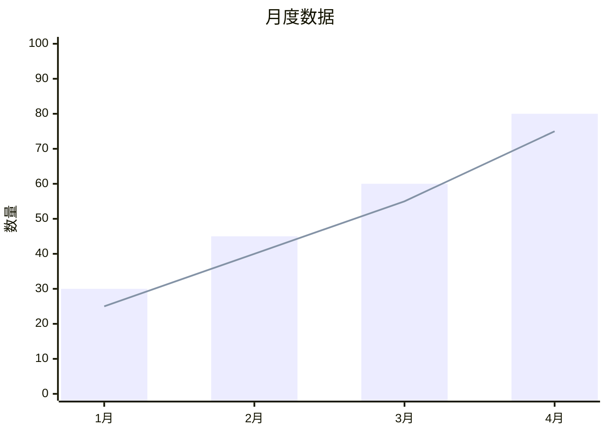
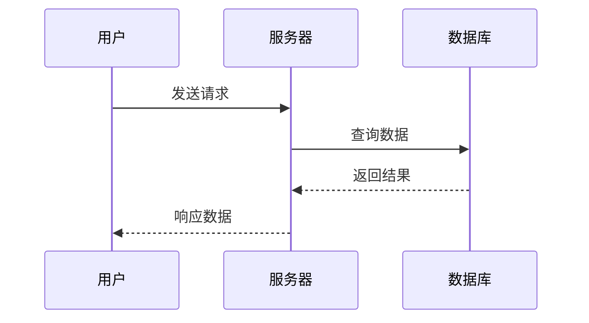

# Markdown 文档内容生成指南

创建可通过 `frago view` 预览的高质量 Markdown 文档。

## 预览命令

```bash
frago view document.md                    # 默认主题
frago view document.md --theme monokai    # 指定代码主题
```

---

## 支持的元素

### 基础元素

| 元素 | 语法 | 渲染效果 |
|------|------|---------|
| 标题 | `# H1` ~ `###### H6` | 带底部边框的层级标题 |
| 段落 | 空行分隔 | 16px 下边距 |
| 粗体 | `**text**` | 加粗文本 |
| 斜体 | `*text*` | 斜体文本 |
| 链接 | `[text](url)` | 蓝色链接（#58a6ff） |
| 图片 | `` | 自适应宽度 |
| 代码块 | ` ```lang ` | 语法高亮 |
| 行内代码 | `` `code` `` | 灰色背景圆角 |
| 表格 | `\| col \|` | 边框表格 |
| 列表 | `- item` / `1. item` | 缩进列表 |
| 引用 | `> quote` | 左侧蓝色边框 |
| 水平线 | `---` | 灰色分隔线 |

### 扩展元素

| 元素 | 语法 | 说明 |
|------|------|------|
| 脚注 | `[^1]` | 底部脚注 |
| 定义列表 | `term\n: definition` | 术语定义 |
| 缩写 | `*[abbr]: full` | 悬停显示全称 |
| 属性 | `{#id .class}` | 元素属性 |
| HTML 内嵌 | `<div markdown>` | HTML 中使用 Markdown |

---

## Mermaid 图表

### 支持的图表类型

| 类型 | 关键字 | 用途 |
|------|--------|------|
| 流程图 | `flowchart` | 流程、决策 |
| 时序图 | `sequenceDiagram` | 交互流程 |
| 类图 | `classDiagram` | 类关系 |
| 状态图 | `stateDiagram` | 状态转换 |
| ER 图 | `erDiagram` | 数据模型 |
| 甘特图 | `gantt` | 项目进度 |
| 饼图 | `pie` | 占比分布 |
| 思维导图 | `mindmap` | 层级结构 |
| 时间线 | `timeline` | 事件序列 |
| XY 图表 | `xychart-beta` | 柱状图/折线图 |

### 流程图示例

````markdown

````

### XY 图表示例

````markdown

````

### 时序图示例

````markdown

````

---

## 代码块

### 必须标记语言

```markdown
```python
def hello():
    print("Hello!")
```
```

**不标记语言则无高亮**。

### 支持的语言

| 语言 | 标记 |
|------|------|
| Python | `python` |
| JavaScript | `javascript` / `js` |
| TypeScript | `typescript` / `ts` |
| Bash | `bash` / `sh` |
| JSON | `json` |
| YAML | `yaml` |
| SQL | `sql` |
| Go | `go` |
| Rust | `rust` |
| HTML | `html` |
| CSS | `css` |
| Markdown | `markdown` |

### 代码主题

默认：`github-dark`

可选：`monokai`、`atom-one-dark`、`atom-one-light`、`vs2015`、`github`

---

## 最佳实践

### 1. 标题层次

```markdown
# 文档标题（仅一个）

## 一级章节

### 二级章节

#### 三级章节（尽量避免更深）
```

**原则**：最多 4 级，层次过深影响阅读。

### 2. 段落长度

- 每段 **3-5 句话**
- 单句不超过 **80 字符**
- 空行分隔段落

### 3. 列表使用

**适合**：并列要点、步骤说明、特性列举

**不适合**：连续叙述、需要上下文关联的内容

### 4. 表格设计

- 列数不超过 **5 列**
- 单元格内容 **简短**
- 复杂内容用列表或段落替代

### 5. 图片处理

```markdown

```

**自动复制**：`images/`、`assets/`、`img/`、`media/`、`figures/` 目录会被自动复制。

**格式推荐**：PNG（无损）、JPG（照片）、SVG（矢量）

**尺寸建议**：源图宽度 800-1200px，文件大小 < 500KB

---

## 回避事项

| 语法 | 问题 | 替代方案 |
|------|------|---------|
| LaTeX 数学公式 | 不支持 | 使用图片或 Mermaid |
| `<script>` 标签 | 安全限制 | 不可用 |
| iframe 嵌入 | 安全限制 | 使用截图 |
| 超大 Mermaid 图 | 渲染慢 | 拆分为多个小图 |
| 过多代码块 | 性能压力 | 合并相关代码 |
| 超长文档 | 滚动卡顿 | 拆分为多文件 |

---

## 样式参考（GitHub Dark）

| 元素 | 颜色 |
|------|------|
| 背景 | `#0d1117` |
| 文字 | `#c9d1d9` |
| 链接 | `#58a6ff` |
| 代码背景 | `#161b22` |
| 边框 | `#30363d` |
| 引用文字 | `#8b949e` |

---

## 模板库

| 模板 | 用途 | 路径 |
|------|------|------|
| 技术文档 | API/功能说明 | [templates/technical-doc.md](templates/technical-doc.md) |
| 报告文档 | 分析报告 | [templates/report.md](templates/report.md) |
| 项目总结 | 项目概览 | [templates/project-summary.md](templates/project-summary.md) |

---

## 调试技巧

| 问题 | 原因 | 解决 |
|------|------|------|
| 代码无高亮 | 未标记语言 | 添加语言标记 |
| Mermaid 不渲染 | 语法错误 | 检查 mermaid 语法 |
| 图片不显示 | 路径错误 | 使用相对路径 |
| 表格错乱 | 列不对齐 | 检查 `\|` 数量 |
