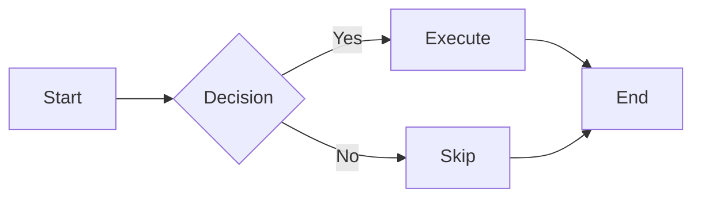
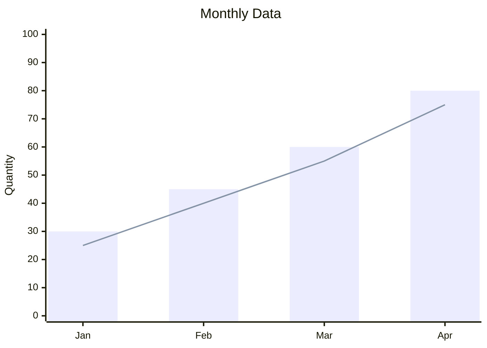
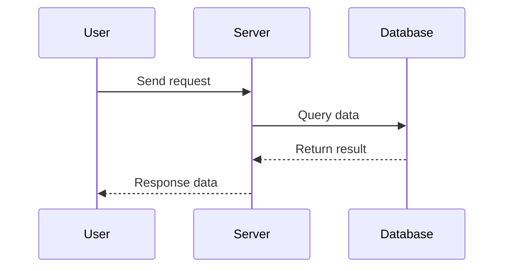

# Markdown Document Content Generation Guide

Create high-quality Markdown documents that can be previewed via `frago view`.

## Preview Commands

```bash
frago view document.md                    # Default theme
frago view document.md --theme monokai    # Specify code theme
```

---

## Supported Elements

### Basic Elements

| Element | Syntax | Rendered Effect |
|---------|--------|-----------------|
| Headings | `# H1` ~ `###### H6` | Hierarchical headings with bottom border |
| Paragraphs | Separated by blank lines | 16px bottom margin |
| Bold | `**text**` | Bold text |
| Italic | `*text*` | Italic text |
| Links | `[text](url)` | Blue links (#58a6ff) |
| Images | `` | Adaptive width |
| Code Blocks | ` ```lang ` | Syntax highlighting |
| Inline Code | `` `code` `` | Gray background with rounded corners |
| Tables | `\| col \|` | Bordered tables |
| Lists | `- item` / `1. item` | Indented lists |
| Blockquotes | `> quote` | Left blue border |
| Horizontal Rules | `---` | Gray divider line |

### Extended Elements

| Element | Syntax | Description |
|---------|--------|-------------|
| Footnotes | `[^1]` | Bottom footnotes |
| Definition Lists | `term\n: definition` | Term definitions |
| Abbreviations | `*[abbr]: full` | Show full text on hover |
| Attributes | `{#id .class}` | Element attributes |
| HTML Embedding | `<div markdown>` | Markdown within HTML |

---

## Mermaid Charts

### Supported Chart Types

| Type | Keyword | Purpose |
|------|---------|---------|
| Flowcharts | `flowchart` | Flows, decisions |
| Sequence diagrams | `sequenceDiagram` | Interaction flows |
| Class diagrams | `classDiagram` | Class relationships |
| State diagrams | `stateDiagram` | State transitions |
| ER diagrams | `erDiagram` | Data models |
| Gantt charts | `gantt` | Project progress |
| Pie charts | `pie` | Distribution |
| Mind maps | `mindmap` | Hierarchical structure |
| Timelines | `timeline` | Event sequences |
| XY charts | `xychart-beta` | Bar/line charts |

### Flowchart Example

````markdown

````

### XY Chart Example

````markdown

````

### Sequence Diagram Example

````markdown

````

---

## Code Blocks

### Must Tag Language

```markdown
```python
def hello():
    print("Hello!")
```
```

**No language tag means no highlighting**.

### Supported Languages

| Language | Tag |
|----------|-----|
| Python | `python` |
| JavaScript | `javascript` / `js` |
| TypeScript | `typescript` / `ts` |
| Bash | `bash` / `sh` |
| JSON | `json` |
| YAML | `yaml` |
| SQL | `sql` |
| Go | `go` |
| Rust | `rust` |
| HTML | `html` |
| CSS | `css` |
| Markdown | `markdown` |

### Code Themes

Default: `github-dark`

Available: `monokai`, `atom-one-dark`, `atom-one-light`, `vs2015`, `github`

---

## Best Practices

### 1. Heading Hierarchy

```markdown
# Document Title (only one)

## Level 1 Section

### Level 2 Section

#### Level 3 Section (avoid deeper levels)
```

**Principle**: Maximum 4 levels, deeper hierarchy affects readability.

### 2. Paragraph Length

- Each paragraph **3-5 sentences**
- Single sentence no more than **80 characters**
- Blank lines separate paragraphs

### 3. List Usage

**Appropriate**: Parallel points, step instructions, feature enumeration

**Not appropriate**: Continuous narrative, content requiring contextual connection

### 4. Table Design

- No more than **5 columns**
- Cell content **brief**
- Use lists or paragraphs for complex content

### 5. Image Handling

```markdown

```

**Auto-copy**: `images/`, `assets/`, `img/`, `media/`, `figures/` directories are automatically copied.

**Format recommendations**: PNG (lossless), JPG (photos), SVG (vector)

**Size recommendations**: Source image width 800-1200px, file size < 500KB

---

## Things to Avoid

| Syntax | Issue | Alternative |
|--------|-------|-------------|
| LaTeX math formulas | Not supported | Use images or Mermaid |
| `<script>` tags | Security restrictions | Not available |
| iframe embedding | Security restrictions | Use screenshots |
| Oversized Mermaid diagrams | Slow rendering | Split into multiple smaller diagrams |
| Too many code blocks | Performance pressure | Merge related code |
| Very long documents | Scrolling lag | Split into multiple files |

---

## Style Reference (GitHub Dark)

| Element | Color |
|---------|-------|
| Background | `#0d1117` |
| Text | `#c9d1d9` |
| Links | `#58a6ff` |
| Code Background | `#161b22` |
| Borders | `#30363d` |
| Quote Text | `#8b949e` |

---

## Template Library

| Template | Purpose | Path |
|----------|---------|------|
| Technical documentation | API/feature description | [templates/technical-doc.md](templates/technical-doc.md) |
| Report documentation | Analysis reports | [templates/report.md](templates/report.md) |
| Project summary | Project overview | [templates/project-summary.md](templates/project-summary.md) |

---

## Debugging Tips

| Issue | Cause | Solution |
|-------|-------|----------|
| No code highlighting | Language not tagged | Add language tag |
| Mermaid not rendering | Syntax error | Check mermaid syntax |
| Images not displaying | Path error | Use relative paths |
| Table misalignment | Columns misaligned | Check `\|` count |
