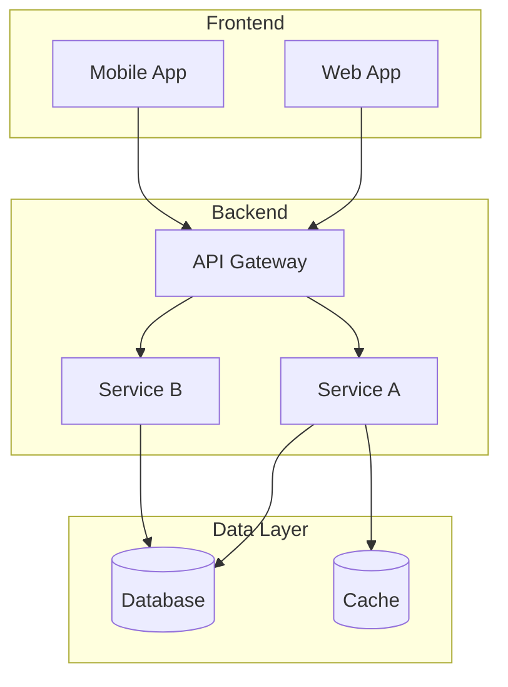
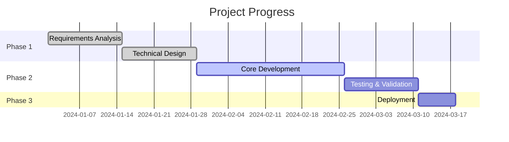

# Project Name

> One-sentence description of the project's core value.

## Project Overview

### Background

Project background and motivation (2-3 sentences).

### Goals

- Goal 1: Specific measurable goal
- Goal 2: Specific measurable goal
- Goal 3: Specific measurable goal

### Scope

| In Scope | Out of Scope |
|----------|--------------|
| Scope Item 1 | Excluded Item 1 |
| Scope Item 2 | Excluded Item 2 |

---

## Technical Approach

### Architecture Design

### Technology Stack

| Layer | Technology | Description |
|-------|------------|-------------|
| Frontend | React | User Interface |
| Backend | Python/FastAPI | API Service |
| Database | PostgreSQL | Persistent Storage |
| Cache | Redis | High-speed Cache |

---

## Progress Status

| Milestone | Planned Date | Status |
|-----------|--------------|--------|
| Requirements Confirmed | 2024-01-15 | Completed |
| Design Review | 2024-02-01 | Completed |
| Development Complete | 2024-03-01 | In Progress |
| Launch | 2024-03-15 | Pending |

---

## Team Members

| Role | Member | Responsibility |
|------|--------|----------------|
| Project Manager | Alice Smith | Project Coordination, Schedule Management |
| Technical Lead | Bob Johnson | Architecture Design, Technical Decisions |
| Developer | Charlie Brown | Backend Development |
| Developer | Diana Lee | Frontend Development |

---

## Risks and Challenges

| Risk | Impact | Mitigation |
|------|--------|------------|
| Risk 1 | High | Mitigation plan description |
| Risk 2 | Medium | Mitigation plan description |
| Risk 3 | Low | Mitigation plan description |

---

## Next Steps

1. **Short-term (1-2 weeks)**: Specific task description
2. **Mid-term (1 month)**: Specific task description
3. **Long-term (3 months)**: Specific task description
