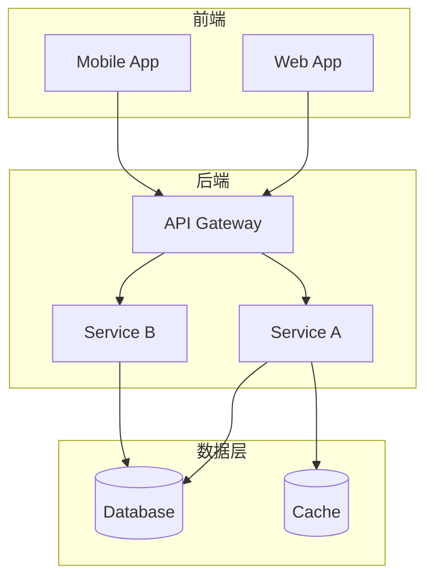
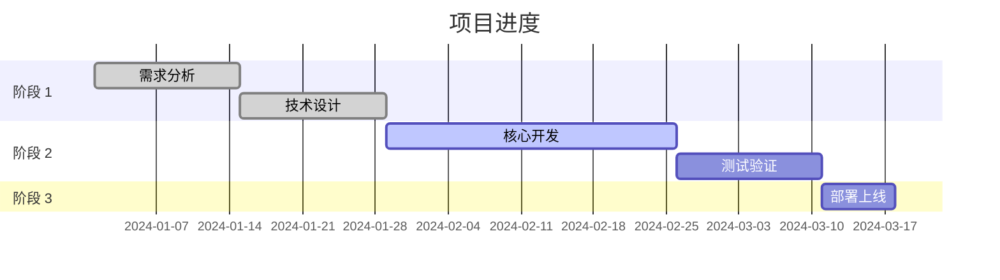

# 项目名称

> 一句话描述项目的核心价值。

## 项目概述

### 背景

项目启动的背景和动机（2-3 句话）。

### 目标

- 目标 1：具体可衡量的目标
- 目标 2：具体可衡量的目标
- 目标 3：具体可衡量的目标

### 范围

| 包含 | 不包含 |
|------|--------|
| 范围内容 1 | 排除内容 1 |
| 范围内容 2 | 排除内容 2 |

---

## 技术方案

### 架构设计

### 技术栈

| 层级 | 技术 | 说明 |
|------|------|------|
| 前端 | React | 用户界面 |
| 后端 | Python/FastAPI | API 服务 |
| 数据库 | PostgreSQL | 持久化存储 |
| 缓存 | Redis | 高速缓存 |

---

## 进度状态

| 里程碑 | 计划日期 | 状态 |
|--------|----------|------|
| 需求确认 | 2024-01-15 | 已完成 |
| 设计评审 | 2024-02-01 | 已完成 |
| 开发完成 | 2024-03-01 | 进行中 |
| 上线发布 | 2024-03-15 | 待开始 |

---

## 团队成员

| 角色 | 成员 | 职责 |
|------|------|------|
| 项目经理 | 张三 | 项目协调、进度管理 |
| 技术负责 | 李四 | 架构设计、技术决策 |
| 开发工程师 | 王五 | 后端开发 |
| 开发工程师 | 赵六 | 前端开发 |

---

## 风险与挑战

| 风险 | 影响 | 缓解措施 |
|------|------|---------|
| 风险 1 | 高 | 缓解方案描述 |
| 风险 2 | 中 | 缓解方案描述 |
| 风险 3 | 低 | 缓解方案描述 |

---

## 下一步计划

1. **短期（1-2 周）**：具体任务描述
2. **中期（1 个月）**：具体任务描述
3. **长期（3 个月）**：具体任务描述
