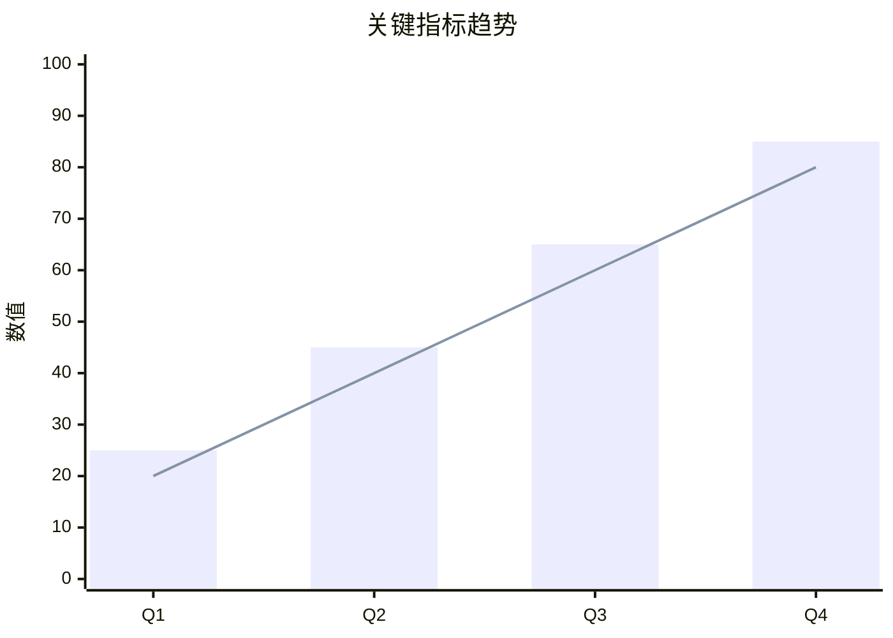
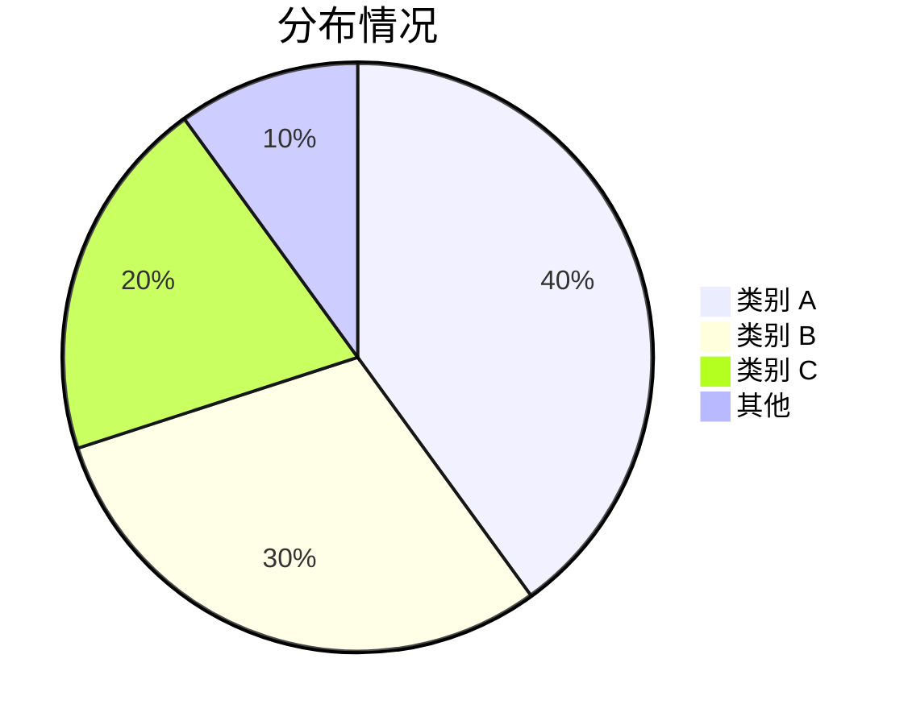

# 报告标题

**日期**：YYYY-MM-DD
**作者**：作者名称

---

## 摘要

关键发现的 3-5 点总结：

- 核心发现 1
- 核心发现 2
- 核心发现 3

---

## 数据概览

| 指标 | 当前值 | 上期值 | 变化 |
|------|--------|--------|------|
| 指标 A | 100 | 80 | +25% |
| 指标 B | 50 | 60 | -17% |
| 指标 C | 75 | 75 | 0% |

---

## 详细分析

### 维度 1：标题

分析内容...

关键洞察：

- 洞察点 1
- 洞察点 2

### 维度 2：标题

分析内容...

| 子项 | 数据 1 | 数据 2 | 备注 |
|------|--------|--------|------|
| 子项 A | 10 | 20 | 说明 |
| 子项 B | 15 | 25 | 说明 |
| 子项 C | 20 | 30 | 说明 |

### 维度 3：标题

分析内容...

---

## 结论与建议

### 结论

1. 结论 1：基于数据的核心判断
2. 结论 2：基于数据的核心判断
3. 结论 3：基于数据的核心判断

### 建议

1. **建议 1**：具体行动建议，预期效果
2. **建议 2**：具体行动建议，预期效果
3. **建议 3**：具体行动建议，预期效果

---

## 附录

### 数据来源

- 数据源 1：说明
- 数据源 2：说明

### 方法论

分析方法和假设说明。
