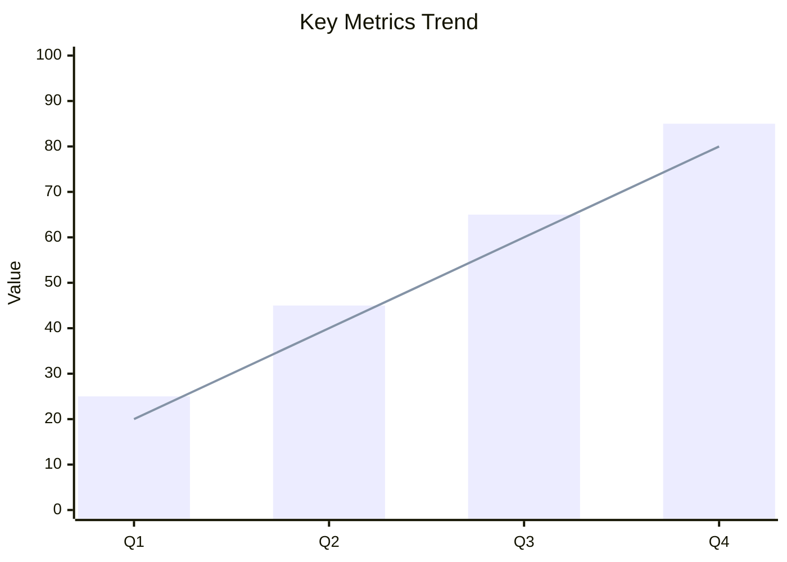
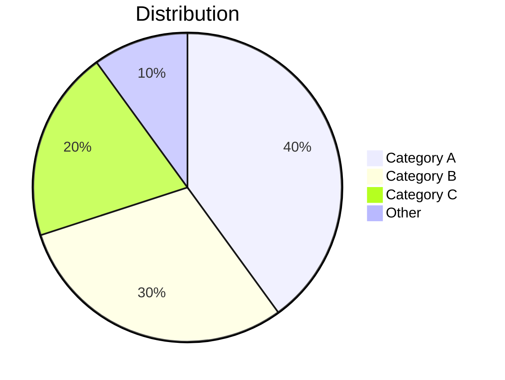

# Report Title

**Date**: YYYY-MM-DD
**Author**: Author Name

---

## Summary

3-5 key findings summary:

- Key Finding 1
- Key Finding 2
- Key Finding 3

---

## Data Overview

| Metric | Current | Previous | Change |
|--------|---------|----------|--------|
| Metric A | 100 | 80 | +25% |
| Metric B | 50 | 60 | -17% |
| Metric C | 75 | 75 | 0% |

---

## Detailed Analysis

### Dimension 1: Title

Analysis content...

Key Insights:

- Insight 1
- Insight 2

### Dimension 2: Title

Analysis content...

| Item | Data 1 | Data 2 | Notes |
|------|--------|--------|-------|
| Item A | 10 | 20 | Description |
| Item B | 15 | 25 | Description |
| Item C | 20 | 30 | Description |

### Dimension 3: Title

Analysis content...

---

## Conclusions and Recommendations

### Conclusions

1. Conclusion 1: Core judgment based on data
2. Conclusion 2: Core judgment based on data
3. Conclusion 3: Core judgment based on data

### Recommendations

1. **Recommendation 1**: Specific action recommendation, expected outcome
2. **Recommendation 2**: Specific action recommendation, expected outcome
3. **Recommendation 3**: Specific action recommendation, expected outcome

---

## Appendix

### Data Sources

- Data Source 1: Description
- Data Source 2: Description

### Methodology

Analysis methodology and assumptions.
