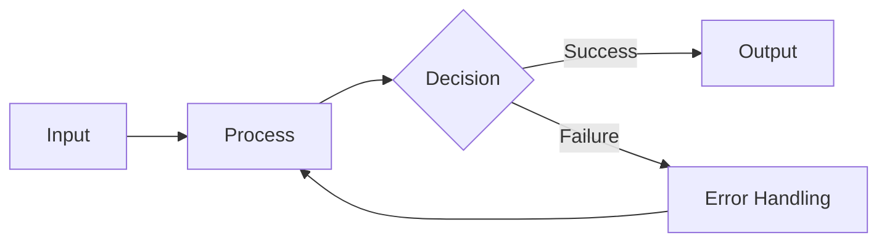

# Feature Name

Brief description of feature purpose (1-2 sentences).

## Overview

2-3 sentences explaining the core value and problems it solves.

## Usage

### Basic Usage

```python
# Basic example code
from module import feature

result = feature.do_something()
print(result)
```

Key points about basic usage.

### Advanced Usage

```python
# Advanced example code
from module import feature

config = {
    "option1": "value1",
    "option2": True
}

result = feature.do_something_advanced(config)
```

Scenarios and considerations for advanced usage.

## Configuration Options

| Option | Type | Default | Description |
|--------|------|---------|-------------|
| `option1` | string | `"default"` | Purpose of option 1 |
| `option2` | boolean | `false` | Purpose of option 2 |
| `option3` | number | `10` | Purpose of option 3 |

## Workflow



## Important Notes

- Note 1: Important limitations or prerequisites
- Note 2: Common incorrect usage patterns
- Note 3: Performance or security considerations

## FAQ

### Q: Question 1?

A: Answer to question 1.

### Q: Question 2?

A: Answer to question 2.

## References

- [Related Documentation 1](url)
- [Related Documentation 2](url)
