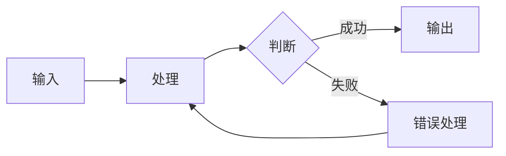

# 功能名称

简短描述功能用途（1-2 句话）。

## 概述

2-3 句话说明核心价值和解决的问题。

## 使用方法

### 基本用法

```python
# 基础示例代码
from module import feature

result = feature.do_something()
print(result)
```

说明基本用法的要点。

### 高级用法

```python
# 进阶示例代码
from module import feature

config = {
    "option1": "value1",
    "option2": True
}

result = feature.do_something_advanced(config)
```

说明高级用法的场景和注意事项。

## 配置选项

| 选项 | 类型 | 默认值 | 说明 |
|------|------|--------|------|
| `option1` | string | `"default"` | 选项 1 的作用 |
| `option2` | boolean | `false` | 选项 2 的作用 |
| `option3` | number | `10` | 选项 3 的作用 |

## 工作流程



## 注意事项

- 注意事项 1：说明重要的限制或前提条件
- 注意事项 2：说明常见的错误用法
- 注意事项 3：说明性能或安全考量

## 常见问题

### Q: 问题 1？

A: 问题 1 的解答。

### Q: 问题 2？

A: 问题 2 的解答。

## 参考

- [相关文档 1](url)
- [相关文档 2](url)
