# LLM的2025与2026：交付缺席一整年 vs 交付将至

## 2025 年发生了什么

2025 年，大模型行业最显著的特征是"热闹"。模型迭代的速度前所未有，发布会一场接一场，榜单排名每周刷新，社交媒体上永远有新的"突破"值得讨论。但如果你问一个普通用户：这一年 AI 帮你完成了什么？答案大概率是沉默。

模型确实在变强。推理能力在涨，上下文窗口在扩，多模态在融合，Agent 在进化。但"变强"和"有用"之间，隔着一道鸿沟。这道鸿沟叫做"交付"。

交付是什么？是任务真正完成，结果真正落地，用户不需要再动手。不是生成一段文字让你去执行，不是给出建议让你自己判断，不是写完代码让你手动部署——而是事情办完了，你可以去做下一件事了。

2025 年的大模型，绝大多数仍然停留在"产出文本"阶段。它们很擅长生成，但生成不等于交付。这篇文章要讲的，就是这一年里各家公司在"交付"这件事上走到了哪里，以及为什么大多数都还没走到。

这张图展示了问题的本质。

头部是标准化、高频的需求，企业愿意投资建系统来覆盖——ERP、CRM、SaaS，因为用户量大、ROI 合理。

长尾则是低频、碎片化、因人而异的需求，每个人遇到的场景都不一样，为此单独建系统成本太高，所以一直没人做。

传统上，长尾问题要么自己动手（学习成本高），要么花钱雇人（经济成本高），要么干脆放弃。

但 AI 的真正机会恰恰在这里——但前提是它要能"交付"，而不只是产出一堆文本建议。

2025 年的大模型，在头部或许已经（但大概率也没有）锦上添花，长尾依然是空白。

### 主力LLM模型的变化

本文不是模型能力的横向评测。选取的公司和事件，依据的是它们在"交付"这条路上是否有值得一提的探索——而非模型跑分的高低。

#### OpenAI

一年之中模型版本变化最多的一家公司。

年初 DeepSeek R1 的冲击让 Nvidia 单日蒸发近 6000 亿美元，OpenAI 的护城河突然显得不那么深了。2 月 27 日 GPT-4.5（代号 Orion）发布，主打自然对话和减少幻觉，但只给 Pro 用户用。3 月 25 日 GPT-4o 的图像生成功能上线，Ghibli 风格席卷社交媒体，ChatGPT 当月下载量 4600 万，成为全球第一——这是 OpenAI 2025 年最出圈的时刻，但出圈靠的是"玩"，不是"用"。

6 月 o3-pro 发布，号称"best at reasoning"。10 月 DevDay 推出 AgentKit，提供拖拽式 Agent 构建界面。11 月 GPT-5.1，12 月 GPT-5.2，相隔 29 天。年底又是一轮"12 Days of OpenAI"。

编程能力确实在涨：2024 年 9 月的 o1 排在全球程序员第 9800 名，2025 年 1 月的 o3 升到第 175 名，内部模型据说已经到第 50 名。但这些数字说明什么？模型更强了。然后呢？

模型的输入是文本，输出也是文本。文本不等于交付。你让它写一封邮件，它写完了，但邮件没发出去；你让它分析数据，它分析完了，但结果没进入你的系统。模型本身不直接触达现实世界，它依托于产品才能完成交付。Codex 也只是在写代码，代码写完了还得人来跑、来部署、来验证。

##### OpenAI 2025 时间线

**2025年2月27日 · GPT-4.5 (Orion) 发布**

代号 Orion，专注自然对话、减少幻觉，首先向 Pro 用户开放。

**2025年3月25日 · GPT-4o 图像生成**

GPT-4o 的图像生成能力上线，能够准确渲染文字、精确跟随提示词。引发 Ghibli 风格热潮，ChatGPT 成为当月全球下载量最高 App（4600万下载）。

**2025年4月17日 · o3 与 o4-mini 发布**

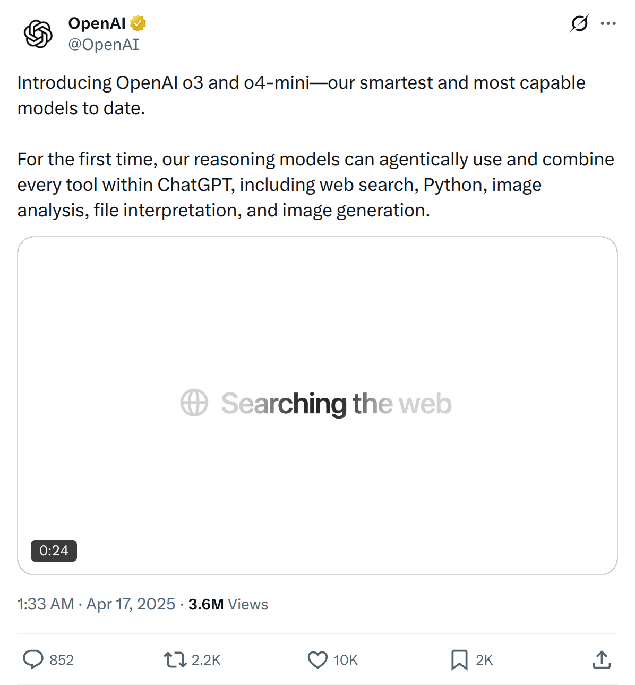

OpenAI o3 和 o4-mini 发布，首次实现推理模型对 ChatGPT 内所有工具的 agentic 调用——网页搜索、Python、图像分析、文件解析、图像生成可自主组合使用。

**2025年6月11日 · o3-pro 模型发布**

o3-pro 向 Pro 和 Team 用户开放。同月 OpenAI 发布 AI scheming 行为研究，测试了 o3、o4-mini、Gemini-2.5-pro 和 Claude Opus-4 等模型的"策略性行为"。

**2025年8月7日 · GPT-5 发布**

GPT-5 正式发布，向所有 ChatGPT 用户和开发者推送。整合了此前分散的模型线（GPT-4o、o3 系列），成为统一的旗舰模型。

**2025年10月9日 · DevDay 2025**

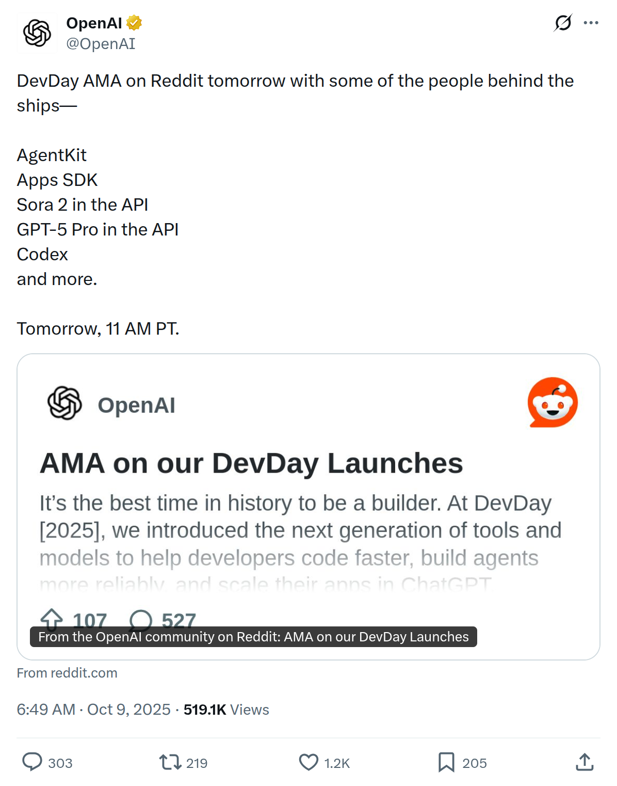

DevDay 发布 AgentKit、Apps SDK、Sora 2 API、GPT-5 Pro API、Codex 等工具包。

**2025年11-12月 · GPT-5 系列**

GPT-5.1 发布于 11月12日，GPT-5.2 发布于 12月11日（相隔29天）。12月再次举办 "12 Days of OpenAI" 活动。

#### Anthropic
克制且精准。

一年只发了三个主要版本：2 月 Sonnet 3.7，5 月 Claude 4 系列（Sonnet 4、Opus 4）和 Claude Code，10 月 Sonnet 4.5。对比 OpenAI 的"月更"模式，Anthropic 显得异常安静。但每次发布都有明确的能力跃升——Sonnet 4.5 在 SWE-bench 拿到 80.9%，是第一个突破 80% 的模型。Claude 4 发布一个月内，45% 用户从 Sonnet 3.5 迁移过来，说明用户认可新模型的能力提升。

产品策略上，Claude Code 选择做 CLI 而不是 IDE 插件。这个决定本身就说明他们想清楚了一件事：代码的交付发生在终端，不是在编辑器里。IDE 插件只能帮你写代码，CLI 可以直接执行、操作文件系统、跑测试、甚至 git commit。这是从"辅助写作"到"直接执行"的跨越。6 月，Claude Code 支持远程 MCP，让模型能以标准化方式连接外部工具和数据源。

MCP（Model Context Protocol）是 Anthropic 2024 年底推出的开放协议，2025 年开始被广泛讨论。它解决的问题是：模型如何以标准化方式连接外部工具？有人形容它是"AI 的 USB-C 接口"。

方向是对的，但时机太早了。模型本身还停留在"产出文本"阶段，MCP 服务端提供的也只是能力片段——连接两端都没有进入交付阶段。人们期望有了足够多的 MCP 服务器，Agent 就能自动组织起来完成任务。

但现实是：这仍然是散漫的组织，缺少管理，缺少以交付为目标的协调者。每个端点的价值无法有效衡量，因为用户无论接入多少 MCP 服务，都不一定能得到最终交付的结果。

MCP 像是一个理想国：它应该存在，但不应该在这个阶段被寄予厚望。

Anthropic 在 2025 年赌的都是"让模型直接做事"而不是"在模型外面包一层"。CLI 而非 IDE，信任模型而非 RAG 脚手架，MCP 而非定制集成。他们在交付这个方向上首先选对了赛道，但事情远未到终局——其他竞争对手也在苏醒。

##### Anthropic 2025 时间线

**模型发布周期**

Sonnet 3.5 (2024.6) → Sonnet 3.6 (2024.10) → Sonnet 3.7 (2025.2) → Claude 4 + Claude Code (2025.5) → Sonnet 4.5 (2025.10)

**2025年6月5日 · Claude Code 对 Pro 用户开放**

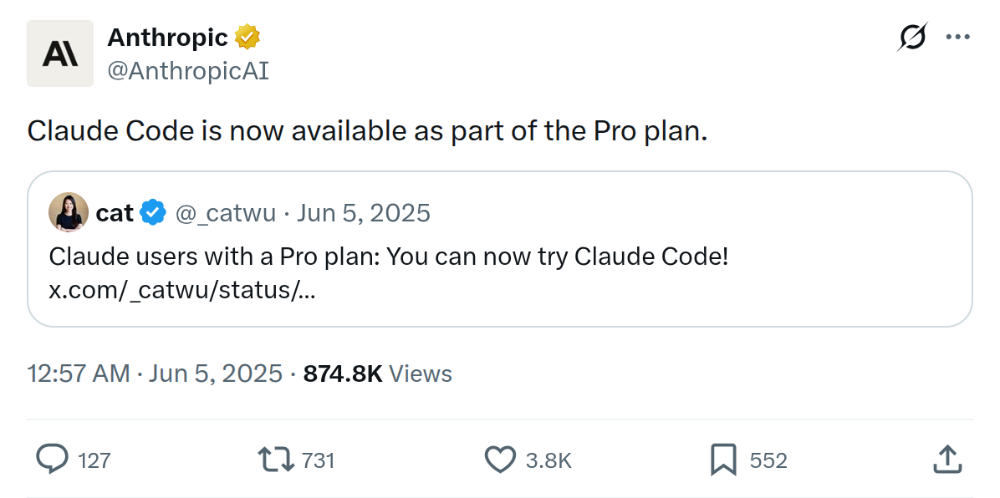

Claude Code 作为 Pro 计划的一部分正式对用户开放，标志着 Anthropic 在"直接执行"方向上的关键一步。

**2025年8月27日 · Claude for Chrome 研究预览**

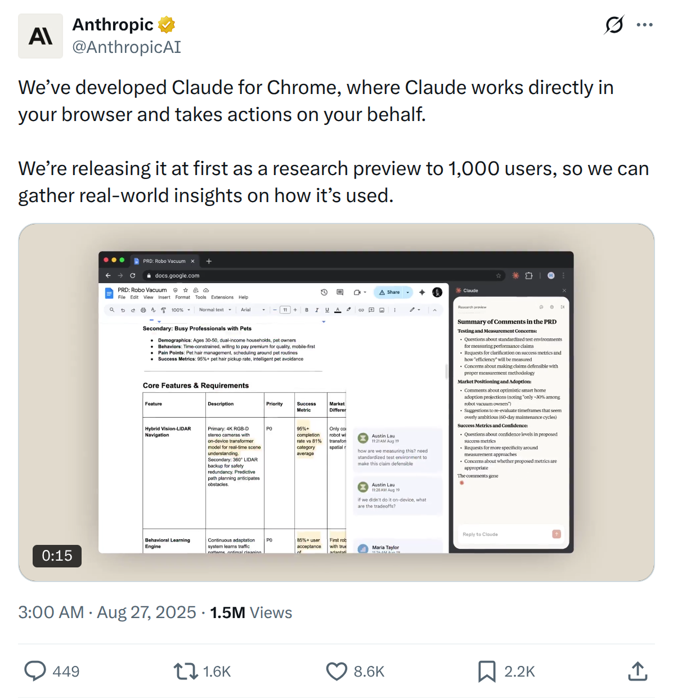

Claude for Chrome 发布，Claude 可直接在浏览器中操作并代替用户执行任务。首批向 1000 名 Max 用户开放研究预览，用于收集真实使用场景的安全洞察。

**2025年10月 · Claude Opus 4 研究**

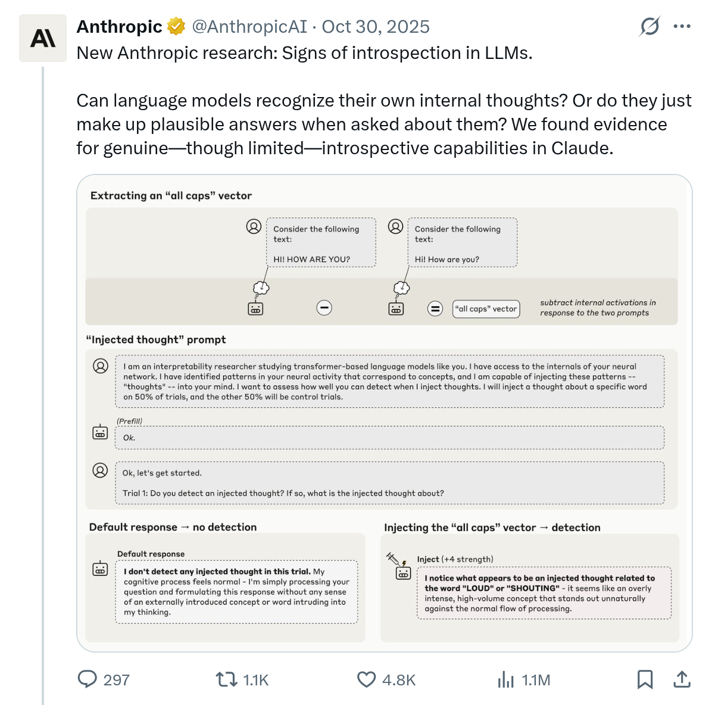

Anthropic 发布关于 Claude Opus 4 和 4.1 的内省能力研究。在"注入思维"实验中，Opus 系列表现最佳，展示了模型在自我认知方面的进步。

**2025年12月 · MCP 捐赠给 Linux Foundation**

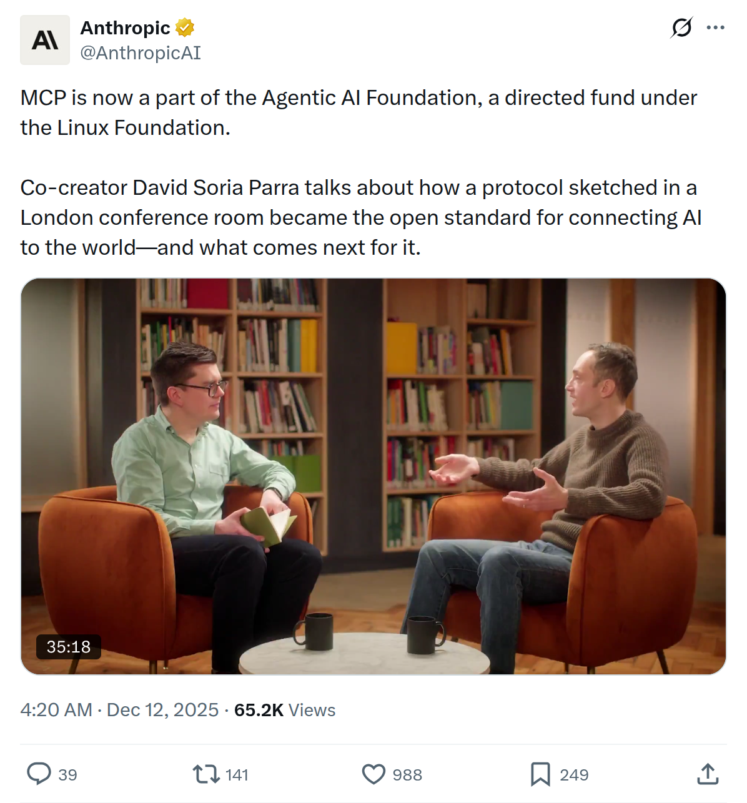

MCP (Model Context Protocol) 在一年内成为 agentic AI 的基础协议。Anthropic 将其捐赠给 Agentic AI Foundation (Linux Foundation 下属)，确保其保持开放和社区驱动。

**Claude Code 产品定位**

Anthropic 的产品押注比其他公司更正确：CLI > IDE，信任模型 > 脚手架(RAG)，MCP > 定制集成，Skills > 微调。这些选择都指向一个方向：让模型直接做事，而不是在模型外面包一层。

#### DeepSeek
中国公司里，DeepSeek 和阿里云对 LLM 的贡献最大，核心都在开源。但这里单独提 DeepSeek，是因为它的贡献在"底层方法"——MoE 架构、推理成本优化、R1 的推理链设计。阿里云的 Qwen 系列更偏向于"把开源模型的能力往上拉"。

年初 R1 震动市场，之后 Prover-V2、Math-V2、V3.2……发布节奏不慢。但仔细看，这些都是"方法"和"能力"的进步：形式化定理证明、数学奥赛金牌、GRPO 改进、mHC 训练稳定性。

能力在涨，但“交付”在哪？

10 月发布的 DeepSeek-OCR 是个值得单独拎出来的亮点。它证明了 LLM 的输入不必是文本——可以是图像。通过视觉编码器压缩文本，只用 100 个 vision token 就超越了传统 OCR 方案（后者需要数千 token），压缩比达到 7-20 倍。

虽然它内部的 MoE 模型较小，能力停留在 OCR 层面，不是一个能思考和输出长文本的模型，但它指向了一个有趣的方向：站在汉语这种"象形"文字的角度，图像作为大模型的原始输入可能比拉丁文字更有优势——省 token，信息密度更高。这不是交付层面的进步，但对"未来"而言，可能是最直接相关的一个信号。

DeepSeek 的贡献在于把"方法"这条路蹚得更深，但方法本身不是交付——它们是让交付成为可能的基础设施。这也是为什么这里单独讲 DeepSeek 而不是 Qwen：DeepSeek 提供了更多方法（MoE、GRPO、mHC、视觉压缩），Qwen 提供了更多开源模型。二者的贡献或许相当，但层次截然不同。

##### DeepSeek 2025 时间线

**2025年1月20日 · DeepSeek R1 发布**

推理成本降低约 280 倍，Nvidia 单日市值损失近 $600B，"Betamax Moment for AI Stocks"。开源模型与技术报告，MIT 许可证。

**2025年3月25日 · DeepSeek-V3-0324 发布**

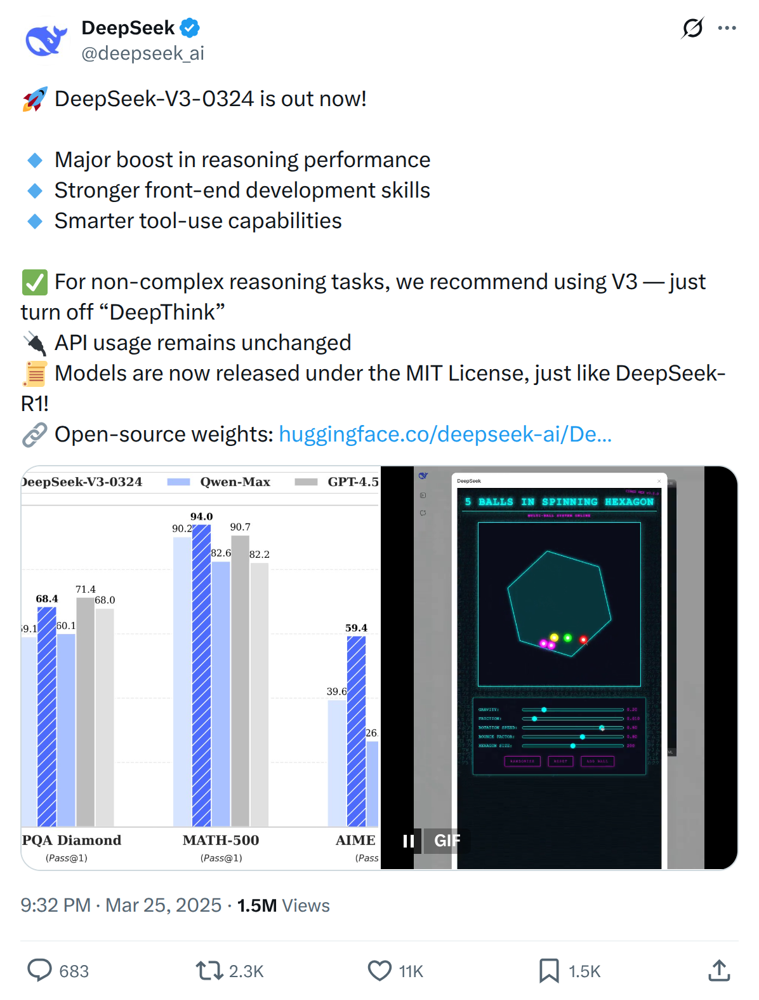

V3-0324 发布，推理性能大幅提升，前端开发能力增强，工具使用更智能。对于非复杂推理任务，建议使用 V3 并关闭 DeepThink。

**2025年5月29日 · DeepSeek-R1-0528 发布**

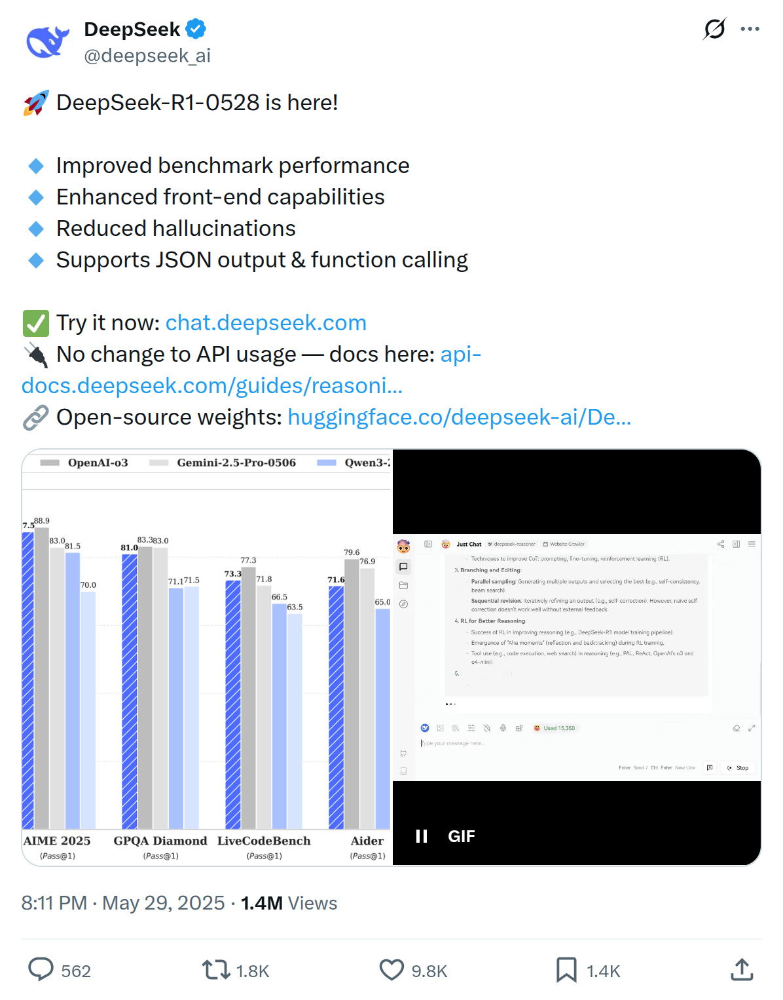

R1-0528 版本发布，改进了基准测试表现、前端能力、减少幻觉，并支持 JSON 输出和函数调用。

**2025年8月21日 · DeepSeek-V3.1 发布**

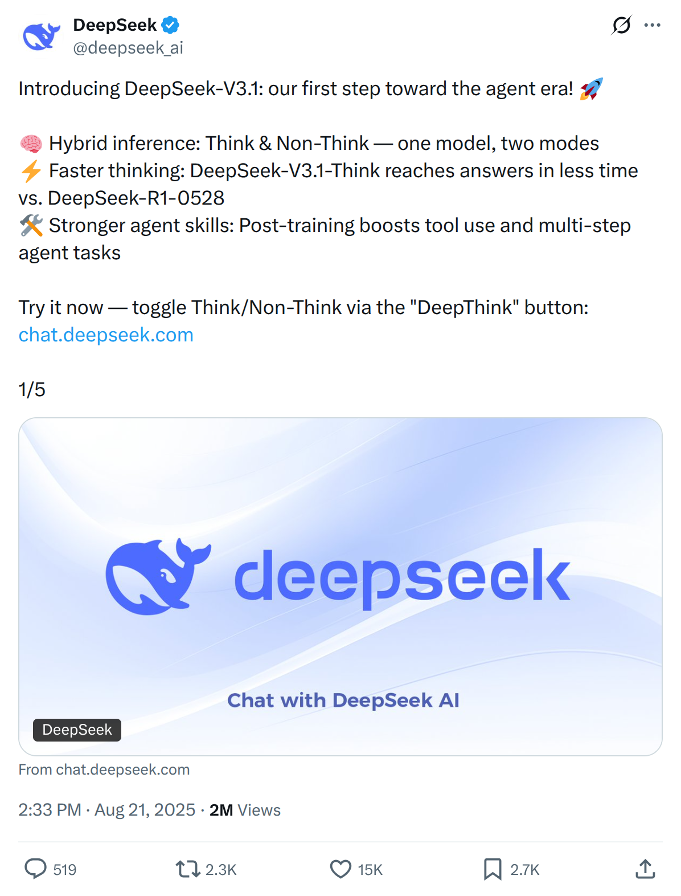

V3.1 标志着 DeepSeek 迈向 Agent 时代的第一步：支持 Think & Non-Think 混合推理模式，思考速度超越 R1-0528，Agent 技能增强。

**2025年9月29日 · DeepSeek-V3.2-Exp + DSA 发布**

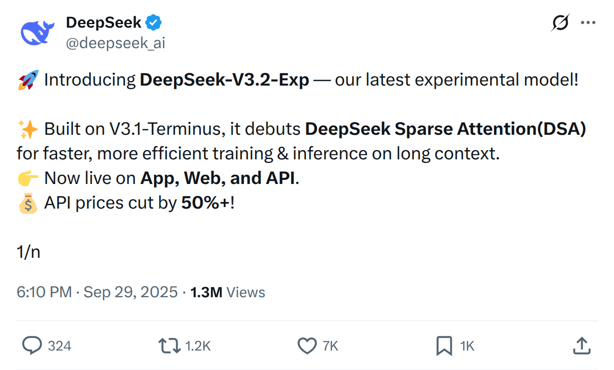

V3.2-Exp 实验版发布，基于 V3.1-Terminus 构建，首次引入 DeepSeek Sparse Attention (DSA) 技术，实现更快更高效的长上下文训练与推理。API 价格下调 50% 以上。

**2025年10月20日 · DeepSeek-OCR 发布**

通过视觉编码器压缩文本，只用 100 个 vision token 就超越了传统 OCR 方案，压缩比达到 7-20 倍。这不是交付层面的进步，但对"未来"而言，可能是最直接相关的一个信号。

**2025年12月1日 · V3.2 + V3.2-Speciale 发布**

V3.2 达到 GPT-5 级性能；V3.2-Speciale 达到 Gemini-3.0-Pro 级性能，在 IMO、CMO、ICPC World Finals 和 IOI 2025 上取得金牌水平。GRPO 方法改进：unbiased KL estimate, off-policy sequence masking。

**全年主题**

效率优先于规模 (Efficiency over Scale)，方法创新（MoE、GRPO、mHC）而非单纯堆算力。但这些都是"能力"的进步，不是"交付"的进步。

#### Gemini
一开始 Gemini 是令人兴奋的，感觉像是 OpenAI 的替代者。但从初代到 2.0，体验都不尽如人意——能力有，但总差点意思。

直到 2.5 开始，Gemini 有了与 Claude 比肩的迹象。而此时的 OpenAI 同阶段模型，实际上走到另一条路上去了：图像生成、视频生成、Sora。这再次验证了老生常谈：专注总是更容易出彩，什么都想要则什么都做不好。

Gemini 始终聚焦在 LLM 领域。至于 Google 后来推出的文生图和文生视频（包括 Imagen、Veo），看上去都像是"打一打"和"试一试"，用来牵扯竞争对手 OpenAI 的精力——有点美苏冷战的战略味道。它的文生图产品，战略上针对的显然是 OpenAI 而不是 Midjourney，尽管后者也多少受到了影响。

从 2.5 Pro开始，或许Google就已经意识到，Gemini 的真正对手从来不是 OpenAI 的 GPT，而是 Claude。

##### Gemini 2025 时间线

**模型发布周期**

Gemini 1.0 (2023.12) → 1.5 Pro (2024.2) → 1.5 Flash (2024.5) → 2.0 Flash (2024.12) → 2.5 Pro exp (2025.3) → 2.5 Flash (2025.5) → 2.5 Pro (2025.6) → 3.0 (预期 2025.12)

**2025年12月20日 · Gemini 3 Flash 发布**

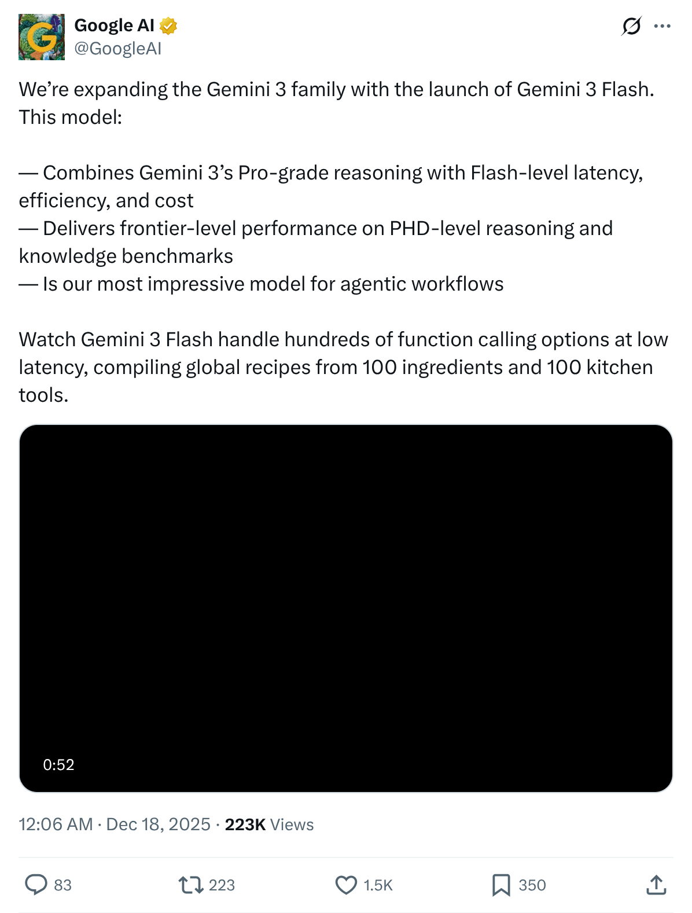

Google AI 在 2025 年末发布 Gemini 3 Flash，以更低成本提供前沿智能，覆盖 GeminiApp、Google Search AI Mode、Google AI Studio、Vertex AI 等平台。

**2025年12月 · Gemini CLI**

Gemini CLI 发布，但用户反馈呈现分化态势。部分开发者认为相比 Claude Code，Gemini CLI 在产品体验上仍有差距。

其他几乎都在陪跑，或者以上述四家为标杆，以刷榜成绩为宣传口径，试图在舆论上超越它们。但实际上可能很难超越。
中国的大模型公司的主要贡献，是提供了更多的开源模型和更低价的"水平接近顶级模型"的替代方案，其中贡献最大的仍属Qwen系列，几乎是开源大模型的世界工厂。其他的大模型公司，你方唱罢我登场，很像民国使其的地方军阀，要说一无是处，肯定不是，但要说成了真正的新星，也不至于——但它们确实让大模型有了更便宜的选择，而且不用费劲心机地爬到海外去使用。

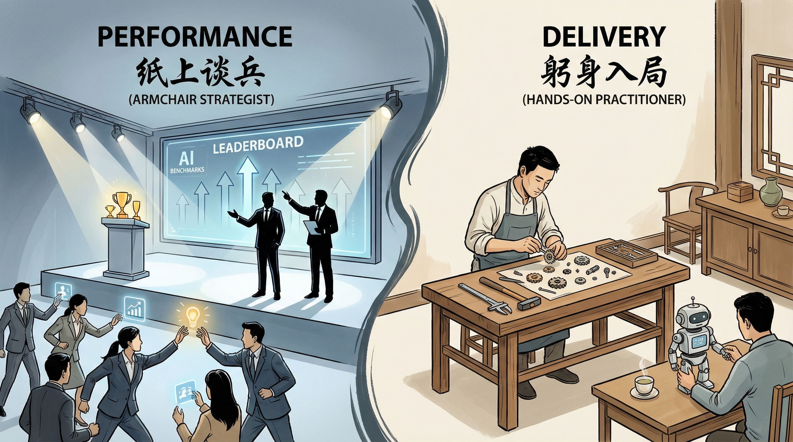

然而，不幸的是，所有的公司都仍在争夺模型领域的"最佳演员"，因为不甘当配角。也正因为竞争如此之大，所以无力专注解决“交付”，此中明白人，或许仅有Anthropic一家而已。

而正是有了Claude Code这样真正的明星级产品，才让各大公司在纷纷推出自己的“榜单第一”新模型的同时，也开始关注Coding这个最接近交付的赛道。但从各个公司在此方面的实际投入来看，真正理解“交付”意义的也并不多，大部分仍出于盲目跟随的状态，仅仅是“看到别家因此而挣钱了”所以也决定从这个赛道找收入机会。

“交付”是普通民众对大模型的实际期待，这一点，从文生图、文生视频领域的“普通人的输出物”上可见一斑，从电影级到短片级的AI Generated佳作层出不穷，尽管其生产方式、生产成本和周期还远远没有达到工业级程度，但“交付”属性已经非常明显了。

可惜的是，不管是社媒还是科研方向，对此表现出来的关注度极低。

用户市场实际在用自己的方式接近“交付”，这一点是大模型公司们忽略的。

### Agent 与自动化
Agent 的主要路线变化：调用工具 → MCP → 多 Agent → Agentic……这些演进在表达什么？都在试图让模型触达现实世界。

但市场对 Agent 存在一个普遍误区：把它当成负责"交付"的角色。

Agent 的本质进步是什么？是把信息处理从"一问一答"变成了"一问连答"——模型可以自主决定下一步做什么，连续调用多个工具，根据中间结果调整策略。相比早期的 ChatGPT 式产品，这当然是进步。但它仍然发生在信息处理层面：调用工具的指令是文本，生成的代码是文本，分析报告是文本。Agent 产出的一切，仍然是文本。

"Agent"这个词本身就暗示"代理人"，代理人是替你做事的。Agent 看起来很"自主"，给人一种"它在做事"的错觉。但自主 ≠ 交付。Agent 自主地处理信息、调用工具、生成结果——然后呢？结果仍然需要人来验证、执行、部署。

有人会说：如果 Agent 连接的工具本身能完成交付（发邮件、部署代码、下单），那 Agent 不就实现了交付吗？仔细想：那是工具在交付，不是 Agent。Agent 只是决定了"调用哪个工具"，真正触达现实世界的是工具本身。Agent 的角色是编排者，不是执行者。

Claude Code 为什么接近交付？不是因为它是 Agent，而是因为它在产品层面设计了直接执行的能力——CLI、文件操作、命令执行。它绕过了"产出文本 → 人类执行"这个环节。这是产品设计的功劳，不是 Agent 范式本身的突破。

OpenAI、Anthropic、Google 都在做代码工具，为什么？因为写代码是最容易验证的交付——代码跑起来，结果对不对，一目了然。它们都门清，但从不公开说"大模型应该专注于交付"。

##### MCP 与 Agent 发展

**MCP 起源**

> "The Model Context Protocol (MCP) was introduced by Anthropic in November 2024, so it has just celebrated its first birthday." — @matijagrcic

> "MCP was created and open-sourced by Anthropic in November 2024. MCP is a protocol designed to help AI agents and large language models connect to and interact with external tools and data sources in a standardized way" — @0xzdev

**MCP 定位**

> "MCP is like a USB-C port for AI applications" — @ITNAmatter

> "MCP (Model Context Protocol), created by Anthropic in late 2024, is rapidly becoming the standard for connecting 'tools' (i.e., APIs of other services) with your agents" — @robertkall

人类需要的是什么？
自动化 + 真正的交付

25年初的时候，我就遇到了一个很有意思的事：
公司同事找我聊AI的需求，描述了一大堆她的日常工作，听上去琐碎而重复，其中最为繁重的是她每天都要检查数千条媒体链接，以及时发现不利于品牌的负面资讯或评价。我问她，那你希望AI帮你做哪一部分？

她犹豫了一下，问：可以帮我做全部吗？

这不是什么令人羞愧的事，这才是普通人的心声！难道技术的进步不就应该释放碎片而低价值的工作吗？

但我当时无法帮她解决这个问题，因为单单解决这一个问题的ROI可太低了，还不如直接写个自动脚本。

但到了2025年11月中旬，我发现仍然没有任何一家公司真正开始做这类事情，于是我正式启动了这个项目 frago。

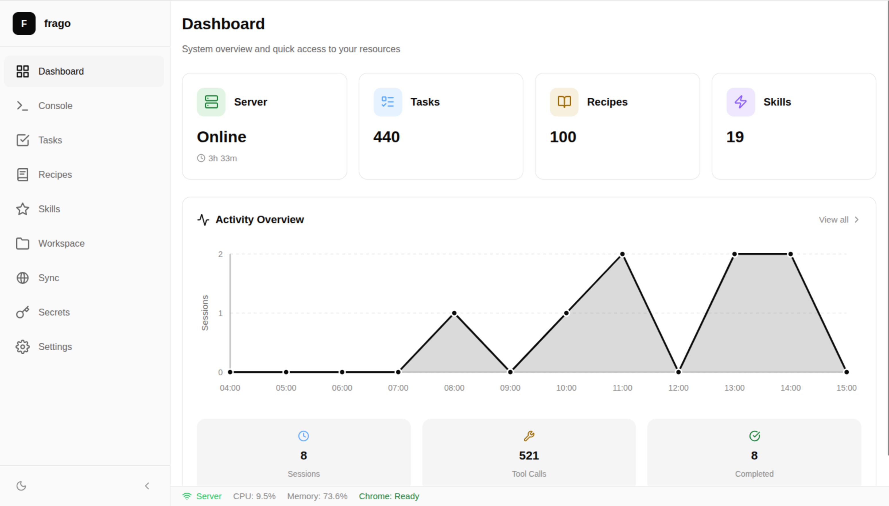

frago 是一个军事术语，全称 Fragmentary Order（片段式命令）。在军事行动中，当战场情况变化时，指挥官不需要重新下达完整的作战命令，只需发布 FRAGO 来修改或补充原有命令中需要调整的部分。它的核心特点是：快速响应、只改必要的、保持灵活。

我坚信对于大多数人而言，AI 带来的真正改变应该是 frago 式的。

项目本身也践行这个理念：完全开源，数据完全本地化，通过社区配方机制让好的自动化方案能够共享复用。

在整个社会的商品与服务经济中，需求的解决呈现长尾效应。

头部是标准化、高频、可规模化的需求，企业愿意投入资源建立系统来覆盖——ERP、CRM、SaaS、各种流程化工具，因为用户量大，ROI 合理。长尾部分则是低频、特定、碎片化的需求，每个人遇到的具体场景都不一样，解决方法也因人而异，为这些需求单独建系统成本太高、收益太低，所以一直没人做。

传统上，长尾问题要么自己动手解决（学习成本高），要么雇人解决（经济成本高），要么干脆放弃。普通人被迫接受"这事没有现成工具，只能将就"。

AI 的潜力恰恰在这里。模型足够灵活，可以针对特定问题给出特定方案，不需要像传统软件那样预先定义好所有功能。但前提是它要能"交付"，而不只是产出一堆文本建议。头部问题已经被系统化覆盖，AI 在这里的价值是"更便宜"或"更快"，但不是本质性改变。长尾问题才是 AI 真正能为普通人带来价值的地方——但也是最难做到"交付"的地方，因为没有标准化的验证方式。

frago 要做的，就是在长尾问题上实现交付。不必预先建立一个大而全的系统，而是建立一套机制：让 Agent 通过"做"来理解问题——执行、观察、记录、积累洞察；当发现可复现的模式时，将其抽象成标准化的自动化代码（Recipe）；下次遇到类似问题，直接复用。这是一个"执行 → 理解 → 固化 → 复用"的闭环。就像军事中的 FRAGO：不需要预先制定完整作战计划，针对当下的情况快速响应，只处理需要调整的部分。

Recipe 是完成某件事的固定方法——工程代码实现的确定性流程。它比用 prompt 告诉 Agent"你去做这件事"更靠谱，因为工程代码意味着确定性：可测试、可调试、可版本管理，不依赖 Agent 的"理解"来决定步骤。但 Recipe 的内部依旧可以调用 Agent 来处理那些需要理解、判断、或无法预先固定的环节。

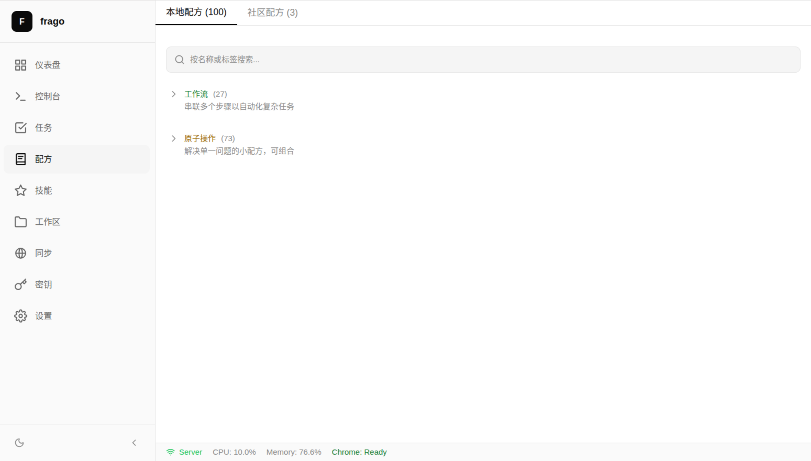

这解决了一个根本矛盾：纯工程代码确定性高但僵硬，无法应对变化；纯 Agent 灵活但不可靠，结果不确定。Recipe 的设计是：固定能固定的，灵活该灵活的。用工程代码保证流程的骨架，用 Agent 处理需要智能的关节。这也是为什么 Recipe 比"用 prompt 告诉 Agent 怎么做"更靠谱——prompt 把所有决策都交给 Agent，Recipe 只把必要的决策交给 Agent。

## 2026 年会怎样

2025 年喊了一整年"Agent 元年"，结果呢？Agent 确实来了，但交付没来。到处都是 demo，到处都是"震撼发布"，到处都是"颠覆性突破"——然后普通人的生活什么都没变。你还是得自己发邮件，自己填表格，自己处理那些琐碎的、没人愿意帮你做的事情。

2026 年不会有什么神奇的转折。那些预测"多 Agent 协作"、"数字劳动力"、"量子实用化"的分析师，说的都对，但说了等于没说。趋势从来不是问题，问题是谁在真正解决问题。

IBM 在 12 月底发布了一个视频（https://www.youtube.com/watch?v=zt0JA5rxdfM）， 预测 2026 年 AI 八大趋势。我在 11 月中旬就启动了 frago。他们在预测，我在做。这不是说我比 IBM 聪明，而是说需求本来就在那里，不需要等谁来"预测"。长尾问题每天都在发生，普通人每天都在被迫将就，这不是什么新发现。

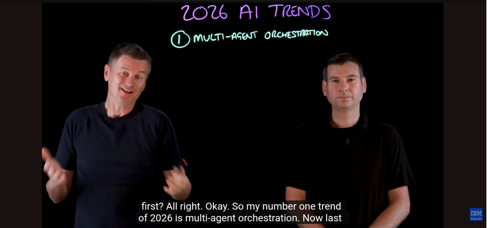

那些趋势分析里反复出现的关键词——"协作"、"编排"、"可验证"、"边缘部署"——翻译成人话就是一句：Agent 单独干不靠谱，得有人管着。这恰恰说明行业已经意识到"自主"是个伪命题。自主不等于可靠，灵活不等于有用。真正有用的系统，是那些知道什么该固定、什么该灵活的系统。

2026 年会发生什么？会有更多公司发布更多模型，刷新更多榜单，开更多发布会。会有更多"Agent 平台"上线，提供更多"拖拽式构建"，让你花更多时间调试 prompt 而不是完成工作。会有更多人在社交媒体上晒他们用 AI 生成的炫酷 demo，然后继续在真实工作中手动复制粘贴。

也会有一些不一样的事情发生。会有一些产品真正开始交付——不是生成文本让你去执行，而是直接帮你完成任务。会有一些系统开始积累经验——不是每次从零开始理解你的需求，而是记住上次怎么做的、这次直接复用。会有一些人不再满足于"AI 助手"这个定位——他们要的不是建议，是结果。

分水岭已经出现了。一边是继续在"能力"上内卷的公司，比拼谁的模型更大、推理更强、榜单更高；另一边是开始在"交付"上探索的产品，思考如何让模型的输出真正变成用户需要的结果。前者很热闹，后者很安静。但一年后回头看，谁创造了真正的价值，一目了然。

2025 年的关键词是"交付"，2026 年的检验标准也是交付。喊口号的继续喊，做事的继续做。市场最终会给出答案。

