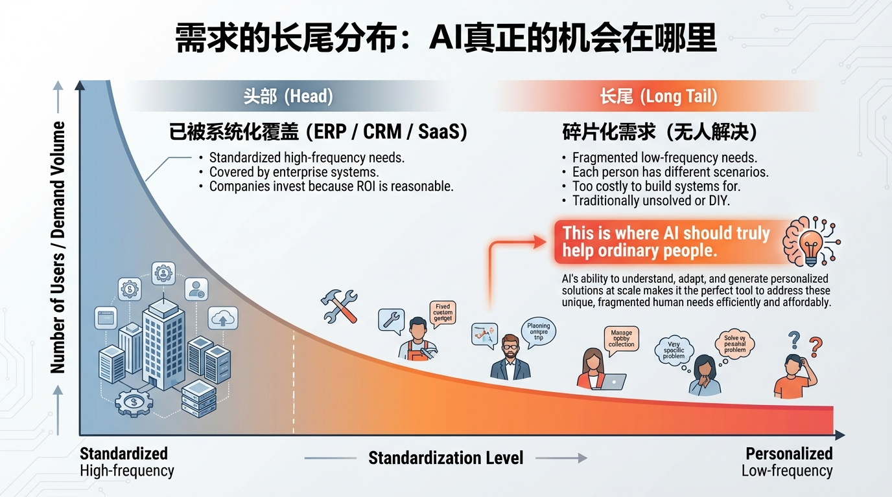
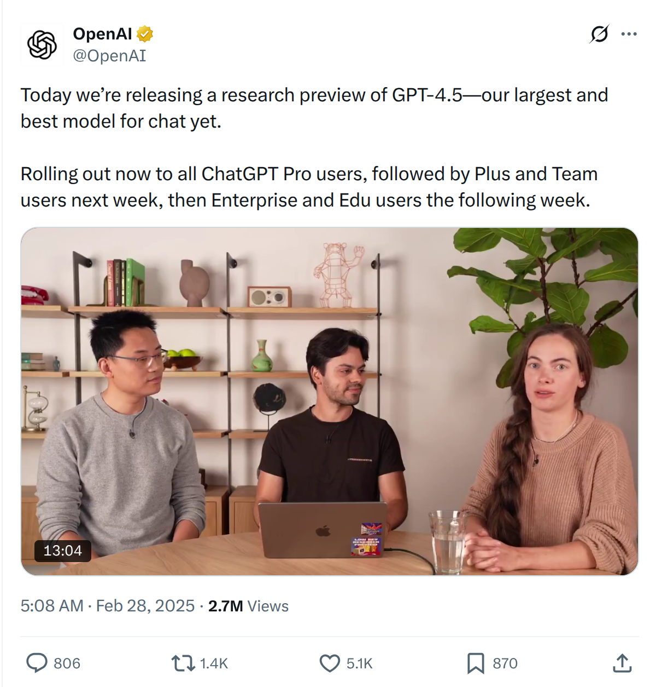
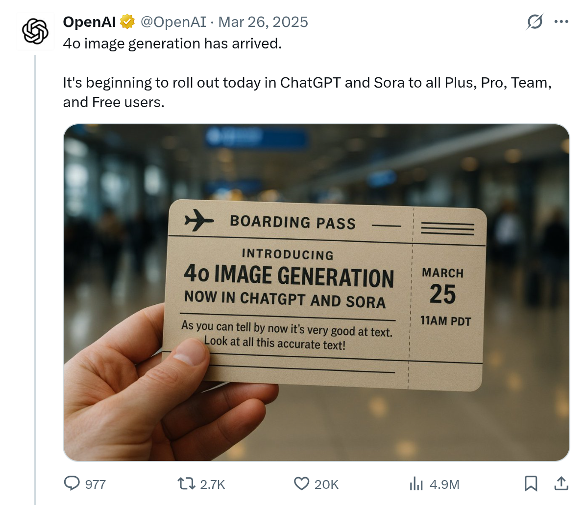
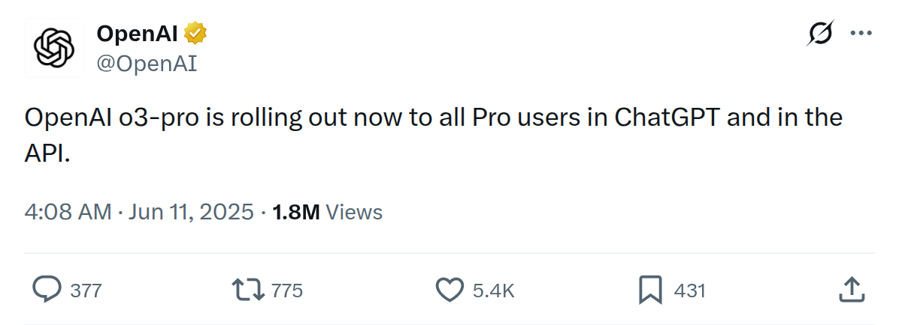
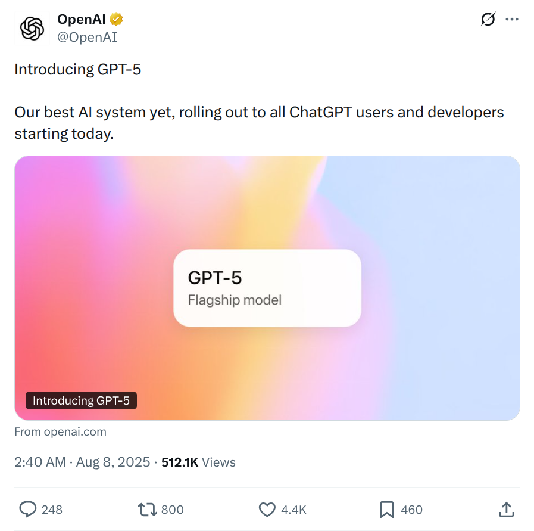
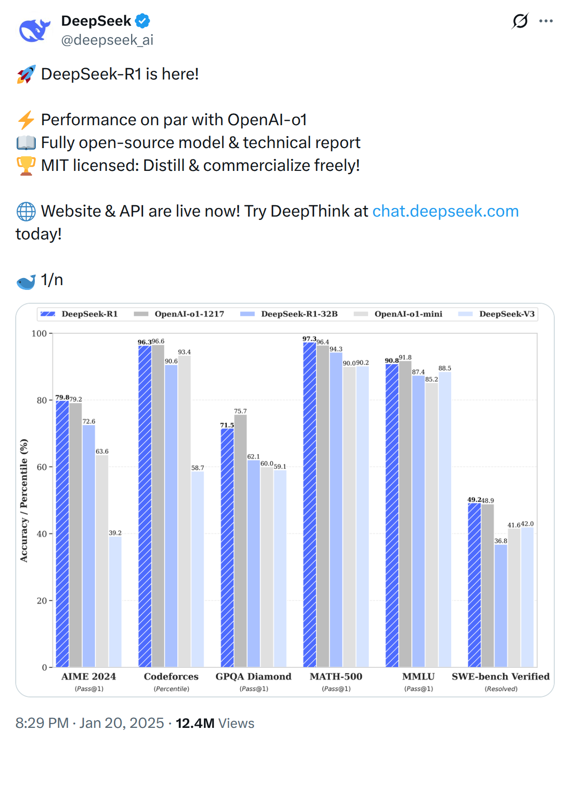
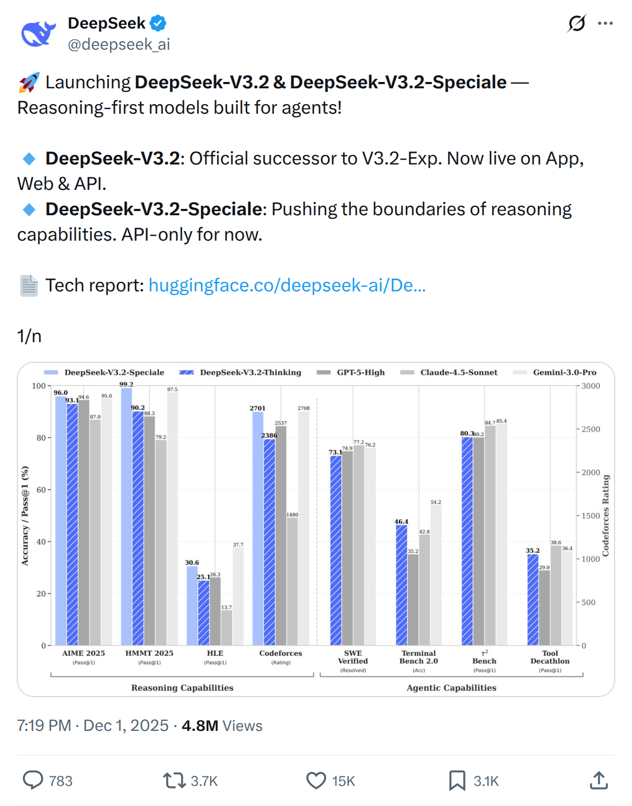
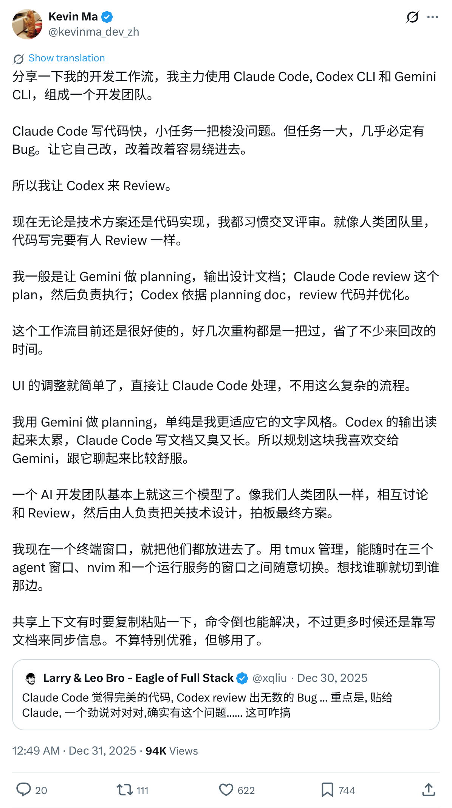
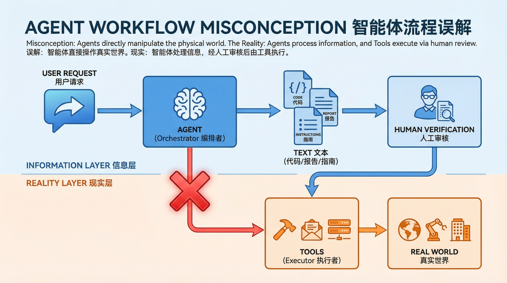
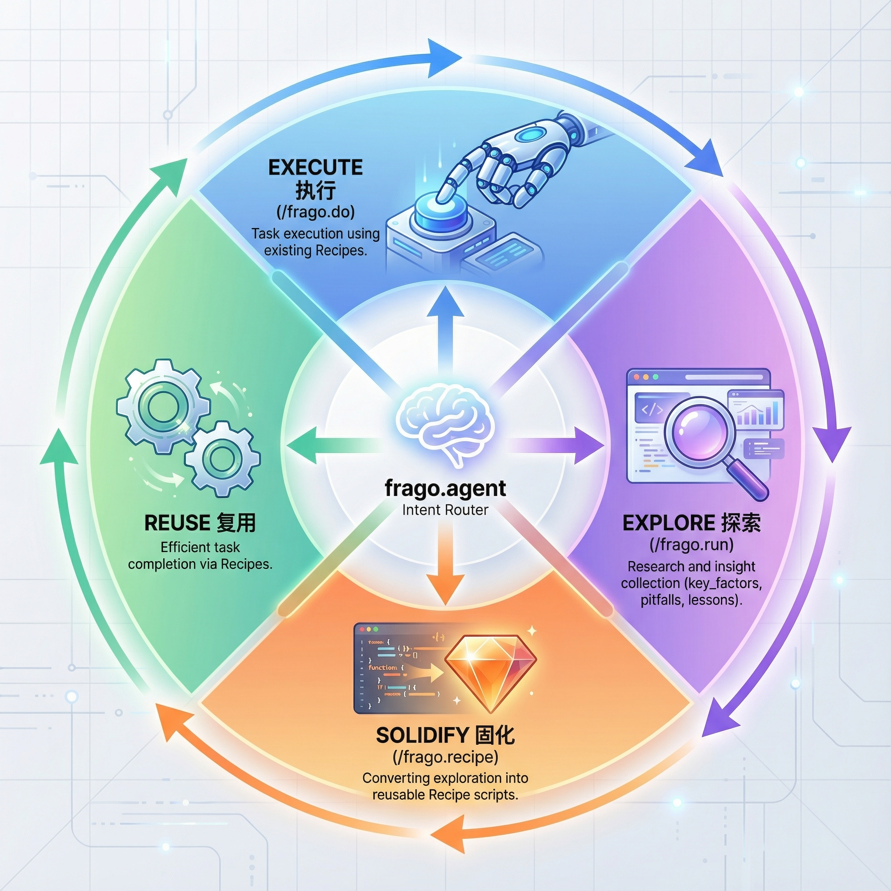

# LLMs in 2025 and 2026: A Year Without Delivery vs Delivery Is Coming

## What Happened in 2025

The most striking characteristic of the large model industry in 2025 was "noise." Model iterations happened at an unprecedented pace, press conferences followed one after another, benchmark rankings refreshed weekly, and there was always some new "breakthrough" worth discussing on social media. But if you ask an ordinary user: what did AI actually accomplish for you this year? The answer is most likely silence.

Models did get stronger. Reasoning capabilities improved, context windows expanded, multimodality merged, Agents evolved. But between "getting stronger" and "being useful" lies a chasm. That chasm is called "delivery."

What is delivery? It's when a task is actually completed, results actually land, and users don't need to lift a finger anymore. Not generating text for you to execute, not giving suggestions for you to judge, not writing code for you to manually deploy—but the job being done, and you being able to move on to the next thing.

In 2025, the vast majority of large models remained stuck at the "producing text" stage. They're great at generation, but generation is not delivery. This article discusses where various companies got to on "delivery" this year, and why most of them haven't arrived yet.

This diagram illustrates the essence of the problem.

The head contains standardized, high-frequency needs that enterprises are willing to invest in systems to cover—ERP, CRM, SaaS—because user volume is large and ROI is reasonable.

The long tail contains low-frequency, fragmented, individually varying needs. Everyone encounters different scenarios, and building dedicated systems for these is too costly, so nobody does.

Traditionally, long-tail problems are either handled yourself (high learning cost), solved by hiring someone (high economic cost), or simply abandoned.

But AI's real opportunity lies precisely here—with the prerequisite that it can "deliver," not just produce piles of text suggestions.

In 2025, large models may have gilded the lily on the head (but probably didn't even do that), while the long tail remains blank.

### Changes in Major LLM Models

This article is not a horizontal capability benchmark of models. The companies and events selected are based on whether they made noteworthy explorations on the path of "delivery"—not on benchmark scores.

#### OpenAI

The company with the most model version changes in a single year.

At the start of the year, the shock of DeepSeek R1 caused Nvidia to lose nearly $600 billion in market value in a single day, and OpenAI's moat suddenly seemed less deep. On February 27th, GPT-4.5 (codename Orion) launched, focused on natural conversation and reducing hallucinations, but only for Pro users. On March 25th, GPT-4o's image generation capability went live, the Ghibli style swept social media, ChatGPT had 46 million downloads that month to become number one globally—this was OpenAI's most viral moment of 2025, but virality came from "play," not "use."

In June, o3-pro launched, claiming "best at reasoning." In October, DevDay introduced AgentKit, providing a drag-and-drop Agent building interface. In November came GPT-5.1, December GPT-5.2, just 29 days apart. Year-end brought another round of "12 Days of OpenAI."

Programming capability did improve: o1 from September 2024 ranked at the 9,800th position among global programmers, o3 from January 2025 rose to 175th, internal models reportedly reached 50th. But what do these numbers tell us? The model got stronger. And then what?

The model's input is text, and its output is also text. Text is not delivery. You ask it to write an email, it writes it, but the email hasn't been sent; you ask it to analyze data, it analyzes, but the results haven't entered your system. Models themselves don't directly touch the real world—they depend on products to complete delivery. Codex is also just writing code; once written, humans still have to run, deploy, and verify it.

##### OpenAI 2025 Timeline

**February 27, 2025 · GPT-4.5 (Orion) Release**

Codenamed Orion, focused on natural conversation and reducing hallucinations, first available to Pro users.

**March 25, 2025 · GPT-4o Image Generation**

GPT-4o's image generation capability launched, able to accurately render text and precisely follow prompts. Sparked the Ghibli style trend, ChatGPT became the most downloaded app globally that month (46 million downloads).

**April 17, 2025 · o3 and o4-mini Release**

OpenAI o3 and o4-mini released, the first time reasoning models achieved agentic invocation of all tools within ChatGPT—web search, Python, image analysis, file parsing, and image generation could be autonomously combined.

**June 11, 2025 · o3-pro Model Release**

o3-pro opened to Pro and Team users. That same month, OpenAI published AI scheming behavior research, testing "strategic behavior" in models including o3, o4-mini, Gemini-2.5-pro, and Claude Opus-4.

**August 7, 2025 · GPT-5 Release**

GPT-5 officially released, rolled out to all ChatGPT users and developers. Consolidated the previously scattered model lines (GPT-4o, o3 series) into a unified flagship model.

**October 9, 2025 · DevDay 2025**

DevDay released AgentKit, Apps SDK, Sora 2 API, GPT-5 Pro API, Codex and other toolkits.

**November-December 2025 · GPT-5 Series**

GPT-5.1 released November 12th, GPT-5.2 released December 11th (29 days apart). December featured another "12 Days of OpenAI" event.

#### Anthropic
Restrained and precise.

Only three major releases all year: Sonnet 3.7 in February, Claude 4 series (Sonnet 4, Opus 4) and Claude Code in May, Sonnet 4.5 in October. Compared to OpenAI's "monthly update" mode, Anthropic seemed unusually quiet. But each release came with clear capability leaps—Sonnet 4.5 achieved 80.9% on SWE-bench, the first model to break 80%. Within a month of Claude 4's release, 45% of users migrated from Sonnet 3.5, indicating users recognized the new model's improved capabilities.

On product strategy, Claude Code chose to be a CLI rather than an IDE plugin. This decision itself shows they thought something through: code delivery happens in the terminal, not in the editor. IDE plugins can only help you write code; CLI can directly execute, operate on file systems, run tests, even git commit. This is the leap from "assisted writing" to "direct execution." In June, Claude Code supported remote MCP, enabling models to connect to external tools and data sources in a standardized way.

MCP (Model Context Protocol) was an open protocol introduced by Anthropic at the end of 2024, which began to be widely discussed in 2025. The problem it solves: how can models connect to external tools in a standardized way? Some described it as "the USB-C port for AI."

The direction is right, but the timing is too early. Models themselves are still at the "producing text" stage, and MCP server-side provides only capability fragments—neither end has entered the delivery stage. People expected that with enough MCP servers, Agents would automatically organize themselves to complete tasks.

But the reality is: this is still loose organization, lacking management, lacking coordinators with delivery as the goal. The value of each endpoint cannot be effectively measured, because no matter how many MCP services users connect to, they may not get a final delivered result.

MCP is like a utopia: it should exist, but shouldn't bear high expectations at this stage.

What Anthropic bet on in 2025 was "letting models do things directly" rather than "wrapping a layer around models." CLI over IDE, trusting models over RAG scaffolding, MCP over custom integrations. On delivery, they first chose the right track, but the end is far from near—other competitors are awakening too.

##### Anthropic 2025 Timeline

**Model Release Cycle**

Sonnet 3.5 (2024.6) → Sonnet 3.6 (2024.10) → Sonnet 3.7 (2025.2) → Claude 4 + Claude Code (2025.5) → Sonnet 4.5 (2025.10)

**June 5, 2025 · Claude Code Opens to Pro Users**

Claude Code officially opened to users as part of the Pro plan, marking a key step in Anthropic's "direct execution" direction.

**August 27, 2025 · Claude for Chrome Research Preview**

Claude for Chrome released, allowing Claude to operate directly in browsers and execute tasks on behalf of users. First opened to 1,000 Max users as a research preview to gather safety insights from real usage scenarios.

**October 2025 · Claude Opus 4 Research**

Anthropic published research on introspection capabilities of Claude Opus 4 and 4.1. In "thought injection" experiments, the Opus series performed best, demonstrating progress in model self-awareness.

**December 2025 · MCP Donated to Linux Foundation**

MCP (Model Context Protocol) became a foundational protocol for agentic AI within a year. Anthropic donated it to the Agentic AI Foundation (under Linux Foundation), ensuring it remains open and community-driven.

**Claude Code Product Positioning**

Anthropic's product bets were more correct than other companies: CLI > IDE, trust models > scaffolding (RAG), MCP > custom integration, Skills > fine-tuning. These choices all point in one direction: letting models do things directly, rather than wrapping a layer around them.

#### DeepSeek
Among Chinese companies, DeepSeek and Alibaba Cloud contributed the most to LLMs, with the core being open source. But DeepSeek is mentioned separately here because its contributions are in "foundational methods"—MoE architecture, reasoning cost optimization, R1's reasoning chain design. Alibaba Cloud's Qwen series leans more toward "raising the capabilities of open source models upward."

R1 shook the market at the start of the year, followed by Prover-V2, Math-V2, V3.2... the release pace wasn't slow. But look closely—these are all improvements in "methods" and "capabilities": formal theorem proving, math olympiad gold medals, GRPO improvements, mHC training stability.

Capabilities are rising, but where is "delivery"?

DeepSeek-OCR released in October is a highlight worth singling out. It proved that LLM input doesn't have to be text—it can be images. By compressing text through visual encoders, it surpassed traditional OCR solutions with only 100 vision tokens (the latter requires thousands of tokens), achieving compression ratios of 7-20x.

Although its internal MoE model is relatively small, with capabilities limited to the OCR level—not a model that can think and output long text—it points to an interesting direction: from the perspective of Chinese as a "pictographic" script, images as the raw input to large models may have advantages over Latin scripts—saving tokens with higher information density. This isn't progress on the delivery level, but for "the future," it may be the most directly relevant signal.

DeepSeek's contribution lies in deepening the "methods" path, but methods themselves aren't delivery—they're the infrastructure that makes delivery possible. This is also why DeepSeek is discussed separately from Qwen: DeepSeek provides more methods (MoE, GRPO, mHC, visual compression), while Qwen provides more open source models. Their contributions may be comparable, but at completely different levels.

##### DeepSeek 2025 Timeline

**January 20, 2025 · DeepSeek R1 Release**

Reasoning costs reduced by approximately 280x, Nvidia lost nearly $600B in market value in a single day, "Betamax Moment for AI Stocks." Open source model and technical report, MIT license.

**March 25, 2025 · DeepSeek-V3-0324 Release**

V3-0324 released with significantly improved reasoning performance, enhanced frontend development capabilities, and smarter tool usage. For non-complex reasoning tasks, recommend using V3 with DeepThink disabled.

**May 29, 2025 · DeepSeek-R1-0528 Release**

R1-0528 version released with improved benchmark performance, frontend capabilities, reduced hallucinations, and support for JSON output and function calling.

**August 21, 2025 · DeepSeek-V3.1 Release**

V3.1 marks DeepSeek's first step toward the Agent era: supports Think & Non-Think hybrid reasoning mode, thinking speed surpasses R1-0528, enhanced Agent skills.

**September 29, 2025 · DeepSeek-V3.2-Exp + DSA Release**

V3.2-Exp experimental version released, built on V3.1-Terminus, first introducing DeepSeek Sparse Attention (DSA) technology for faster, more efficient long-context training and inference. API prices reduced by over 50%.

**October 20, 2025 · DeepSeek-OCR Release**

Through visual encoder compression of text, surpassed traditional OCR solutions with only 100 vision tokens, achieving compression ratios of 7-20x. This isn't progress on the delivery level, but for "the future," it may be the most directly relevant signal.

**December 1, 2025 · V3.2 + V3.2-Speciale Release**

V3.2 achieved GPT-5 level performance; V3.2-Speciale achieved Gemini-3.0-Pro level performance, with gold medal performance on IMO, CMO, ICPC World Finals, and IOI 2025. GRPO method improvements: unbiased KL estimate, off-policy sequence masking.

**Year-Round Theme**

Efficiency over Scale, method innovation (MoE, GRPO, mHC) rather than simply stacking compute. But these are all improvements in "capability," not "delivery."

#### Gemini
Initially, Gemini was exciting, feeling like a potential OpenAI replacement. But from the first generation to 2.0, the experience was unsatisfying—capabilities existed, but something always felt off.

It wasn't until 2.5 that Gemini showed signs of matching Claude. Meanwhile, OpenAI at the same stage had actually gone down a different path: image generation, video generation, Sora. This once again validates the cliché: focus always shines more easily, while wanting everything achieves nothing well.

Gemini has consistently focused on the LLM domain. As for Google's later text-to-image and text-to-video offerings (including Imagen, Veo), they all look like "taking a swing" and "trying it out," meant to tie up competitor OpenAI's energy—with a bit of Cold War strategic flavor. Their text-to-image product strategically targets OpenAI rather than Midjourney, though the latter was also affected to some degree.

Starting with 2.5 Pro, perhaps Google already realized that Gemini's true rival was never OpenAI's GPT, but Claude.

##### Gemini 2025 Timeline

**Model Release Cycle**

Gemini 1.0 (2023.12) → 1.5 Pro (2024.2) → 1.5 Flash (2024.5) → 2.0 Flash (2024.12) → 2.5 Pro exp (2025.3) → 2.5 Flash (2025.5) → 2.5 Pro (2025.6) → 3.0 (expected 2025.12)

**December 20, 2025 · Gemini 3 Flash Release**

Google AI released Gemini 3 Flash at the end of 2025, providing frontier intelligence at lower cost, covering GeminiApp, Google Search AI Mode, Google AI Studio, Vertex AI and other platforms.

**December 2025 · Gemini CLI**

Gemini CLI released, but user feedback was divided. Some developers felt that compared to Claude Code, Gemini CLI still had gaps in product experience.

Nearly everyone else was running alongside, or using the above four companies as benchmarks, using benchmark scores as marketing talking points, trying to surpass them in public discourse. But in reality they probably can't.
The main contribution of Chinese large model companies has been providing more open source models and cheaper "near-top-tier" alternatives, with Qwen series contributing the most—essentially the world's factory for open source large models. Other large model companies, taking turns on stage, resemble regional warlords from the Republican era. It's not that they're worthless, but they haven't become true new stars either—though they did make large models more affordable and accessible without having to struggle overseas.

Unfortunately, all companies are still competing to be the "best actor" in the model domain, unwilling to play supporting roles. And precisely because competition is so intense, they lack the bandwidth to focus on solving "delivery." Perhaps only Anthropic truly understands this.

It's precisely because of a genuine star product like Claude Code that various companies, while rushing to release their own "benchmark #1" new models, have also begun paying attention to Coding—the track closest to delivery. But judging from each company's actual investment in this area, not many truly understand the meaning of "delivery." Most are still blindly following, merely "seeing others make money from it" and deciding to find revenue opportunities from this track too.

"Delivery" is what ordinary people actually expect from large models. This is evident from the "ordinary people's outputs" in text-to-image and text-to-video domains—AI-generated masterpieces ranging from film-level to short-video-level are emerging endlessly. Although their production methods, costs, and timelines are still far from industrial grade, the "delivery" attribute is already very obvious.

Unfortunately, whether in social media or research directions, attention to this has been extremely low.

The user market is actually approaching "delivery" in its own way—a point that large model companies have overlooked.

### Agents and Automation
The main evolution of Agent approaches: tool calling → MCP → multi-Agent → Agentic... What are these evolutions expressing? All trying to make models reach the real world.

But there's a widespread misconception about Agents: treating them as responsible for "delivery."

What is the essential progress of Agents? Transforming information processing from "one question, one answer" to "one question, continuous answers"—models can autonomously decide what to do next, call multiple tools in sequence, adjust strategies based on intermediate results. Compared to early ChatGPT-style products, this is certainly progress. But it still happens at the information processing level: tool invocation instructions are text, generated code is text, analysis reports are text. Everything an Agent produces is still text.

The word "Agent" itself implies "representative," a representative does things on your behalf. Agents look very "autonomous," creating the illusion that "it's doing things." But autonomy ≠ delivery. Agents autonomously process information, call tools, generate results—and then what? Results still need humans to verify, execute, deploy.

Some might say: if the tools Agents connect to can themselves complete delivery (send emails, deploy code, place orders), doesn't the Agent achieve delivery? Think carefully: it's the tools delivering, not the Agent. The Agent only decided "which tool to call"; what actually touches the real world is the tool itself. The Agent's role is orchestrator, not executor.

Why does Claude Code approach delivery? Not because it's an Agent, but because it was designed at the product level with direct execution capabilities—CLI, file operations, command execution. It bypasses the "produce text → human executes" step. This is the merit of product design, not a breakthrough of the Agent paradigm itself.

OpenAI, Anthropic, Google are all making code tools. Why? Because writing code is the most easily verifiable delivery—code runs, whether results are correct is immediately clear. They all understand this, but never publicly say "large models should focus on delivery."

##### MCP and Agent Development

**MCP Origins**

> "The Model Context Protocol (MCP) was introduced by Anthropic in November 2024, so it has just celebrated its first birthday." — @matijagrcic

> "MCP was created and open-sourced by Anthropic in November 2024. MCP is a protocol designed to help AI agents and large language models connect to and interact with external tools and data sources in a standardized way" — @0xzdev

**MCP Positioning**

> "MCP is like a USB-C port for AI applications" — @ITNAmatter

> "MCP (Model Context Protocol), created by Anthropic in late 2024, is rapidly becoming the standard for connecting 'tools' (i.e., APIs of other services) with your agents" — @robertkall

What do humans actually need?
Automation + true delivery

At the beginning of 2025, I encountered something quite interesting:
A colleague at the company came to discuss AI needs with me, describing a whole pile of her daily work—sounding tedious and repetitive. The most burdensome was checking thousands of media links every day to promptly discover negative news or reviews unfavorable to the brand. I asked her: which part would you like AI to help with?

She hesitated, then asked: can it help with all of it?

This isn't something to be ashamed of—this is the voice of ordinary people! Shouldn't technological progress be releasing fragmented, low-value work?

But I couldn't help her solve this problem at the time, because the ROI of solving just this one problem was too low—might as well just write an automated script.

But by mid-November 2025, I found that still no company had truly started doing this type of thing, so I officially launched this project: frago.

frago is a military term, short for Fragmentary Order. In military operations, when battlefield conditions change, commanders don't need to reissue complete operational orders—they just issue a FRAGO to modify or supplement the parts of the original order that need adjustment. Its core characteristics are: rapid response, changing only what's necessary, maintaining flexibility.

I firmly believe that for most people, the real change AI should bring should be frago-style.

The project itself practices this philosophy: completely open source, data completely local, with a community recipe mechanism enabling good automation solutions to be shared and reused.

In the overall economy of goods and services, the resolution of needs exhibits a long-tail effect.

The head contains standardized, high-frequency, scalable needs that enterprises are willing to invest resources in building systems to cover—ERP, CRM, SaaS, various workflow tools—because user volume is large and ROI is reasonable. The long tail contains low-frequency, specific, fragmented needs. Everyone encounters different specific scenarios, and solutions vary by individual. Building dedicated systems for these needs is too costly with too little return, so nobody does it.

Traditionally, long-tail problems are either solved yourself (high learning cost), solved by hiring someone (high economic cost), or simply abandoned. Ordinary people are forced to accept "there's no ready-made tool for this, just have to make do."

AI's potential lies precisely here. Models are flexible enough to provide specific solutions for specific problems, without needing to pre-define all functions like traditional software. But the prerequisite is that it can "deliver," not just produce piles of text suggestions. Head problems are already systematically covered; AI's value there is "cheaper" or "faster," but not a fundamental change. Long-tail problems are where AI can truly bring value to ordinary people—but also where "delivery" is hardest to achieve, because there's no standardized way to verify.

What frago aims to do is achieve delivery on long-tail problems. No need to pre-build a large, comprehensive system—instead, establish a mechanism: let Agents understand problems by "doing"—executing, observing, recording, accumulating insights; when discovering reproducible patterns, abstract them into standardized automation code (Recipes); next time a similar problem arises, directly reuse. This is a closed loop of "execute → understand → solidify → reuse." Just like FRAGO in military operations: no need for a complete battle plan in advance, rapidly respond to current situations, only handle the parts that need adjustment.

A Recipe is a fixed method for completing something—a deterministic process implemented in engineering code. It's more reliable than telling an Agent "go do this thing" via prompt, because engineering code means determinism: testable, debuggable, version-controllable, not dependent on the Agent's "understanding" to determine steps. But Recipes can still internally call Agents to handle those parts requiring understanding, judgment, or that can't be pre-fixed.

This solves a fundamental contradiction: pure engineering code has high determinism but is rigid, unable to respond to changes; pure Agents are flexible but unreliable, with uncertain results. Recipe design is: fix what can be fixed, keep flexible what should be flexible. Use engineering code to ensure the skeleton of the process, use Agents to handle joints that need intelligence. This is also why Recipes are more reliable than "telling an Agent how to do it via prompt"—prompts hand all decisions to the Agent, Recipes only hand necessary decisions to the Agent.

## What Will 2026 Bring

2025 shouted "Year of the Agent" all year. And the result? Agents did arrive, but delivery didn't. Demos everywhere, "stunning releases" everywhere, "disruptive breakthroughs" everywhere—and then nothing changed in ordinary people's lives. You still have to send your own emails, fill out your own forms, handle all those trivial things nobody is willing to help you with.

2026 won't have some magical turning point. Those analysts predicting "multi-Agent collaboration," "digital workforce," "quantum practicality" are all correct, but saying it is the same as saying nothing. Trends were never the problem; the problem is who's actually solving problems.

IBM released a video at the end of December (https://www.youtube.com/watch?v=zt0JA5rxdfM) predicting eight major AI trends for 2026. I launched frago in mid-November. They were predicting, I was doing. This isn't saying I'm smarter than IBM—it's saying the need was already there, no need to wait for anyone to "predict" it. Long-tail problems happen every day, ordinary people are forced to make do every day—this isn't some new discovery.

Keywords that repeatedly appear in those trend analyses—"collaboration," "orchestration," "verifiable," "edge deployment"—translated to plain language means one thing: Agents alone aren't reliable, someone needs to manage them. This precisely shows the industry has realized "autonomy" is a false proposition. Autonomy doesn't equal reliability, flexibility doesn't equal usefulness. Truly useful systems are those that know what to fix and what to keep flexible.

What will happen in 2026? More companies will release more models, refresh more benchmarks, hold more press conferences. More "Agent platforms" will launch, providing more "drag-and-drop building," making you spend more time debugging prompts instead of completing work. More people will show off on social media the cool demos they generated with AI, then continue manually copying and pasting in real work.

Some different things will also happen. Some products will truly start delivering—not generating text for you to execute, but directly completing tasks for you. Some systems will start accumulating experience—not understanding your needs from scratch each time, but remembering how it was done last time and directly reusing. Some people will no longer be satisfied with "AI assistant" as a positioning—they want results, not suggestions.

A watershed has already appeared. On one side are companies continuing to compete on "capability," comparing whose model is larger, whose reasoning is stronger, whose benchmark is higher. On the other side are products starting to explore "delivery," thinking about how to make model output truly become the results users need. The former is very noisy, the latter is very quiet. But looking back a year later, who created real value will be immediately clear.

The keyword for 2025 was "delivery," and the test standard for 2026 is also delivery. Those shouting slogans will keep shouting, those doing work will keep doing. The market will ultimately provide the answer.

